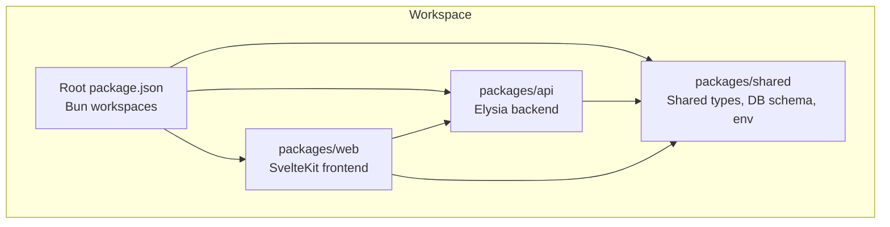
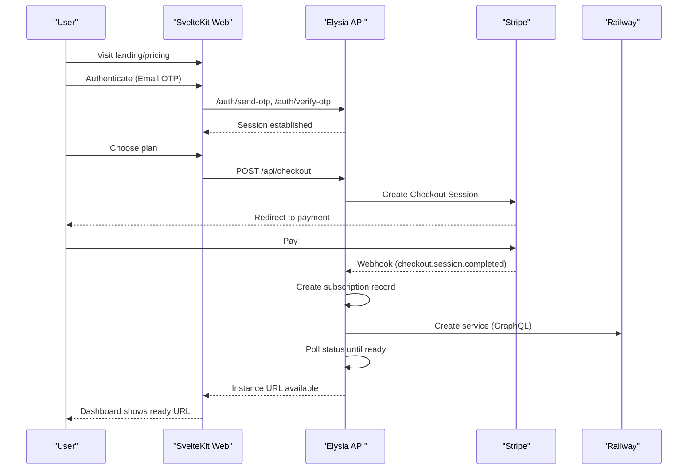
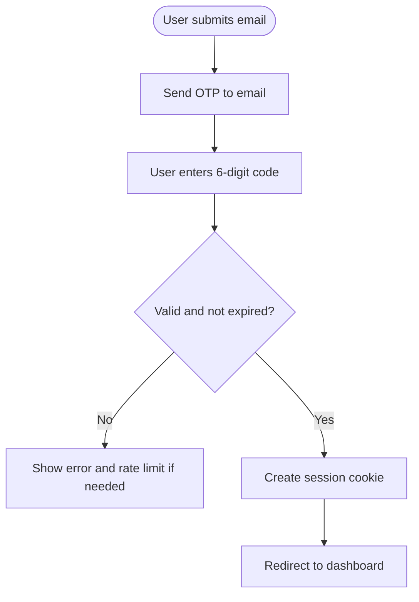
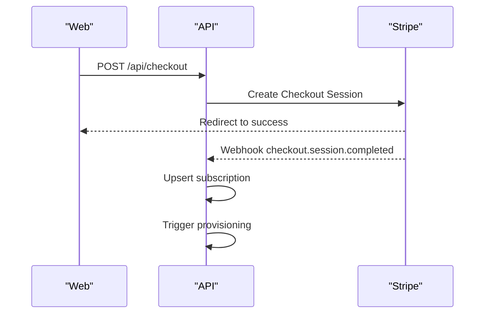
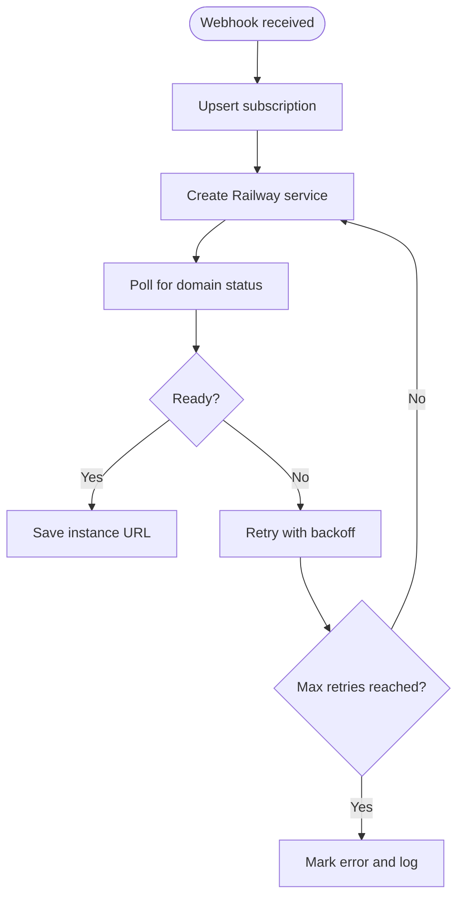
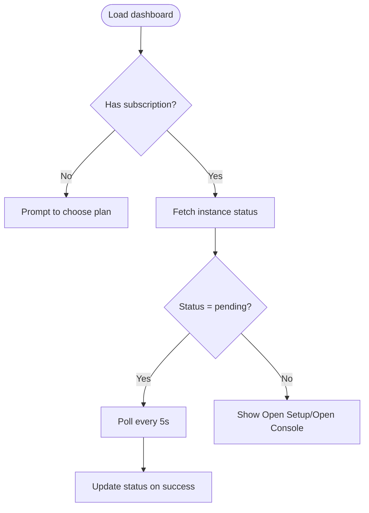
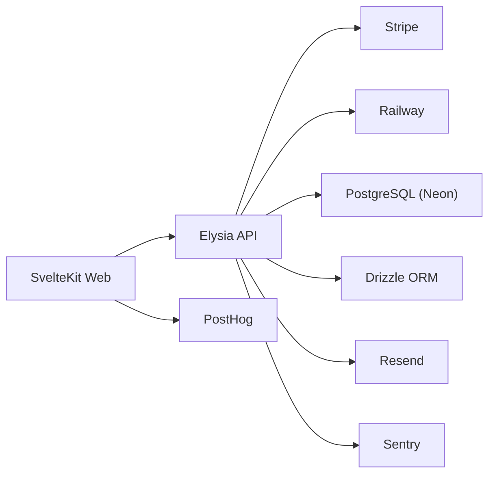

# Problem-Solution Fit

<cite>
**Referenced Files in This Document**
- [PRD.md](file://PRD.md)
- [package.json](file://package.json)
- [drizzle.config.ts](file://drizzle.config.ts)
- [packages/api/src/index.ts](file://packages/api/src/index.ts)
- [packages/api/src/routes/auth.ts](file://packages/api/src/routes/auth.ts)
- [packages/api/src/services/stripe.ts](file://packages/api/src/services/stripe.ts)
- [packages/api/src/services/railway.ts](file://packages/api/src/services/railway.ts)
- [packages/shared/src/env.ts](file://packages/shared/src/env.ts)
- [packages/shared/src/constants.ts](file://packages/shared/src/constants.ts)
- [packages/shared/src/db/schema.ts](file://packages/shared/src/db/schema.ts)
- [packages/web/src/routes/dashboard/+page.svelte](file://packages/web/src/routes/dashboard/+page.svelte)
</cite>

## Table of Contents
1. [Introduction](#introduction)
2. [Project Structure](#project-structure)
3. [Core Components](#core-components)
4. [Architecture Overview](#architecture-overview)
5. [Detailed Component Analysis](#detailed-component-analysis)
6. [Dependency Analysis](#dependency-analysis)
7. [Performance Considerations](#performance-considerations)
8. [Troubleshooting Guide](#troubleshooting-guide)
9. [Conclusion](#conclusion)
10. [Appendices](#appendices)

## Introduction
SparkClaw solves the primary pain points of self-hosting OpenClaw by eliminating DevOps complexity, infrastructure management overhead, SSL certificate setup, database configuration, monitoring, and backup maintenance. Instead of requiring users to provision servers, configure Docker, manage SSL certificates, or maintain databases, SparkClaw automates provisioning on modern cloud platforms, manages infrastructure, and simplifies operations so users can focus on building.

Target market segments include indie developers, creators, agencies, and small businesses who want AI assistant capabilities but lack dedicated DevOps resources. SparkClaw delivers a “launch your own OpenClaw in minutes” experience, removing the barrier of deploying and maintaining infrastructure.

Typical deployment scenarios SparkClaw solves include:
- Server provisioning and containerization via automated cloud deployment
- SSL/TLS termination and domain management handled automatically
- Database initialization and schema migrations managed centrally
- Monitoring and alerting integrated into the platform
- Backup and disaster recovery orchestrated behind the scenes

Quantitative benefits compared to self-hosted deployments:
- Time saved: From days or weeks of DevOps work to under five minutes from sign-up to a ready instance
- Cost efficiency: Predictable monthly pricing versus variable infrastructure, licensing, and maintenance costs
- Operational simplicity: No need to manage updates, patches, or infrastructure scaling

These outcomes are grounded in the documented V0 goals and flows, which automate provisioning, billing, and instance lifecycle management.

**Section sources**
- [PRD.md](file://PRD.md#L11-L33)

## Project Structure
SparkClaw is a Bun workspace monorepo with three packages:
- packages/web: SvelteKit frontend for landing, authentication, pricing, and dashboard
- packages/api: Elysia backend handling authentication, Stripe billing, and Railway provisioning
- packages/shared: Shared types, schemas, database schema, environment validation, and constants

The monorepo enables clean separation of concerns, shared validation, and consistent environment configuration across services.



**Diagram sources**
- [package.json](file://package.json#L1-L23)

**Section sources**
- [package.json](file://package.json#L1-L23)
- [drizzle.config.ts](file://drizzle.config.ts#L1-L13)

## Core Components
This section outlines the components that eliminate DevOps complexity and operational overhead:

- Automated provisioning on Railway
  - After successful Stripe payment, the backend triggers an asynchronous provisioning pipeline that creates a new service on Railway, sets environment variables, and polls until the instance is ready. This removes the need for users to touch infrastructure APIs or scripts.
  - The provisioning flow includes retry logic and error handling to improve reliability.

- Managed infrastructure and SSL
  - Custom domains are generated and attached to Railway services, with DNS verification handled automatically. Users receive a ready-to-use URL without managing SSL certificates or DNS records.

- Simplified authentication and billing
  - Email-based OTP login removes the need for complex identity providers. Stripe Checkout handles subscription creation and webhooks, ensuring seamless transitions from sign-up to a live instance.

- Centralized database and schema management
  - Drizzle ORM manages schema-first migrations against a managed PostgreSQL service, removing manual database setup and maintenance tasks.

- Observability and monitoring
  - Structured logging, error tracking, and analytics are integrated to surface issues and measure performance without manual instrumentation.

**Section sources**
- [PRD.md](file://PRD.md#L131-L167)
- [PRD.md](file://PRD.md#L100-L130)
- [PRD.md](file://PRD.md#L422-L506)
- [PRD.md](file://PRD.md#L387-L420)

## Architecture Overview
The end-to-end flow from sign-up to a ready OpenClaw instance is fully automated:



**Diagram sources**
- [PRD.md](file://PRD.md#L278-L327)
- [packages/api/src/services/stripe.ts](file://packages/api/src/services/stripe.ts#L45-L72)
- [packages/api/src/services/railway.ts](file://packages/api/src/services/railway.ts#L177-L291)
- [packages/web/src/routes/dashboard/+page.svelte](file://packages/web/src/routes/dashboard/+page.svelte#L24-L72)

## Detailed Component Analysis

### Authentication and Session Management
- OTP-based login with rate limiting prevents abuse and ensures security
- Sessions are stored securely and validated on protected routes
- The frontend integrates with backend endpoints to provide a seamless login experience



**Diagram sources**
- [packages/api/src/routes/auth.ts](file://packages/api/src/routes/auth.ts#L21-L71)
- [packages/shared/src/constants.ts](file://packages/shared/src/constants.ts#L16-L23)

**Section sources**
- [PRD.md](file://PRD.md#L85-L99)
- [packages/api/src/routes/auth.ts](file://packages/api/src/routes/auth.ts#L1-L80)
- [packages/shared/src/constants.ts](file://packages/shared/src/constants.ts#L16-L23)

### Billing and Subscription Lifecycle
- Stripe Checkout handles payment initiation and redirects
- Webhooks process subscription events to update records and trigger provisioning
- Idempotent handling and signature verification ensure reliable and secure updates



**Diagram sources**
- [PRD.md](file://PRD.md#L108-L125)
- [packages/api/src/services/stripe.ts](file://packages/api/src/services/stripe.ts#L28-L72)

**Section sources**
- [PRD.md](file://PRD.md#L100-L130)
- [packages/api/src/services/stripe.ts](file://packages/api/src/services/stripe.ts#L1-L107)

### Instance Provisioning on Railway
- The backend provisions a new Railway service using a pinned template and environment variables
- It polls for readiness and updates the instance URL upon success
- Retries and timeouts are handled with structured logging and error states



**Diagram sources**
- [packages/api/src/services/railway.ts](file://packages/api/src/services/railway.ts#L177-L291)
- [packages/api/src/services/stripe.ts](file://packages/api/src/services/stripe.ts#L68-L72)

**Section sources**
- [PRD.md](file://PRD.md#L131-L167)
- [packages/api/src/services/railway.ts](file://packages/api/src/services/railway.ts#L1-L291)

### Database Schema and Environment Validation
- Drizzle schema defines normalized tables for users, sessions, OTP codes, subscriptions, and instances
- Environment variables are validated at startup to prevent misconfiguration
- Migrations are managed via Drizzle Kit and executed during deployment

```mermaid
erDiagram
USERS {
uuid id PK
varchar email UK
timestamp created_at
timestamp updated_at
}
OTP_CODES {
uuid id PK
varchar email
varchar code_hash
timestamp expires_at
timestamp used_at
timestamp created_at
}
SESSIONS {
uuid id PK
uuid user_id FK
varchar token UK
timestamp expires_at
timestamp created_at
}
SUBSCRIPTIONS {
uuid id PK
uuid user_id UK FK
varchar plan
varchar stripe_customer_id
varchar stripe_subscription_id UK
varchar status
timestamp current_period_end
timestamp created_at
timestamp updated_at
}
INSTANCES {
uuid id PK
uuid user_id FK
uuid subscription_id UK FK
varchar railway_project_id
varchar railway_service_id
varchar custom_domain
text railway_url
text url
varchar status
varchar domain_status
text error_message
timestamp created_at
timestamp updated_at
}
USERS ||--o{ SESSIONS : "has"
USERS ||--o{ OTP_CODES : "has"
USERS ||--|| SUBSCRIPTIONS : "has"
USERS ||--|| INSTANCES : "has"
SUBSCRIPTIONS ||--|| INSTANCES : "has"
```

**Diagram sources**
- [packages/shared/src/db/schema.ts](file://packages/shared/src/db/schema.ts#L14-L146)
- [drizzle.config.ts](file://drizzle.config.ts#L1-L13)

**Section sources**
- [PRD.md](file://PRD.md#L422-L506)
- [packages/shared/src/db/schema.ts](file://packages/shared/src/db/schema.ts#L1-L146)
- [packages/shared/src/env.ts](file://packages/shared/src/env.ts#L1-L45)

### Dashboard Experience and User Actions
- The dashboard displays subscription and instance status, with automatic polling for pending instances
- Users can open the OpenClaw setup wizard and console directly from the dashboard
- Clear state messages guide users through provisioning failures and suspension scenarios



**Diagram sources**
- [packages/web/src/routes/dashboard/+page.svelte](file://packages/web/src/routes/dashboard/+page.svelte#L24-L72)

**Section sources**
- [PRD.md](file://PRD.md#L168-L192)
- [packages/web/src/routes/dashboard/+page.svelte](file://packages/web/src/routes/dashboard/+page.svelte#L1-L206)

## Dependency Analysis
External dependencies and their role in eliminating operational overhead:
- Bun runtime and Elysia: Fast, type-safe backend runtime suitable for long-running tasks
- SvelteKit: SSR + static frontend with simple deployment targets
- PostgreSQL (Neon): Serverless, auto-scaling database with schema-first migrations
- Drizzle ORM: Lightweight, type-safe SQL with schema-first migrations
- Stripe: Hosted checkout and webhooks for billing
- Railway: Programmatic deployment of OpenClaw instances
- Resend: Transactional email for OTP delivery
- Sentry and PostHog: Error tracking and product analytics



**Diagram sources**
- [PRD.md](file://PRD.md#L193-L208)

**Section sources**
- [PRD.md](file://PRD.md#L193-L208)

## Performance Considerations
- Instance provisioning time is bounded by retries and polling intervals to ensure timely availability
- API response targets and frontend performance metrics are defined to maintain a responsive experience
- Database connections leverage connection pooling and keep-alive queries to minimize cold starts

[No sources needed since this section provides general guidance]

## Troubleshooting Guide
Common operational issues and their resolution:
- Provisioning failures: The system marks instances as error and logs structured messages; administrators can manually intervene and retry
- Subscription cancellations: Instances are suspended, and users are guided to re-subscribe
- Webhook delivery delays: Idempotent handlers and manual replay from the Stripe dashboard mitigate missed events
- OTP delivery issues: Using reputable transactional email providers and verifying SPF/DKIM reduces deliverability problems

**Section sources**
- [PRD.md](file://PRD.md#L317-L327)
- [PRD.md](file://PRD.md#L654-L674)
- [packages/api/src/services/stripe.ts](file://packages/api/src/services/stripe.ts#L74-L107)
- [packages/api/src/services/railway.ts](file://packages/api/src/services/railway.ts#L266-L291)

## Conclusion
SparkClaw eliminates the barriers of self-hosting OpenClaw by automating provisioning, managing infrastructure, and simplifying operations. Users move from days or weeks of DevOps work to minutes of setup, while gaining predictable pricing, managed SSL, centralized database management, and integrated monitoring. The documented V0 flows and component implementations demonstrate a clear path to solving real-world pain points for indie developers, creators, agencies, and small businesses.

[No sources needed since this section summarizes without analyzing specific files]

## Appendices
- Quantitative outcomes: Under five minutes from sign-up to a ready instance; predictable monthly pricing; automated infrastructure lifecycle
- Typical deployment scenarios: Server provisioning, Docker configuration, SSL setup, and ongoing maintenance tasks are fully automated

[No sources needed since this section provides general guidance]