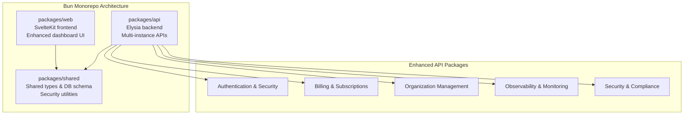
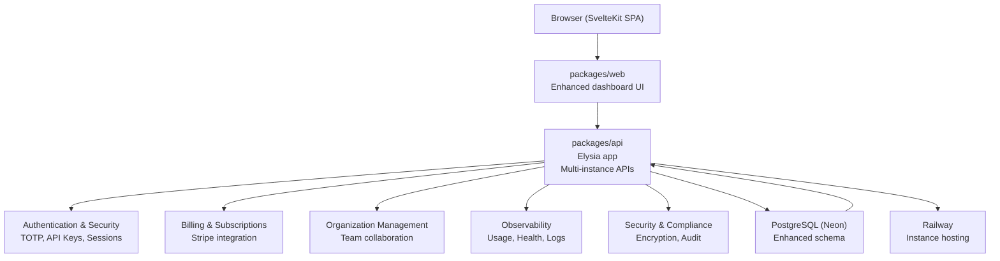
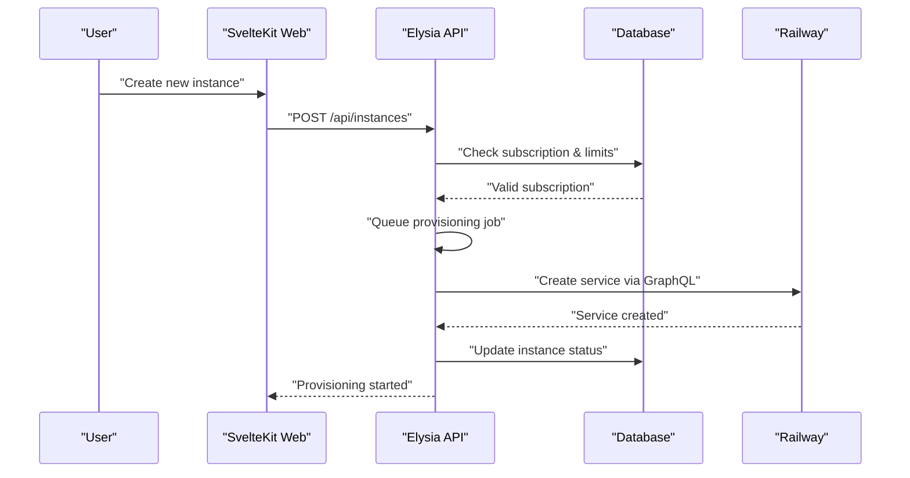
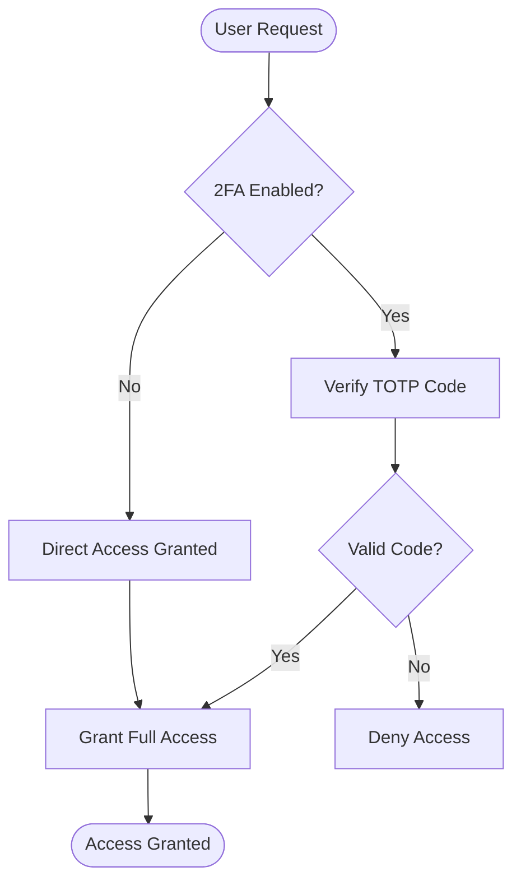
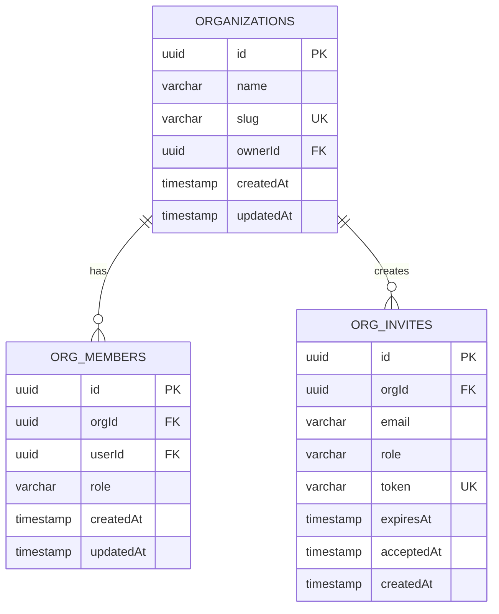
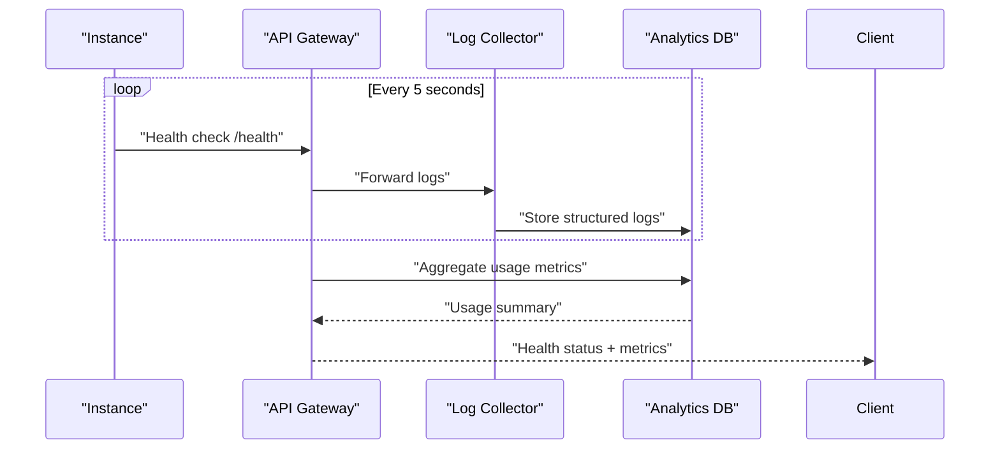
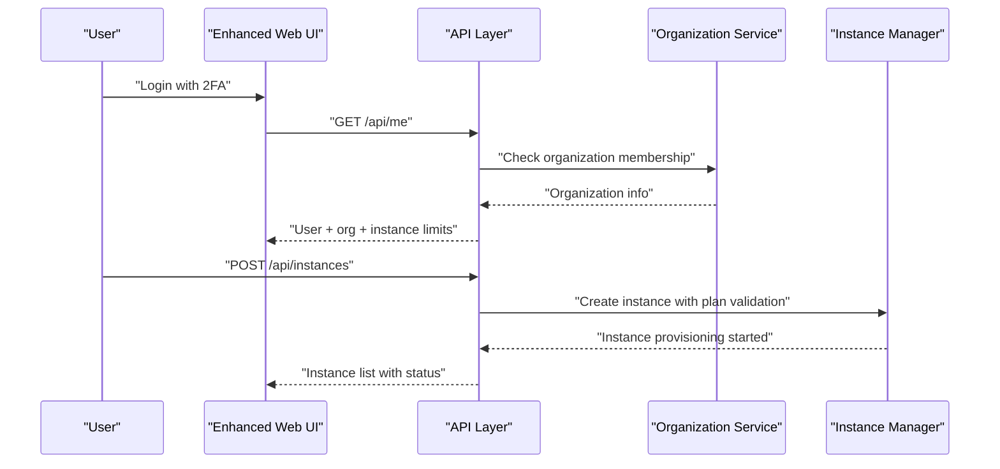
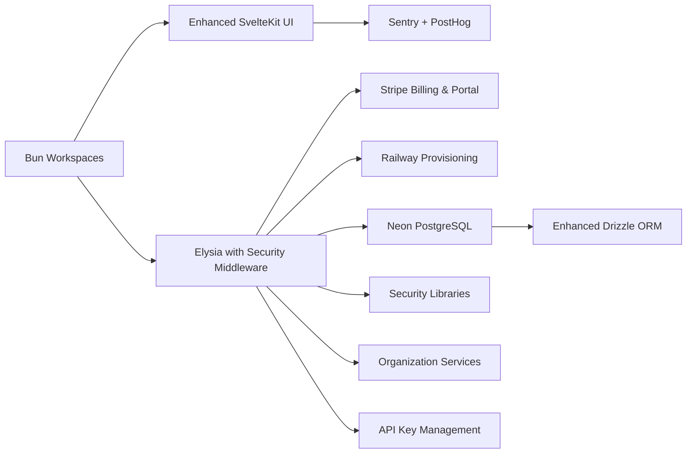

# Project Overview

<cite>
**Referenced Files in This Document**
- [PRD.md](file://PRD.md)
- [package.json](file://package.json)
- [docs/plans/2026-03-09-multi-instance-design.md](file://docs/plans/2026-03-09-multi-instance-design.md)
- [docs/plans/2026-03-09-multi-instance-plan.md](file://docs/plans/2026-03-09-multi-instance-plan.md)
- [packages/api/src/index.ts](file://packages/api/src/index.ts)
- [packages/api/src/routes/api.ts](file://packages/api/src/routes/api.ts)
- [packages/api/src/routes/orgs.ts](file://packages/api/src/routes/orgs.ts)
- [packages/api/src/routes/usage.ts](file://packages/api/src/routes/usage.ts)
- [packages/api/src/routes/billing.ts](file://packages/api/src/routes/billing.ts)
- [packages/api/src/routes/instance-actions.ts](file://packages/api/src/routes/instance-actions.ts)
- [packages/api/src/routes/totp.ts](file://packages/api/src/routes/totp.ts)
- [packages/api/src/routes/api-keys.ts](file://packages/api/src/routes/api-keys.ts)
- [packages/api/src/routes/env-vars.ts](file://packages/api/src/routes/env-vars.ts)
- [packages/api/src/routes/custom-skills.ts](file://packages/api/src/routes/custom-skills.ts)
- [packages/shared/src/db/schema.ts](file://packages/shared/src/db/schema.ts)
</cite>

## Update Summary
**Changes Made**
- Updated multi-instance architecture from single-instance to multi-instance platform
- Added comprehensive security infrastructure including TOTP, API keys, and encryption
- Integrated team management with organization and membership features
- Enhanced observability stack with usage tracking, health monitoring, and logging
- Expanded billing system with subscription management and cancellation workflows
- Added advanced instance management capabilities including health checks and logs

## Table of Contents
1. [Introduction](#introduction)
2. [Project Structure](#project-structure)
3. [Core Components](#core-components)
4. [Architecture Overview](#architecture-overview)
5. [Detailed Component Analysis](#detailed-component-analysis)
6. [Security Infrastructure](#security-infrastructure)
7. [Team Management](#team-management)
8. [Observability Stack](#observability-stack)
9. [Business Model and Value Proposition](#business-model-and-value-proposition)
10. [Dependency Analysis](#dependency-analysis)
11. [Performance Considerations](#performance-considerations)
12. [Troubleshooting Guide](#troubleshooting-guide)
13. [Conclusion](#conclusion)

## Introduction
SparkClaw is a comprehensive managed OpenClaw hosting platform designed to eliminate infrastructure complexity for deploying OpenClaw AI assistants. The platform has evolved from a simple single-instance solution to a sophisticated multi-instance AI platform with enterprise-grade security, team management, and observability features.

**Transformed Value Propositions:**
- **Launch multiple OpenClaw instances with plan-based limits** (Starter: 1, Pro: 3, Scale: 10 instances)
- **Enterprise-grade security** with TOTP, API keys, encrypted secrets, and audit logging
- **Team collaboration** through organization management and member permissions
- **Advanced observability** with usage tracking, health monitoring, and real-time logging
- **Subscription-based billing** with Stripe integration and flexible cancellation options
- **Managed hosting on modern cloud** with automated provisioning and maintenance

**Platform Evolution:**
SparkClaw now serves as a complete AI platform solution, moving beyond simple instance hosting to provide a full-stack managed service with comprehensive security, collaboration, and operational capabilities. The platform supports individual developers, teams, agencies, and enterprises with scalable infrastructure and robust governance features.

**Relationship to OpenClaw Ecosystem:**
- Provides managed hosting for OpenClaw instances across individual and organizational use cases
- Integrates with Prism (internal LLM gateway/router) for unified LLM access and future usage billing
- Supports mission control features including custom skills, scheduled jobs, and environment variable management
- Enables multi-client deployment for agencies and service providers

**Target Audience Segmentation:**
- **Primary**: Individual developers, creators, and small SaaS teams requiring multiple AI assistants
- **Secondary**: Agencies and consultants managing multiple client instances
- **Enterprise**: Organizations needing team collaboration, security compliance, and centralized management
- **Future**: SMEs and non-technical owners seeking enterprise-grade AI assistant capabilities

**Business Model Advantages:**
- **Scalable subscription tiers** with instance-based limits (1-10 instances per plan)
- **Enhanced security posture** reducing liability and compliance risks
- **Team collaboration features** enabling service provider business models
- **Comprehensive observability** improving operational efficiency and customer support
- **Enterprise-grade security** meeting compliance requirements for sensitive deployments

## Project Structure
SparkClaw uses an expanded Bun monorepo architecture with eight specialized packages supporting the multi-instance platform:

- **packages/web**: SvelteKit frontend (landing, auth, dashboard, pricing, team management)
- **packages/api**: Elysia backend (authentication, checkout, webhooks, provisioning, security, observability)
- **packages/shared**: Shared types, schemas, database definitions, constants, and utilities

**Diagram sources**
- [package.json](file://package.json#L1-L27)
- [docs/plans/2026-03-09-multi-instance-design.md](file://docs/plans/2026-03-09-multi-instance-design.md#L1-L98)

**Section sources**
- [package.json](file://package.json#L1-L27)
- [docs/plans/2026-03-09-multi-instance-design.md](file://docs/plans/2026-03-09-multi-instance-design.md#L1-L98)

## Core Components
The platform now encompasses eight major functional domains:

### Multi-Instance Management
- **Instance Limit Enforcement**: Plan-based instance limits (1-10 instances) with automatic enforcement
- **Instance Lifecycle Management**: Creation, deletion, suspension, and status tracking
- **Instance Isolation**: Secure separation between user instances with proper authorization
- **Provisioning Orchestration**: Automated instance creation with Railway integration

### Enhanced Security Infrastructure
- **Two-Factor Authentication (TOTP)**: RFC 6238 compliant 2FA with backup codes
- **API Key Management**: Scoped API keys with expiration and audit trails
- **Encrypted Secrets Storage**: AES encryption for sensitive configuration data
- **Audit Logging**: Comprehensive activity tracking for compliance and troubleshooting

### Team Collaboration Platform
- **Organization Management**: Multi-client support with ownership hierarchy
- **Member Permissions**: Role-based access control (Owner, Admin, Editor, Viewer)
- **Invite System**: Secure invitation workflow with expiration and acceptance tracking
- **Cross-Instance Access**: Controlled sharing of resources between team members

### Observability and Monitoring
- **Usage Tracking**: Detailed consumption analytics with per-instance granularity
- **Health Monitoring**: Real-time instance status, uptime tracking, and channel connectivity
- **Log Streaming**: Server-Sent Events for live log monitoring and debugging
- **Performance Metrics**: Response times, error rates, and operational insights

### Advanced Instance Management
- **Environment Variables**: Secure configuration management with encryption
- **Custom Skills**: Sandboxed code execution for custom functionality
- **Scheduled Jobs**: Cron-based task automation within instances
- **Instance Actions**: Start/stop/restart operations with status tracking

**Section sources**
- [docs/plans/2026-03-09-multi-instance-design.md](file://docs/plans/2026-03-09-multi-instance-design.md#L33-L98)
- [packages/api/src/routes/orgs.ts](file://packages/api/src/routes/orgs.ts#L1-L393)
- [packages/api/src/routes/totp.ts](file://packages/api/src/routes/totp.ts#L1-L254)
- [packages/api/src/routes/usage.ts](file://packages/api/src/routes/usage.ts#L1-L111)
- [packages/api/src/routes/instance-actions.ts](file://packages/api/src/routes/instance-actions.ts#L1-L170)

## Architecture Overview
The enhanced SparkClaw platform integrates multiple layers of security, collaboration, and observability with the core OpenClaw hosting infrastructure.

**Diagram sources**
- [docs/plans/2026-03-09-multi-instance-design.md](file://docs/plans/2026-03-09-multi-instance-design.md#L1-L98)
- [packages/api/src/index.ts](file://packages/api/src/index.ts#L1-L78)

## Detailed Component Analysis

### Multi-Instance Architecture
The platform now supports flexible instance management with plan-based limitations and comprehensive lifecycle operations.

**Instance Limit Enforcement:**
- Starter: 1 instance limit with automatic enforcement
- Pro: 3 instance limit supporting small teams
- Scale: 10 instance limit for enterprise deployments

**Instance Lifecycle Operations:**
- Creation with plan validation and limit checking
- Deletion with cascading cleanup of related resources
- Status tracking (pending, ready, suspended, error)
- URL management for both custom and internal domains

**Diagram sources**
- [docs/plans/2026-03-09-multi-instance-design.md](file://docs/plans/2026-03-09-multi-instance-design.md#L48-L58)
- [packages/api/src/routes/api.ts](file://packages/api/src/routes/api.ts#L499-L541)

**Section sources**
- [docs/plans/2026-03-09-multi-instance-design.md](file://docs/plans/2026-03-09-multi-instance-design.md#L33-L58)
- [packages/api/src/routes/api.ts](file://packages/api/src/routes/api.ts#L475-L541)

### Enhanced Security Infrastructure
The platform implements enterprise-grade security measures including multi-factor authentication, API key management, and comprehensive encryption.

**Two-Factor Authentication (TOTP):**
- RFC 6238 compliant implementation with SHA1 hashing
- 6-digit codes with 30-second validity window
- 8 backup codes for emergency access
- QR code generation via otpauth URI format

**API Key Management:**
- Scoped permissions with granular access control
- Configurable expiration periods (0-365 days)
- Audit trail for all API key operations
- Encrypted storage with secure generation

**Data Encryption:**
- AES encryption for sensitive configuration data
- Secure key derivation with salt and pepper
- Automatic rotation and secure deletion
- Transparent encryption/decryption in API layer

**Diagram sources**
- [packages/api/src/routes/totp.ts](file://packages/api/src/routes/totp.ts#L57-L71)
- [packages/api/src/routes/api-keys.ts](file://packages/api/src/routes/api-keys.ts#L47-L92)

**Section sources**
- [packages/api/src/routes/totp.ts](file://packages/api/src/routes/totp.ts#L1-L254)
- [packages/api/src/routes/api-keys.ts](file://packages/api/src/routes/api-keys.ts#L1-L119)

### Team Management and Organization
The platform supports complex organizational structures with role-based access control and collaborative workflows.

**Organization Hierarchy:**
- Single owner with unlimited administrative privileges
- Multiple administrators with delegated management rights
- Editors with instance modification capabilities
- Viewers with read-only access

**Member Management:**
- Invitation system with expiration tracking
- Role assignment and modification
- Permission inheritance from organization to instances
- Audit logging for all membership changes

**Cross-Instance Access:**
- Controlled sharing of resources between members
- Permission escalation for specific instances
- Team-wide configuration management
- Resource quota tracking per organization

**Diagram sources**
- [packages/shared/src/db/schema.ts](file://packages/shared/src/db/schema.ts#L327-L394)
- [packages/api/src/routes/orgs.ts](file://packages/api/src/routes/orgs.ts#L172-L277)

**Section sources**
- [packages/api/src/routes/orgs.ts](file://packages/api/src/routes/orgs.ts#L1-L393)
- [packages/shared/src/db/schema.ts](file://packages/shared/src/db/schema.ts#L327-L394)

### Observability and Monitoring
The platform provides comprehensive monitoring and analytics capabilities for operational excellence.

**Usage Tracking:**
- Per-instance consumption analytics
- Monthly aggregation with historical trends
- Credit-based usage for premium features
- Real-time capacity planning

**Health Monitoring:**
- API endpoint availability checks
- Channel connectivity status tracking
- Uptime percentage calculation
- Automated alerting for service degradation

**Log Management:**
- Server-Sent Events for live log streaming
- Structured log format with metadata
- Filtering by severity and timestamp
- Export capabilities for compliance

**Performance Analytics:**
- Response time tracking for all endpoints
- Error rate monitoring and trend analysis
- Resource utilization metrics
- Capacity planning indicators

**Diagram sources**
- [packages/api/src/routes/instance-actions.ts](file://packages/api/src/routes/instance-actions.ts#L61-L101)
- [packages/api/src/routes/usage.ts](file://packages/api/src/routes/usage.ts#L69-L110)

**Section sources**
- [packages/api/src/routes/usage.ts](file://packages/api/src/routes/usage.ts#L1-L111)
- [packages/api/src/routes/instance-actions.ts](file://packages/api/src/routes/instance-actions.ts#L1-L170)

### End-to-End User Journey
The enhanced platform supports complex workflows for individual users, teams, and organizations.

**Individual User Flow:**
- Registration → Email verification → Plan selection → Instance creation → Setup wizard → Multiple instance management

**Team Collaboration Flow:**
- Organization creation → Member invitation → Role assignment → Shared instance management → Cross-instance collaboration

**Enterprise Deployment Flow:**
- Multi-organization setup → Hierarchical permission management → Audit compliance → Advanced security configuration → Centralized monitoring

**Diagram sources**
- [docs/plans/2026-03-09-multi-instance-design.md](file://docs/plans/2026-03-09-multi-instance-design.md#L20-L58)
- [packages/api/src/routes/api.ts](file://packages/api/src/routes/api.ts#L446-L474)

**Section sources**
- [docs/plans/2026-03-09-multi-instance-design.md](file://docs/plans/2026-03-09-multi-instance-design.md#L20-L58)

## Security Infrastructure
The platform implements comprehensive security measures across authentication, authorization, and data protection layers.

**Authentication Enhancements:**
- Multi-factor authentication with TOTP and backup codes
- Session management with secure cookies and CSRF protection
- Rate limiting for authentication attempts
- Account lockout mechanisms for security

**Authorization Framework:**
- Role-based access control (RBAC) with four permission levels
- Instance-level permissions with inheritance from organization
- API key scoping with granular permission sets
- Audit trail for all privileged operations

**Data Protection:**
- End-to-end encryption for sensitive configuration data
- Secure key management with hardware-backed storage
- Encrypted communication between services
- Compliance-ready data retention and deletion policies

**Compliance Features:**
- Audit logging for all user actions and system events
- Data encryption at rest and in transit
- Secure deletion procedures for sensitive information
- Privacy controls for user data management

**Section sources**
- [packages/api/src/routes/totp.ts](file://packages/api/src/routes/totp.ts#L1-L254)
- [packages/api/src/routes/api-keys.ts](file://packages/api/src/routes/api-keys.ts#L1-L119)
- [packages/api/src/routes/orgs.ts](file://packages/api/src/routes/orgs.ts#L1-L393)

## Team Management
The platform provides enterprise-grade team collaboration capabilities with flexible permission models and organizational structures.

**Organizational Structure:**
- Hierarchical organization with single owner and multiple administrators
- Flexible member roles with clear permission boundaries
- Automatic inheritance of permissions from organization to instances
- Granular control over resource access and modification

**Collaboration Features:**
- Invitation system with expiration and acceptance tracking
- Cross-instance resource sharing with permission controls
- Team-wide configuration management and deployment
- Audit trails for all collaborative activities

**Resource Management:**
- Quota enforcement based on organization membership
- Shared billing across organization members
- Centralized monitoring and alerting
- Standardized security policies across team instances

**Section sources**
- [packages/api/src/routes/orgs.ts](file://packages/api/src/routes/orgs.ts#L1-L393)
- [packages/shared/src/db/schema.ts](file://packages/shared/src/db/schema.ts#L327-L394)

## Observability Stack
The platform includes comprehensive monitoring, logging, and analytics capabilities for operational excellence.

**Usage Analytics:**
- Per-instance consumption tracking with detailed categorization
- Historical trend analysis with customizable time ranges
- Credit-based usage for premium features and services
- Real-time capacity planning and alerting

**Health Monitoring:**
- Automated health checks for API endpoints and instance status
- Channel connectivity monitoring with real-time status updates
- Uptime tracking with SLA compliance reporting
- Performance metrics collection and analysis

**Logging Infrastructure:**
- Structured logging with standardized formats and metadata
- Live log streaming via Server-Sent Events for debugging
- Log filtering by severity, timestamp, and resource
- Export capabilities for compliance and analysis

**Operational Insights:**
- Performance monitoring with response time tracking
- Error rate analysis and trend identification
- Resource utilization metrics and capacity planning
- Incident response and troubleshooting support

**Section sources**
- [packages/api/src/routes/usage.ts](file://packages/api/src/routes/usage.ts#L1-L111)
- [packages/api/src/routes/instance-actions.ts](file://packages/api/src/routes/instance-actions.ts#L1-L170)

## Business Model and Value Proposition
The platform operates on a subscription-based model with enhanced value propositions for different customer segments.

**Subscription Tiers:**
- **Starter ($19/month)**: 1 instance, essential features, basic support
- **Pro ($39/month)**: 3 instances, team collaboration, advanced security
- **Scale ($79/month)**: 10 instances, enterprise features, priority support

**Revenue Streams:**
- Recurring subscription revenue with predictable margins
- Usage-based add-ons for premium features and services
- Enterprise licensing for large organizations and agencies
- Professional services for setup, customization, and training

**Value Proposition Evolution:**
- **Zero DevOps**: Eliminates infrastructure complexity for AI assistant deployment
- **Enterprise Security**: Comprehensive security features for compliance and risk management
- **Team Collaboration**: Built-in collaboration tools for agencies and organizations
- **Operational Excellence**: Advanced monitoring and observability for reliable operations
- **Scalable Infrastructure**: Automatic scaling with plan-based instance limits

**Market Positioning:**
- Competitive advantage through comprehensive feature set
- Differentiation via security, collaboration, and observability capabilities
- Market expansion from individual developers to enterprise organizations
- Service provider enablement for agencies and consulting firms

**Section sources**
- [docs/plans/2026-03-09-multi-instance-design.md](file://docs/plans/2026-03-09-multi-instance-design.md#L7-L11)

## Dependency Analysis
The enhanced platform leverages a modern technology stack with comprehensive integration points across security, collaboration, and observability domains.

**Core Technology Stack:**
- **Runtime**: Bun (monorepo, workspaces, enhanced performance)
- **Frontend**: SvelteKit (SSR/static with enhanced UI components)
- **Backend**: Elysia (REST + webhooks + security middleware)
- **Database**: PostgreSQL (Neon) with enhanced schema and relationships
- **Security**: Cryptography libraries, JWT tokens, audit logging
- **Billing**: Stripe (Checkout + webhooks + portal integration)
- **Hosting**: Railway (programmatic instance provisioning)
- **Observability**: Sentry (error tracking), PostHog (analytics), custom logging

**Enhanced Integration Points:**
- **Security Libraries**: Crypto utilities for encryption and authentication
- **Team Management**: Organization and membership services
- **Observability**: Usage tracking, health monitoring, and log aggregation
- **API Management**: Scoped API keys with granular permissions
- **Environment Management**: Secure configuration storage and retrieval

**Diagram sources**
- [packages/api/src/index.ts](file://packages/api/src/index.ts#L1-L78)
- [docs/plans/2026-03-09-multi-instance-design.md](file://docs/plans/2026-03-09-multi-instance-design.md#L193-L208)

**Section sources**
- [packages/api/src/index.ts](file://packages/api/src/index.ts#L1-L78)
- [docs/plans/2026-03-09-multi-instance-design.md](file://docs/plans/2026-03-09-multi-instance-design.md#L193-L208)

## Performance Considerations
The enhanced platform maintains high performance while adding comprehensive security, collaboration, and observability features.

**Frontend Performance:**
- Optimized SvelteKit SSR/static rendering with enhanced UI components
- Lazy loading for team management and observability features
- Efficient data fetching with caching strategies
- Progressive enhancement for security and collaboration features

**Backend Performance:**
- Elysia on Bun for low-latency API responses with security middleware
- Connection pooling for enhanced database performance
- Caching strategies for frequently accessed organization and instance data
- Asynchronous processing for time-consuming operations like provisioning

**Database Optimization:**
- Enhanced schema with optimized indexes for multi-instance queries
- Connection pooling with Neon serverless architecture
- Query optimization for organization membership and permission checks
- Partitioning strategies for usage analytics and audit logs

**Security Performance:**
- Hardware-accelerated encryption for minimal performance impact
- Efficient TOTP verification with caching
- Optimized API key validation with token caching
- Minimal overhead for audit logging and compliance features

**Observability Performance:**
- Lightweight telemetry collection with sampling strategies
- Efficient log aggregation and indexing
- Asynchronous processing for usage analytics
- Optimized health check endpoints with caching

## Troubleshooting Guide
Enhanced troubleshooting guidance for the comprehensive SparkClaw platform.

**Multi-Instance Issues:**
- **Instance creation failures**: Check plan limits, subscription status, and provisioning quotas
- **Instance status inconsistencies**: Verify Railway service status and domain configuration
- **Cross-instance access problems**: Review organization membership and permission inheritance
- **Instance deletion failures**: Check for dependent resources and cascading constraints

**Security and Authentication Problems:**
- **TOTP setup failures**: Verify QR code scanning, time synchronization, and backup code generation
- **API key authentication issues**: Check key scopes, expiration dates, and signature verification
- **Session management problems**: Verify cookie settings, CSRF protection, and session storage
- **Audit log discrepancies**: Check logging configuration and database connectivity

**Team Management Issues:**
- **Organization creation failures**: Verify unique slug generation and membership validation
- **Member invitation problems**: Check email delivery, token expiration, and acceptance workflows
- **Permission inheritance issues**: Review role assignments and permission hierarchies
- **Cross-organization access conflicts**: Verify membership boundaries and resource isolation

**Observability and Monitoring Problems:**
- **Usage tracking inconsistencies**: Check data aggregation intervals and historical data processing
- **Health check failures**: Verify endpoint accessibility, timeout configurations, and network connectivity
- **Log streaming interruptions**: Check Server-Sent Events configuration and connection timeouts
- **Performance metric inaccuracies**: Verify data collection intervals and aggregation calculations

**Section sources**
- [docs/plans/2026-03-09-multi-instance-design.md](file://docs/plans/2026-03-09-multi-instance-design.md#L654-L674)
- [packages/api/src/routes/totp.ts](file://packages/api/src/routes/totp.ts#L162-L210)
- [packages/api/src/routes/orgs.ts](file://packages/api/src/routes/orgs.ts#L230-L277)

## Conclusion
SparkClaw has evolved from a simple managed OpenClaw hosting solution to a comprehensive AI platform delivering enterprise-grade security, collaboration, and observability capabilities. The transformation to a multi-instance architecture with plan-based limits enables scalable deployment for individual developers, teams, and organizations.

**Key Achievements:**
- **Multi-Instance Support**: Flexible instance management with plan-based limits (1-10 instances)
- **Enterprise Security**: Comprehensive security infrastructure including TOTP, API keys, and encryption
- **Team Collaboration**: Advanced organization management with role-based access control
- **Operational Excellence**: Complete observability stack with usage tracking and health monitoring
- **Scalable Architecture**: Modern technology stack supporting growth and enterprise requirements

**Platform Strengths:**
- **Zero DevOps Experience**: Eliminates infrastructure complexity while adding enterprise capabilities
- **Comprehensive Security**: Multi-layered security approach meeting enterprise compliance requirements
- **Team Enablement**: Built-in collaboration tools for agencies and service providers
- **Operational Visibility**: Complete monitoring and analytics for reliable operations
- **Flexible Scaling**: Plan-based instance limits supporting growth from individual to enterprise use

The platform successfully addresses the real market need for creators, indie developers, agencies, and enterprises who want to focus on building AI applications rather than managing infrastructure. With its comprehensive feature set, robust security posture, and scalable architecture, SparkClaw positions itself as a leading managed OpenClaw hosting platform for the modern AI application landscape.