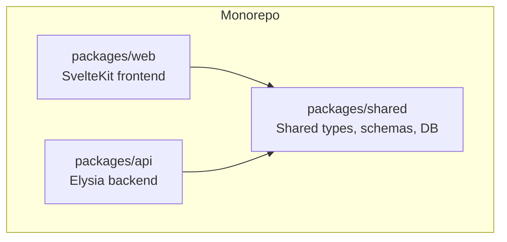
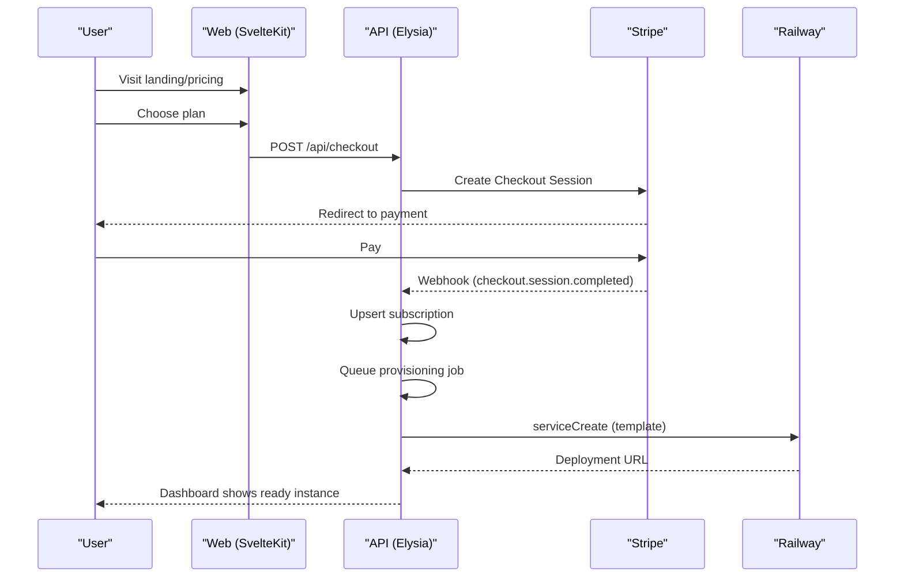
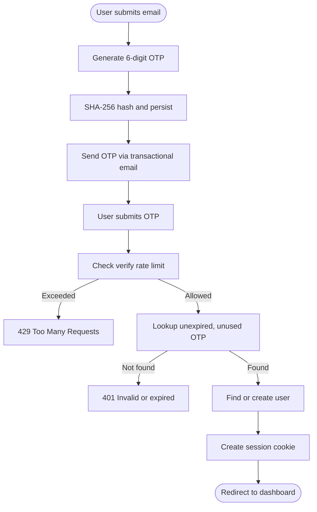
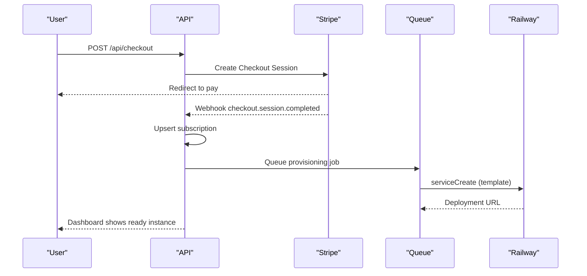
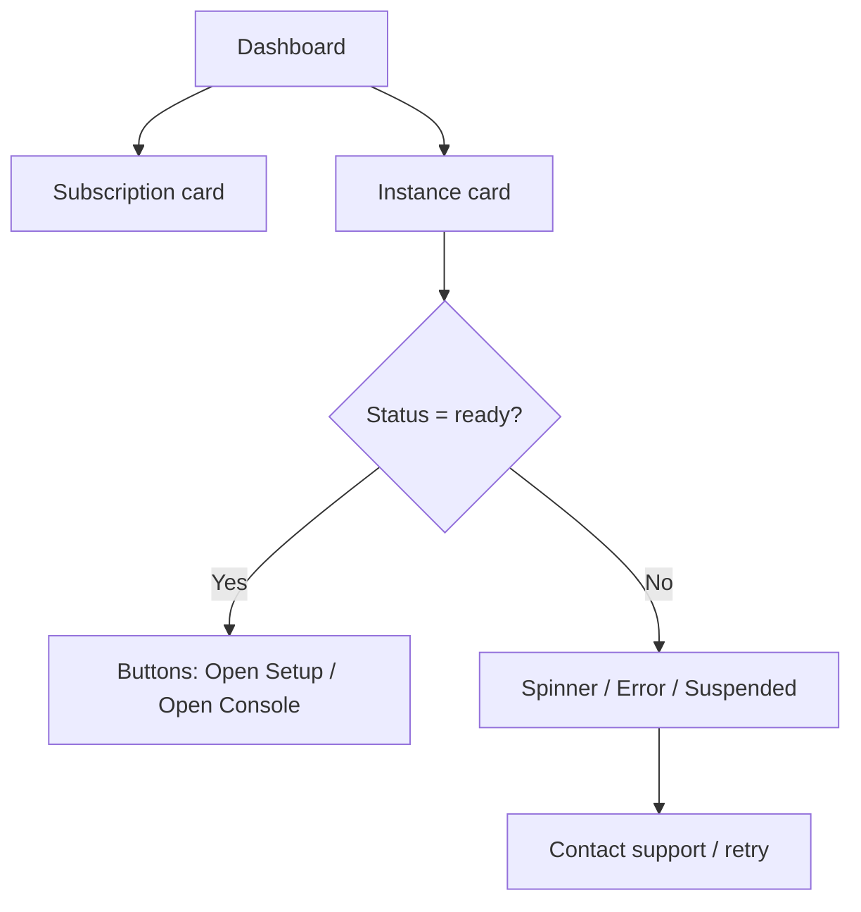
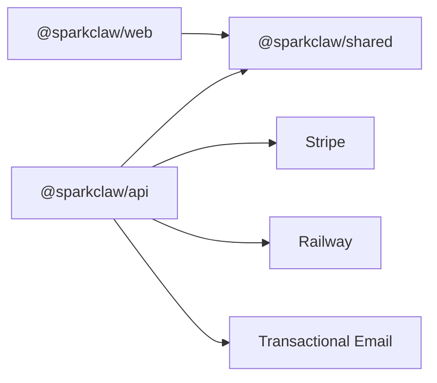

# Target Users

<cite>
**Referenced Files in This Document**
- [PRD.md](file://PRD.md)
- [package.json](file://package.json)
- [mockup.html](file://mockup.html)
- [packages/api/src/index.ts](file://packages/api/src/index.ts)
- [packages/api/src/routes/auth.ts](file://packages/api/src/routes/auth.ts)
- [packages/api/src/services/otp.ts](file://packages/api/src/services/otp.ts)
- [packages/api/src/services/stripe.ts](file://packages/api/src/services/stripe.ts)
- [packages/shared/src/types.ts](file://packages/shared/src/types.ts)
- [packages/shared/src/schemas.ts](file://packages/shared/src/schemas.ts)
- [packages/shared/src/constants.ts](file://packages/shared/src/constants.ts)
- [packages/shared/src/db/schema.ts](file://packages/shared/src/db/schema.ts)
</cite>

## Table of Contents
1. [Introduction](#introduction)
2. [Project Structure](#project-structure)
3. [Core Components](#core-components)
4. [Architecture Overview](#architecture-overview)
5. [Detailed Component Analysis](#detailed-component-analysis)
6. [Dependency Analysis](#dependency-analysis)
7. [Performance Considerations](#performance-considerations)
8. [Troubleshooting Guide](#troubleshooting-guide)
9. [Conclusion](#conclusion)

## Introduction
This document defines SparkClaw’s target users and how the product solves their specific challenges. It focuses on:
- Primary users: indie developers, creators, and small SaaS teams who want OpenClaw AI assistants but lack DevOps expertise
- Secondary users: agencies and consultants who need to deploy AI solutions for multiple clients

It explains their pain points, user journeys, decision-making factors, success criteria, and how SparkClaw’s managed offering removes setup complexity, maintenance overhead, and operational burden.

## Project Structure
SparkClaw is a monorepo with three packages:
- packages/web: SvelteKit frontend (landing, pricing, auth, dashboard)
- packages/api: Elysia backend (authentication, Stripe billing, provisioning, webhooks)
- packages/shared: shared types, schemas, database schema, and constants

**Diagram sources**
- [package.json](file://package.json#L4-L16)

**Section sources**
- [package.json](file://package.json#L1-L23)

## Core Components
- Authentication via email OTP (passwordless) with rate limiting and secure sessions
- Stripe-powered subscription checkout and webhook-driven provisioning
- Automated OpenClaw instance creation on Railway with polling and retry logic
- Dashboard exposing subscription and instance status with clear actions

These components directly address the primary and secondary personas’ needs for simplicity, speed, and reliability.

**Section sources**
- [PRD.md](file://PRD.md#L37-L56)
- [packages/api/src/routes/auth.ts](file://packages/api/src/routes/auth.ts#L19-L80)
- [packages/api/src/services/stripe.ts](file://packages/api/src/services/stripe.ts#L28-L107)
- [packages/shared/src/constants.ts](file://packages/shared/src/constants.ts#L25-L27)

## Architecture Overview
The target-user-facing flow begins with awareness and ends with a working OpenClaw instance in minutes. The backend orchestrates provisioning after successful payment.

**Diagram sources**
- [PRD.md](file://PRD.md#L107-L125)
- [PRD.md](file://PRD.md#L138-L154)
- [packages/api/src/services/stripe.ts](file://packages/api/src/services/stripe.ts#L45-L72)
- [packages/api/src/index.ts](file://packages/api/src/index.ts#L11-L20)

## Detailed Component Analysis

### Primary Persona: Indie Developer, Creator, Small SaaS
- Behavioral characteristics
  - Wants to experiment quickly and iterate without DevOps effort
  - Prefers “zero-setup” solutions; avoids VPS, Docker, and infrastructure management
  - Values predictable pricing and fast onboarding
- Technical capabilities
  - Comfortable with APIs and basic configuration; not interested in maintaining infrastructure
- Business requirements
  - Need a single, reliable OpenClaw instance per project
  - Desire to connect multiple channels (Telegram, Discord, LINE, etc.) easily
- Pain points addressed by SparkClaw
  - Setup complexity: SparkClaw provisions the instance automatically after payment
  - Maintenance overhead: Managed hosting handles updates, SSL, backups, monitoring
  - Operational burden: No need to manage Railway, Docker, or secrets
- User journey
  - Awareness → Landing/pricing → Auth (OTP) → Choose plan → Pay → Dashboard shows provisioning → Ready in minutes → Open Setup wizard
- Decision-making factors
  - Speed to first bot (under 5 minutes)
  - Predictable monthly pricing
  - Trust in OpenClaw and managed hosting
- Success criteria
  - End-to-end flow success, provisioning success rate > 90%, provisioning time < 5 minutes

Concrete examples
- Individual experimentation: From landing to a running OpenClaw instance in under 5 minutes
- Small SaaS productization: Add an AI assistant to a product without hiring DevOps

**Section sources**
- [PRD.md](file://PRD.md#L39-L44)
- [PRD.md](file://PRD.md#L278-L295)
- [PRD.md](file://PRD.md#L678-L684)

### Secondary Persona: Agencies and Consultants
- Behavioral characteristics
  - Need to deploy AI solutions for multiple clients quickly
  - Require standardized onboarding and consistent experience across clients
- Technical capabilities
  - May not be technical themselves; rely on managed services to reduce risk
- Business requirements
  - Quick onboarding for new clients
  - Ability to manage multiple instances efficiently
  - Predictable pricing per client
- Pain points addressed by SparkClaw
  - Setup complexity: Single-click provisioning after payment
  - Maintenance overhead: Managed updates and monitoring
  - Operational burden: Centralized visibility and control via dashboard
- User journey
  - Client signs up → Choose plan → Pay → Instance created → Access Setup wizard → Connect channels → Hand off to client
- Decision-making factors
  - Speed of deployment per client
  - Consistent experience across clients
  - Transparent billing and support
- Success criteria
  - High provisioning success rate, low support tickets, ability to onboard new clients rapidly

Concrete examples
- Agency onboarding: Provision instances for 5 clients in a day with consistent setup and support
- Consultant projects: Deliver a production-ready OpenClaw assistant to a client within hours of signing up

**Section sources**
- [PRD.md](file://PRD.md#L46-L50)
- [PRD.md](file://PRD.md#L278-L295)
- [PRD.md](file://PRD.md#L138-L154)

### Authentication and Session Management (Indie and Agency)
- Passwordless email OTP reduces friction and eliminates password management
- Rate limits protect against abuse
- Secure session cookies with strict attributes
- Clear logout flow

**Diagram sources**
- [packages/api/src/routes/auth.ts](file://packages/api/src/routes/auth.ts#L21-L71)
- [packages/api/src/services/otp.ts](file://packages/api/src/services/otp.ts#L27-L58)
- [packages/shared/src/schemas.ts](file://packages/shared/src/schemas.ts#L9-L20)
- [packages/shared/src/constants.ts](file://packages/shared/src/constants.ts#L16-L23)

**Section sources**
- [PRD.md](file://PRD.md#L85-L99)
- [packages/api/src/routes/auth.ts](file://packages/api/src/routes/auth.ts#L19-L80)
- [packages/api/src/services/otp.ts](file://packages/api/src/services/otp.ts#L1-L59)

### Subscription and Provisioning (Indie and Agency)
- Stripe Checkout hosted flow simplifies payment and redirects
- Webhooks drive subscription creation and trigger async provisioning
- Railway template deployment with polling and retry logic
- Dashboard communicates provisioning status and provides action links

**Diagram sources**
- [PRD.md](file://PRD.md#L107-L125)
- [PRD.md](file://PRD.md#L138-L154)
- [packages/api/src/services/stripe.ts](file://packages/api/src/services/stripe.ts#L45-L72)

**Section sources**
- [PRD.md](file://PRD.md#L100-L125)
- [PRD.md](file://PRD.md#L131-L167)
- [packages/api/src/services/stripe.ts](file://packages/api/src/services/stripe.ts#L1-L107)

### Dashboard Experience (Indie and Agency)
- Subscription card: plan, status, renewal date
- Instance card: status, URL, action buttons (Open Setup, Open Console)
- Clear empty-state guidance and error messaging
- Supports both returning users and new sign-ups

**Diagram sources**
- [PRD.md](file://PRD.md#L168-L192)
- [mockup.html](file://mockup.html#L371-L449)

**Section sources**
- [PRD.md](file://PRD.md#L168-L192)
- [mockup.html](file://mockup.html#L371-L449)

## Dependency Analysis
- Frontend (SvelteKit) depends on shared types and constants
- Backend (Elysia) depends on shared DB schema and services
- Shared package centralizes types, schemas, DB definitions, and constants
- External dependencies include Stripe, Railway, and transactional email providers

**Diagram sources**
- [package.json](file://package.json#L4-L16)
- [packages/api/src/index.ts](file://packages/api/src/index.ts#L1-L25)
- [packages/shared/src/db/schema.ts](file://packages/shared/src/db/schema.ts#L1-L146)

**Section sources**
- [package.json](file://package.json#L1-L23)
- [packages/api/src/index.ts](file://packages/api/src/index.ts#L1-L25)
- [packages/shared/src/db/schema.ts](file://packages/shared/src/db/schema.ts#L1-L146)

## Performance Considerations
- Landing and dashboard performance targets are defined to ensure fast user experiences
- OTP delivery and provisioning time targets are set to minimize friction
- Backend response targets are defined for read/write operations

[No sources needed since this section provides general guidance]

## Troubleshooting Guide
- Provisioning failures: Dashboard shows error state; optional team alerts; manual resolution and retry
- Subscription cancellation: Instance is suspended; user notified; re-subscribe to restore
- Authentication issues: OTP rate limits, expired codes, and verification attempts are enforced

**Section sources**
- [PRD.md](file://PRD.md#L305-L326)
- [PRD.md](file://PRD.md#L377-L384)
- [packages/api/src/routes/auth.ts](file://packages/api/src/routes/auth.ts#L28-L52)

## Conclusion
SparkClaw removes the barriers that prevent indie developers, creators, and small SaaS teams from adopting OpenClaw. By automating provisioning, managing billing, and providing a clear dashboard, it enables rapid deployment and ongoing operation without DevOps expertise. For agencies and consultants, SparkClaw streamlines multi-client onboarding and reduces operational overhead, allowing them to focus on delivering value to clients.