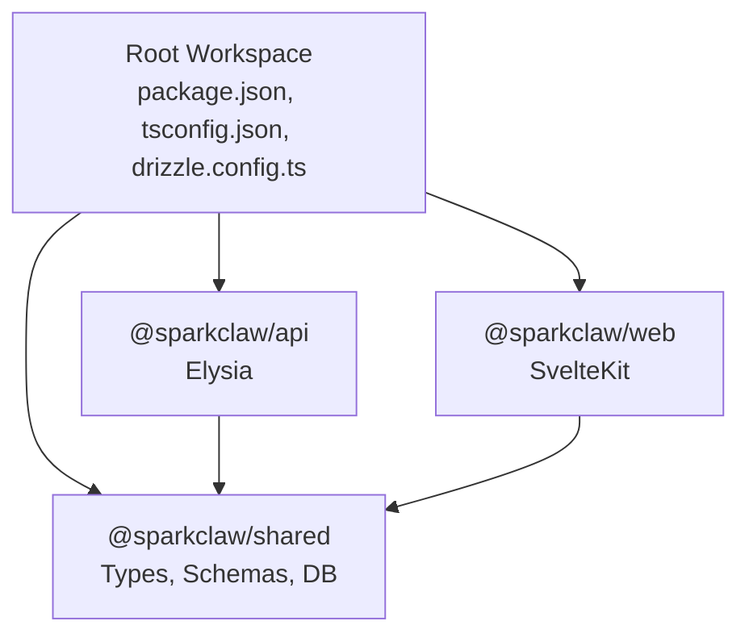
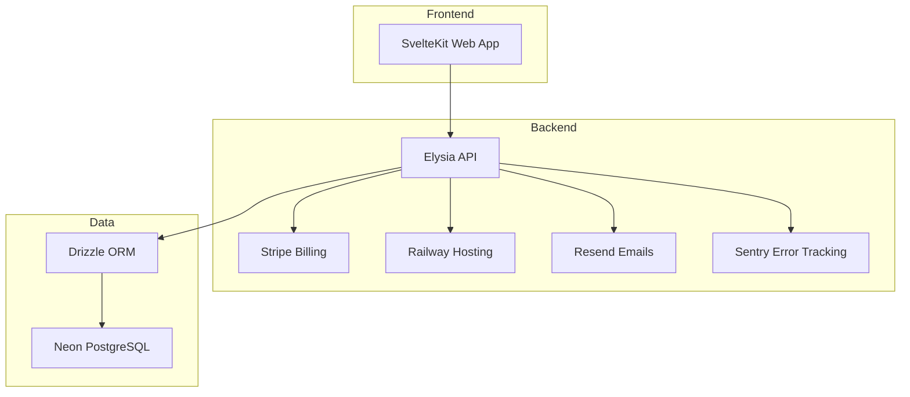
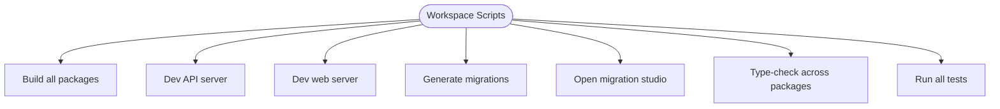
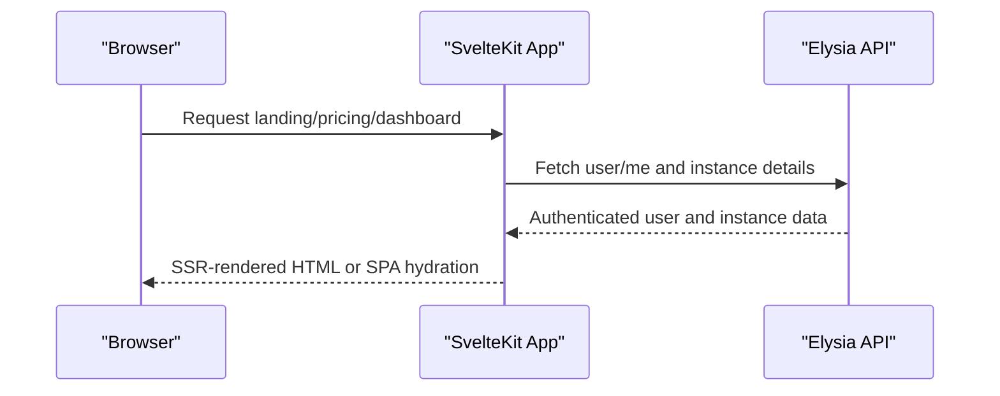
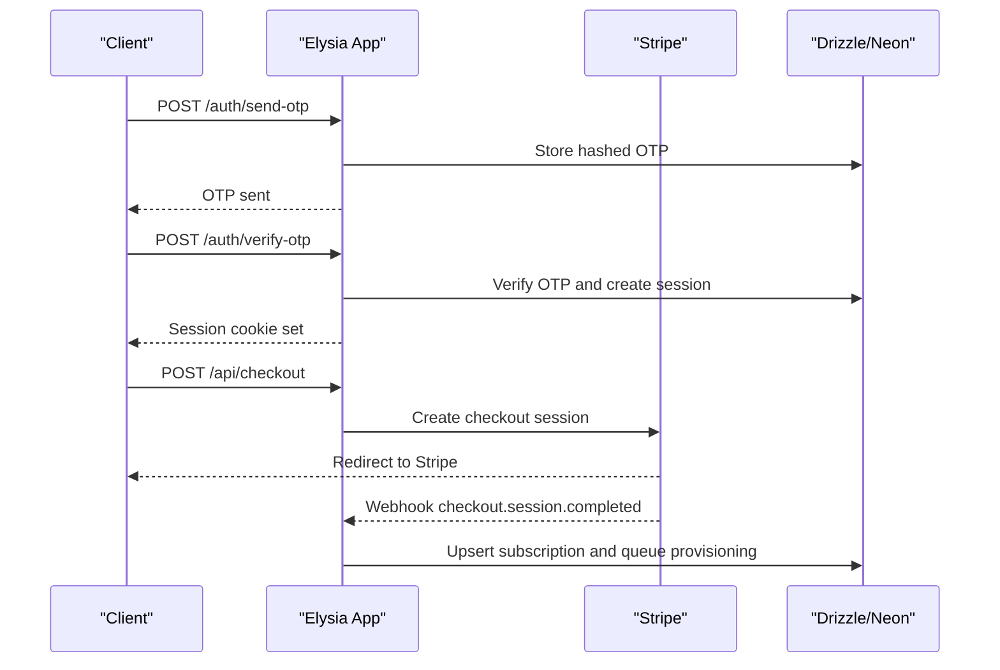
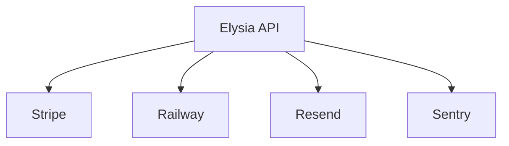
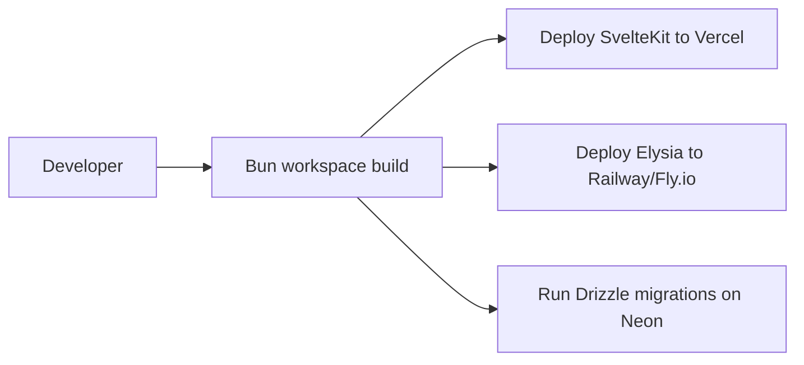
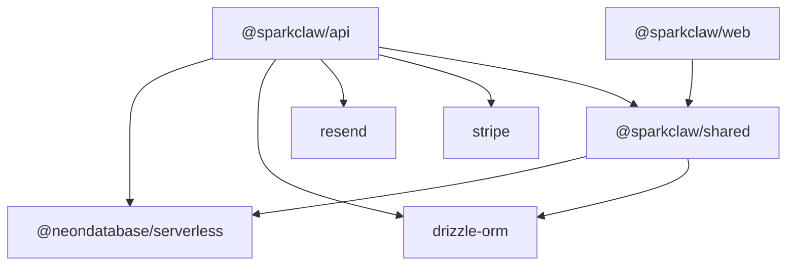

# Technology Stack

<cite>
**Referenced Files in This Document**
- [package.json](file://package.json)
- [tsconfig.json](file://tsconfig.json)
- [drizzle.config.ts](file://drizzle.config.ts)
- [PRD.md](file://PRD.md)
- [packages/api/package.json](file://packages/api/package.json)
- [packages/web/package.json](file://packages/web/package.json)
- [packages/shared/package.json](file://packages/shared/package.json)
- [packages/api/src/index.ts](file://packages/api/src/index.ts)
- [packages/api/src/routes/auth.ts](file://packages/api/src/routes/auth.ts)
- [packages/api/src/services/stripe.ts](file://packages/api/src/services/stripe.ts)
- [packages/shared/src/db/schema.ts](file://packages/shared/src/db/schema.ts)
- [packages/shared/src/types.ts](file://packages/shared/src/types.ts)
</cite>

## Table of Contents
1. [Introduction](#introduction)
2. [Project Structure](#project-structure)
3. [Core Components](#core-components)
4. [Architecture Overview](#architecture-overview)
5. [Detailed Component Analysis](#detailed-component-analysis)
6. [Dependency Analysis](#dependency-analysis)
7. [Performance Considerations](#performance-considerations)
8. [Troubleshooting Guide](#troubleshooting-guide)
9. [Conclusion](#conclusion)

## Introduction
This document presents the complete technology stack and component selection rationale for SparkClaw. It explains how the Bun monorepo with workspaces enables efficient development and deployment, how SvelteKit powers the modern web application with SSR and static site generation, how Elysia delivers a high-performance API with TypeScript support, how PostgreSQL via Neon and Drizzle ORM provide type-safe, serverless database operations, and how the cloud infrastructure stack (Railway, Stripe, Resend, Sentry) supports rapid iteration and reliable operations. It also documents the deployment strategy using Vercel for the frontend and Railway/Fly.io for backend services, and the reasoning behind each technology choice in terms of performance, developer experience, and operational benefits.

## Project Structure
SparkClaw adopts a Bun workspaces monorepo organized around three packages:
- packages/web: SvelteKit frontend (SSR and static site generation)
- packages/api: Elysia backend API (long-running server)
- packages/shared: Shared types, schemas, constants, and database schema/ORM client

The root workspace coordinates scripts, TypeScript configuration, and Drizzle migrations.



**Diagram sources**
- [package.json](file://package.json#L1-L23)
- [packages/web/package.json](file://packages/web/package.json#L1-L29)
- [packages/api/package.json](file://packages/api/package.json#L1-L27)
- [packages/shared/package.json](file://packages/shared/package.json#L1-L24)

**Section sources**
- [package.json](file://package.json#L1-L23)
- [tsconfig.json](file://tsconfig.json#L1-L22)
- [drizzle.config.ts](file://drizzle.config.ts#L1-L13)

## Core Components
- Bun workspaces: Unified development, testing, and build commands across packages; consistent TypeScript configuration; and simplified dependency management.
- SvelteKit: Modern web framework enabling SSR and static site generation with type-safe routes and layouts.
- Elysia: Lightweight, high-performance API framework with strong TypeScript support and minimal boilerplate.
- PostgreSQL via Neon: Serverless, auto-scaling relational database with connection pooling and branching.
- Drizzle ORM: Schema-first, type-safe SQL with migrations and a compact client.
- Cloud infrastructure: Railway for instance hosting, Stripe for payments, Resend for transactional emails, Sentry for error tracking.

**Section sources**
- [PRD.md](file://PRD.md#L193-L208)
- [package.json](file://package.json#L1-L23)
- [packages/web/package.json](file://packages/web/package.json#L1-L29)
- [packages/api/package.json](file://packages/api/package.json#L1-L27)
- [packages/shared/package.json](file://packages/shared/package.json#L1-L24)
- [drizzle.config.ts](file://drizzle.config.ts#L1-L13)

## Architecture Overview
The system follows a clear separation of concerns:
- Frontend (SvelteKit) handles landing, authentication, pricing, and dashboard pages with SSR/static rendering.
- Backend (Elysia) exposes REST endpoints and webhooks for authentication, checkout, and provisioning orchestration.
- Shared package centralizes types, validation schemas, constants, and database schema for type-safe cross-package usage.
- Database (Neon + Drizzle) persists user, session, OTP, subscription, and instance state.
- External services: Stripe for billing, Railway for instance hosting, Resend for OTP emails, Sentry for error tracking.



**Diagram sources**
- [PRD.md](file://PRD.md#L193-L208)
- [packages/api/src/index.ts](file://packages/api/src/index.ts#L1-L25)
- [packages/api/src/services/stripe.ts](file://packages/api/src/services/stripe.ts#L1-L107)
- [packages/shared/src/db/schema.ts](file://packages/shared/src/db/schema.ts#L1-L146)

## Detailed Component Analysis

### Bun Monorepo with Workspaces
- Purpose: Streamline development across web, API, and shared packages; unify scripts and TypeScript configuration.
- Developer experience: Single root for linting, type-checking, migrations, and tests; workspace protocol for internal imports.
- Operational benefits: Consistent tooling, simplified CI/CD, and predictable dependency resolution.



**Section sources**
- [package.json](file://package.json#L1-L23)
- [tsconfig.json](file://tsconfig.json#L1-L22)

### SvelteKit Frontend
- Capabilities: SSR and static site generation enable fast, SEO-friendly pages and interactive dashboards.
- Routing and layout: Type-safe routes under src/routes with shared components and stores.
- Deployment: Adapter-auto targets Vercel or Cloudflare Pages for global CDN distribution.



**Section sources**
- [PRD.md](file://PRD.md#L240-L247)
- [packages/web/package.json](file://packages/web/package.json#L1-L29)

### Elysia Backend
- Purpose: High-performance API with minimal boilerplate, CORS, and TypeScript-first routing.
- Modules: Auth routes (OTP, session), API routes (me, instance), and webhook handlers (Stripe).
- Middleware: CSRF protection and environment validation.
- External integrations: Stripe checkout and webhooks, Railway provisioning, Resend email, Sentry error reporting.



**Diagram sources**
- [packages/api/src/index.ts](file://packages/api/src/index.ts#L1-L25)
- [packages/api/src/routes/auth.ts](file://packages/api/src/routes/auth.ts#L1-L80)
- [packages/api/src/services/stripe.ts](file://packages/api/src/services/stripe.ts#L1-L107)

**Section sources**
- [PRD.md](file://PRD.md#L508-L610)
- [packages/api/package.json](file://packages/api/package.json#L1-L27)
- [packages/api/src/index.ts](file://packages/api/src/index.ts#L1-L25)
- [packages/api/src/routes/auth.ts](file://packages/api/src/routes/auth.ts#L1-L80)
- [packages/api/src/services/stripe.ts](file://packages/api/src/services/stripe.ts#L1-L107)

### Database Layer: PostgreSQL via Neon and Drizzle ORM
- Schema-first design: Centralized table definitions and relations in shared package.
- Type-safe queries: Generated select/insert types and domain enums ensure compile-time correctness.
- Migrations: Drizzle Kit configuration pointing to shared schema and Neon connection string.
- Data model: Users, OTP codes, sessions, subscriptions, and instances with appropriate indices and constraints.

```mermaid
erDiagram
USERS {
uuid id PK
varchar email UK
timestamptz created_at
timestamptz updated_at
}
OTP_CODES {
uuid id PK
varchar email
varchar code_hash
timestamptz expires_at
timestamptz used_at
timestamptz created_at
}
SESSIONS {
uuid id PK
uuid user_id FK
varchar token UK
timestamptz expires_at
timestamptz created_at
}
SUBSCRIPTIONS {
uuid id PK
uuid user_id UK FK
varchar plan
varchar stripe_customer_id
varchar stripe_subscription_id UK
varchar status
timestamptz current_period_end
timestamptz created_at
timestamptz updated_at
}
INSTANCES {
uuid id PK
uuid user_id FK
uuid subscription_id UK FK
varchar railway_project_id
varchar railway_service_id
varchar custom_domain
text railway_url
text url
varchar status
varchar domain_status
text error_message
timestamptz created_at
timestamptz updated_at
}
USERS ||--o{ SESSIONS : "has"
USERS ||--o{ OTP_CODES : "has"
USERS ||--|| SUBSCRIPTIONS : "has"
SUBSCRIPTIONS ||--|| INSTANCES : "has"
```

**Diagram sources**
- [packages/shared/src/db/schema.ts](file://packages/shared/src/db/schema.ts#L1-L146)
- [packages/shared/src/types.ts](file://packages/shared/src/types.ts#L1-L57)

**Section sources**
- [drizzle.config.ts](file://drizzle.config.ts#L1-L13)
- [packages/shared/src/db/schema.ts](file://packages/shared/src/db/schema.ts#L1-L146)
- [packages/shared/src/types.ts](file://packages/shared/src/types.ts#L1-L57)

### Cloud Infrastructure Stack
- Railway: Programmatic instance provisioning via GraphQL API for OpenClaw containers.
- Stripe: Hosted checkout sessions and webhook-driven subscription lifecycle.
- Resend: Transactional email delivery for OTP codes.
- Sentry: Error tracking and performance monitoring for frontend and backend.



**Diagram sources**
- [PRD.md](file://PRD.md#L193-L208)
- [packages/api/src/services/stripe.ts](file://packages/api/src/services/stripe.ts#L1-L107)

**Section sources**
- [PRD.md](file://PRD.md#L193-L208)

### Deployment Strategy
- Frontend: SvelteKit with adapter-auto targeting Vercel or Cloudflare Pages for SSR and static generation.
- Backend: Elysia deployed to Railway or Fly.io as long-running servers with Bun runtime.
- Monorepo: Root scripts orchestrate builds and migrations; shared package is consumed internally.



**Section sources**
- [PRD.md](file://PRD.md#L240-L247)
- [package.json](file://package.json#L1-L23)

## Dependency Analysis
- Internal dependencies:
  - packages/api depends on @sparkclaw/shared for types, schemas, constants, and DB client.
  - packages/web depends on @sparkclaw/shared for shared types and constants.
- External dependencies:
  - Elysia, Stripe SDK, Resend SDK, Drizzle ORM, and Neon driver in the API.
  - SvelteKit, adapter-auto, TailwindCSS, and related tooling in the web package.
  - Drizzle Kit and TypeScript at the root level.



**Diagram sources**
- [packages/web/package.json](file://packages/web/package.json#L1-L29)
- [packages/api/package.json](file://packages/api/package.json#L1-L27)
- [packages/shared/package.json](file://packages/shared/package.json#L1-L24)

**Section sources**
- [packages/web/package.json](file://packages/web/package.json#L1-L29)
- [packages/api/package.json](file://packages/api/package.json#L1-L27)
- [packages/shared/package.json](file://packages/shared/package.json#L1-L24)

## Performance Considerations
- Bun runtime and Elysia minimize overhead for the API server.
- SvelteKit SSR and static generation improve initial load performance.
- Neon’s serverless Postgres auto-scaling and connection pooling reduce operational bottlenecks.
- Drizzle’s schema-first approach reduces query errors and improves maintainability.
- Stripe checkout and webhook handling streamline payment flows and reduce latency.

[No sources needed since this section provides general guidance]

## Troubleshooting Guide
- Authentication flow:
  - OTP send/verify endpoints enforce rate limits and return appropriate HTTP statuses.
  - Session cookies are HTTP-only and secure in production.
- Stripe webhooks:
  - Signature verification and idempotent handling prevent duplicate records.
  - Errors are logged and surfaced for investigation.
- Database migrations:
  - Drizzle Kit generates and runs migrations against Neon; verify DATABASE_URL and schema exports.

**Section sources**
- [packages/api/src/routes/auth.ts](file://packages/api/src/routes/auth.ts#L1-L80)
- [packages/api/src/services/stripe.ts](file://packages/api/src/services/stripe.ts#L1-L107)
- [drizzle.config.ts](file://drizzle.config.ts#L1-L13)

## Conclusion
SparkClaw’s technology stack balances developer productivity, performance, and operational reliability. The Bun monorepo streamlines development; SvelteKit provides a modern, fast frontend; Elysia delivers a concise, high-performance backend; and Neon with Drizzle ensures robust, type-safe data operations. The cloud stack (Railway, Stripe, Resend, Sentry) supports scalable hosting, seamless payments, reliable email delivery, and comprehensive error tracking. The deployment strategy leverages Vercel for the frontend and Railway/Fly.io for the backend, aligning with the project’s goals for rapid iteration and low operational overhead.