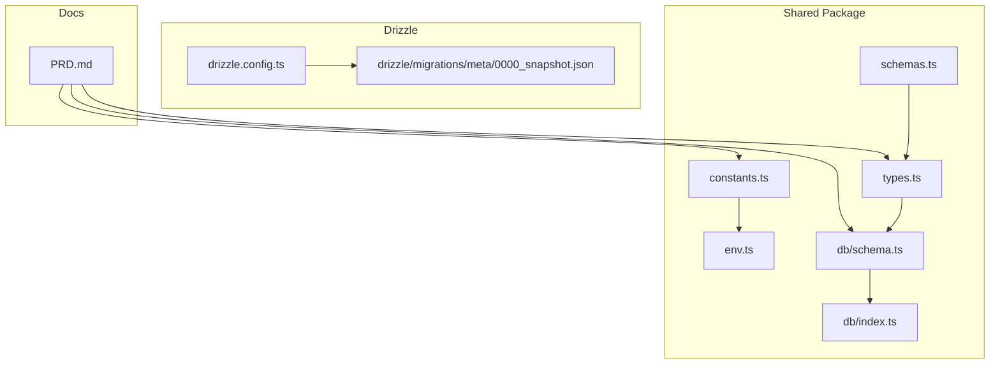
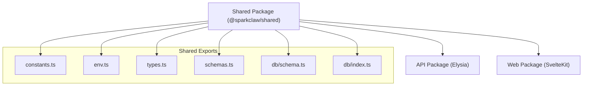
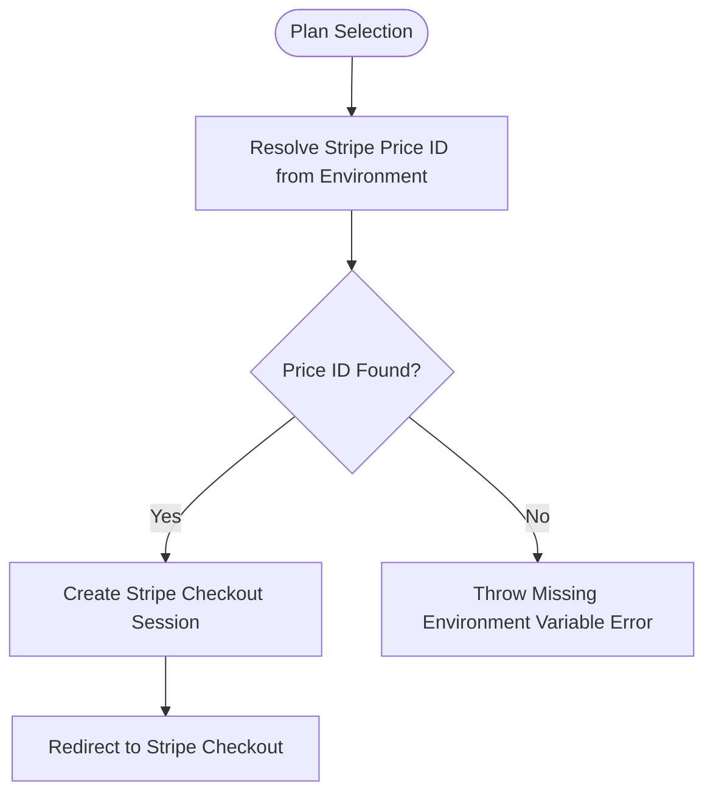
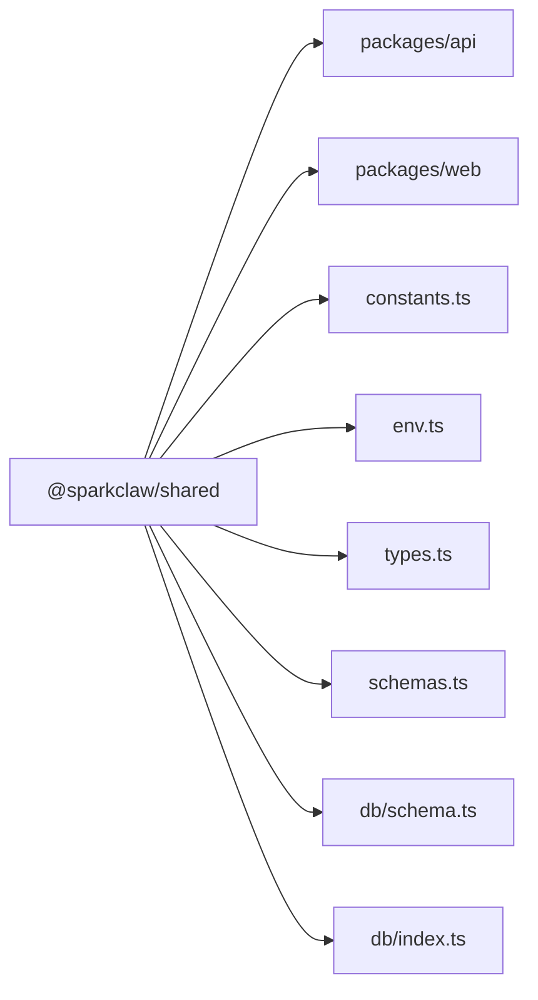

# Constants and Configuration

<cite>
**Referenced Files in This Document**
- [constants.ts](file://packages/shared/src/constants.ts)
- [env.ts](file://packages/shared/src/env.ts)
- [types.ts](file://packages/shared/src/types.ts)
- [schemas.ts](file://packages/shared/src/schemas.ts)
- [schema.ts](file://packages/shared/src/db/schema.ts)
- [index.ts](file://packages/shared/src/db/index.ts)
- [drizzle.config.ts](file://drizzle.config.ts)
- [0000_snapshot.json](file://drizzle/migrations/meta/0000_snapshot.json)
- [PRD.md](file://PRD.md)
- [shared index.ts](file://packages/shared/src/index.ts)
</cite>

## Table of Contents
1. [Introduction](#introduction)
2. [Project Structure](#project-structure)
3. [Core Components](#core-components)
4. [Architecture Overview](#architecture-overview)
5. [Detailed Component Analysis](#detailed-component-analysis)
6. [Dependency Analysis](#dependency-analysis)
7. [Performance Considerations](#performance-considerations)
8. [Troubleshooting Guide](#troubleshooting-guide)
9. [Conclusion](#conclusion)
10. [Appendices](#appendices)

## Introduction
This document consolidates constants and configuration values defined in the shared package and explains how they are used across the monorepo. It covers:
- Plan definitions (starter, pro, scale) including pricing and Stripe price identifiers
- Status enumerations for subscriptions, instances, and domains
- Environment validation and secrets
- Database table names and schema definitions
- API endpoints and request/response shapes
- Guidelines for adding new constants and maintaining consistency
- Versioning and backward compatibility considerations

## Project Structure
The shared package centralizes cross-cutting concerns:
- constants.ts: Business constants (plans, OTP/session timing, provisioning intervals)
- env.ts: Zod-based environment validation and typed accessors
- types.ts: Domain types and API response interfaces
- schemas.ts: Zod validation schemas for request bodies
- db/schema.ts: Drizzle ORM table definitions and relations
- db/index.ts: Database client initialization and proxy
- drizzle.config.ts: Drizzle Kit configuration for migrations
- drizzle/migrations/meta/0000_snapshot.json: Database schema snapshot



**Diagram sources**
- [constants.ts](file://packages/shared/src/constants.ts#L1-L28)
- [env.ts](file://packages/shared/src/env.ts#L1-L45)
- [types.ts](file://packages/shared/src/types.ts#L1-L57)
- [schemas.ts](file://packages/shared/src/schemas.ts#L1-L26)
- [schema.ts](file://packages/shared/src/db/schema.ts#L1-L146)
- [index.ts](file://packages/shared/src/db/index.ts#L1-L26)
- [drizzle.config.ts](file://drizzle.config.ts#L1-L13)
- [0000_snapshot.json](file://drizzle/migrations/meta/0000_snapshot.json#L1-L598)
- [PRD.md](file://PRD.md#L75-L83)

**Section sources**
- [constants.ts](file://packages/shared/src/constants.ts#L1-L28)
- [env.ts](file://packages/shared/src/env.ts#L1-L45)
- [types.ts](file://packages/shared/src/types.ts#L1-L57)
- [schemas.ts](file://packages/shared/src/schemas.ts#L1-L26)
- [schema.ts](file://packages/shared/src/db/schema.ts#L1-L146)
- [index.ts](file://packages/shared/src/db/index.ts#L1-L26)
- [drizzle.config.ts](file://drizzle.config.ts#L1-L13)
- [0000_snapshot.json](file://drizzle/migrations/meta/0000_snapshot.json#L1-L598)
- [PRD.md](file://PRD.md#L75-L83)

## Core Components
This section documents the primary constants and configuration values used across the system.

- Plan definitions and pricing
  - Plans: starter, pro, scale
  - Pricing per month in USD
  - Stripe price identifier resolution via environment variables

- OTP and session configuration
  - OTP expiry and rate limits for sending and verifying
  - Session expiry and cookie name

- Instance provisioning configuration
  - Polling interval and maximum attempts
  - Maximum retries for provisioning failures

- Environment variables
  - Database URL, Stripe keys, Railway tokens, email provider key, session secret
  - Optional: Sentry DSN, PostHog key, custom domain root, Redis URL
  - Defaults for port, environment, and web URL

- Types and statuses
  - Plan type union
  - Subscription status: active, canceled, past_due
  - Instance status: pending, ready, error, suspended
  - Domain status: pending, provisioning, ready, error

- Validation schemas
  - Email format and OTP code format
  - Plan selection enum
  - Request body schemas for OTP send/verify and checkout creation

- Database schema
  - Table names: users, otp_codes, sessions, subscriptions, instances
  - Columns, constraints, indexes, and foreign keys
  - Relations between entities

- API endpoints
  - Public: GET /, GET /pricing
  - Auth: GET /auth, POST /auth/send-otp, POST /auth/verify-otp, POST /auth/logout
  - Protected: GET /dashboard, GET /api/me, GET /api/instance, POST /api/checkout
  - Webhooks: POST /api/webhook/stripe

**Section sources**
- [constants.ts](file://packages/shared/src/constants.ts#L10-L28)
- [env.ts](file://packages/shared/src/env.ts#L3-L22)
- [types.ts](file://packages/shared/src/types.ts#L28-L31)
- [schemas.ts](file://packages/shared/src/schemas.ts#L3-L20)
- [schema.ts](file://packages/shared/src/db/schema.ts#L14-L145)
- [PRD.md](file://PRD.md#L508-L610)

## Architecture Overview
The shared package exposes constants, types, schemas, and database definitions consumed by both the API and web packages. Environment validation ensures all required secrets are present and properly formatted. Database access is centralized via a proxy that lazily initializes the Drizzle client.



**Diagram sources**
- [shared index.ts](file://packages/shared/src/index.ts#L1-L4)
- [constants.ts](file://packages/shared/src/constants.ts#L1-L28)
- [env.ts](file://packages/shared/src/env.ts#L1-L45)
- [types.ts](file://packages/shared/src/types.ts#L1-L57)
- [schemas.ts](file://packages/shared/src/schemas.ts#L1-L26)
- [schema.ts](file://packages/shared/src/db/schema.ts#L1-L146)
- [index.ts](file://packages/shared/src/db/index.ts#L1-L26)

## Detailed Component Analysis

### Plan Definitions and Stripe Integration
- Plan names: starter, pro, scale
- Monthly prices in USD
- Stripe price identifier retrieval via environment variables keyed by plan



**Diagram sources**
- [constants.ts](file://packages/shared/src/constants.ts#L3-L8)
- [env.ts](file://packages/shared/src/env.ts#L7-L9)
- [PRD.md](file://PRD.md#L104-L116)

**Section sources**
- [constants.ts](file://packages/shared/src/constants.ts#L10-L14)
- [constants.ts](file://packages/shared/src/constants.ts#L3-L8)
- [env.ts](file://packages/shared/src/env.ts#L7-L9)
- [PRD.md](file://PRD.md#L75-L83)

### Status Enumerations
- SubscriptionStatus: active, canceled, past_due
- InstanceStatus: pending, ready, error, suspended
- DomainStatus: pending, provisioning, ready, error

These statuses are used across API responses and UI rendering to reflect provisioning and subscription states.

**Section sources**
- [types.ts](file://packages/shared/src/types.ts#L29-L31)
- [PRD.md](file://PRD.md#L180-L186)

### Environment Variables and Validation
- Required and optional environment variables with validation rules
- Typed accessor functions to enforce startup-time validation
- Defaults for development-friendly configuration

Key environment variables include:
- DATABASE_URL
- STRIPE_SECRET_KEY, STRIPE_WEBHOOK_SECRET
- STRIPE_PRICE_STARTER, STRIPE_PRICE_PRO, STRIPE_PRICE_SCALE
- RAILWAY_API_TOKEN, RAILWAY_PROJECT_ID
- RESEND_API_KEY
- SESSION_SECRET
- WEB_URL, PORT, NODE_ENV
- SENTRY_DSN, POSTHOG_API_KEY
- CUSTOM_DOMAIN_ROOT
- REDIS_URL

**Section sources**
- [env.ts](file://packages/shared/src/env.ts#L3-L22)
- [env.ts](file://packages/shared/src/env.ts#L28-L44)

### Database Schema and Table Names
- Table names: users, otp_codes, sessions, subscriptions, instances
- Columns, constraints, indexes, and foreign keys
- Relations between users, sessions, otp_codes, subscriptions, and instances
- Snapshot of the schema for migrations

```mermaid
erDiagram
USERS {
uuid id PK
varchar email UK
timestamp created_at
timestamp updated_at
}
OTP_CODES {
uuid id PK
varchar email
varchar code_hash
timestamp expires_at
timestamp used_at
timestamp created_at
}
SESSIONS {
uuid id PK
uuid user_id FK
varchar token UK
timestamp expires_at
timestamp created_at
}
SUBSCRIPTIONS {
uuid id PK
uuid user_id UK FK
varchar plan
varchar stripe_customer_id
varchar stripe_subscription_id UK
varchar status
timestamp current_period_end
timestamp created_at
timestamp updated_at
}
INSTANCES {
uuid id PK
uuid user_id FK
uuid subscription_id UK FK
varchar railway_project_id
varchar railway_service_id
varchar custom_domain
text railway_url
text url
varchar status
varchar domain_status
text error_message
timestamp created_at
timestamp updated_at
}
USERS ||--o{ OTP_CODES : "has"
USERS ||--o{ SESSIONS : "has"
USERS ||--|| SUBSCRIPTIONS : "has"
USERS ||--|| INSTANCES : "has"
SUBSCRIPTIONS ||--|| INSTANCES : "has"
```

**Diagram sources**
- [schema.ts](file://packages/shared/src/db/schema.ts#L14-L145)
- [0000_snapshot.json](file://drizzle/migrations/meta/0000_snapshot.json#L6-L211)

**Section sources**
- [schema.ts](file://packages/shared/src/db/schema.ts#L14-L145)
- [0000_snapshot.json](file://drizzle/migrations/meta/0000_snapshot.json#L6-L211)

### API Endpoints
- Public: GET /, GET /pricing
- Auth: GET /auth, POST /auth/send-otp, POST /auth/verify-otp, POST /auth/logout
- Protected: GET /dashboard, GET /api/me, GET /api/instance, POST /api/checkout
- Webhooks: POST /api/webhook/stripe

Request/response examples:
- GET /api/me returns user info and subscription details
- POST /auth/send-otp accepts { email }
- POST /auth/verify-otp accepts { email, code }
- POST /api/checkout accepts { plan }
- POST /api/webhook/stripe handles Stripe events

HTTP status mappings:
- 200 OK for successful operations
- 400 Bad Request for invalid input
- 401 Unauthorized for unauthenticated requests
- 429 Too Many Requests for rate limit violations

**Section sources**
- [PRD.md](file://PRD.md#L508-L610)

### Validation Schemas
- Email format and maximum length
- OTP code format (6-digit numeric)
- Plan selection enum
- Request body schemas for OTP send/verify and checkout creation

**Section sources**
- [schemas.ts](file://packages/shared/src/schemas.ts#L3-L20)

### Database Access Pattern
- Lazy initialization of the Drizzle client using DATABASE_URL
- Proxy-based access to database methods
- Centralized schema import for type-safe queries

**Section sources**
- [index.ts](file://packages/shared/src/db/index.ts#L7-L23)

## Dependency Analysis
The shared package exports are consumed by API and web packages. The API uses constants for Stripe price resolution, types for request/response typing, schemas for validation, and database access for persistence. The web package consumes types and schemas for UI and API integration.



**Diagram sources**
- [shared index.ts](file://packages/shared/src/index.ts#L1-L4)

**Section sources**
- [shared index.ts](file://packages/shared/src/index.ts#L1-L4)

## Performance Considerations
- Use constants for timing values to avoid magic numbers and enable easy tuning.
- Keep environment validation at startup to fail fast on misconfiguration.
- Leverage database indexes defined in schema snapshots for efficient lookups.
- Apply rate limiting constants for OTP operations to prevent abuse and reduce load.

## Troubleshooting Guide
Common issues and resolutions:
- Missing environment variables: validateEnv throws an error listing missing or invalid fields; ensure all required variables are set.
- Stripe price ID not found: getStripePriceId throws if the expected environment variable is missing; confirm Stripe product and price configuration.
- Database connectivity: verify DATABASE_URL; the database client will throw if unset.
- Rate limit exceeded: OTP send/verify rate limits are enforced; reduce frequency or adjust window sizes.

**Section sources**
- [env.ts](file://packages/shared/src/env.ts#L28-L44)
- [constants.ts](file://packages/shared/src/constants.ts#L3-L8)
- [index.ts](file://packages/shared/src/db/index.ts#L9-L12)

## Conclusion
The shared package centralizes constants, configuration, types, schemas, and database definitions, enabling consistent behavior across the monorepo. By validating environment variables at startup, using typed domain enums, and organizing database schema with explicit indexes, the system maintains reliability and clarity. Following the guidelines below will help preserve consistency and ease future maintenance.

## Appendices

### Guidelines for Adding New Constants
- Define constants in constants.ts with clear, descriptive names.
- Prefer numeric constants for timing and counts; group related constants logically.
- Use environment variables for external identifiers (e.g., Stripe price IDs) and validate them via env.ts.
- Add Zod schemas in schemas.ts for any new request inputs.
- Update types.ts with domain enums and response interfaces as needed.
- Keep database schema changes in db/schema.ts and regenerate migrations via Drizzle Kit.

### Maintaining Consistency
- Use domain enums (Plan, SubscriptionStatus, InstanceStatus, DomainStatus) consistently across API responses and UI logic.
- Centralize timing-related constants to simplify tuning and auditing.
- Avoid magic numbers; replace with named constants from constants.ts.
- Keep environment variables documented in env.ts with appropriate validation rules.

### Backward Compatibility and Versioning Strategies
- For configuration changes:
  - Introduce new environment variables alongside existing ones during a transition period.
  - Provide defaults in env.ts to minimize disruption.
  - Update validation schemas and types before changing consumers.
- For database schema changes:
  - Use Drizzle migrations; keep schema snapshots in drizzle/migrations/meta.
  - Preserve unique constraints and indexes to maintain referential integrity.
  - Test migrations locally and in staging environments before applying to production.

**Section sources**
- [env.ts](file://packages/shared/src/env.ts#L28-L44)
- [drizzle.config.ts](file://drizzle.config.ts#L1-L13)
- [0000_snapshot.json](file://drizzle/migrations/meta/0000_snapshot.json#L1-L598)