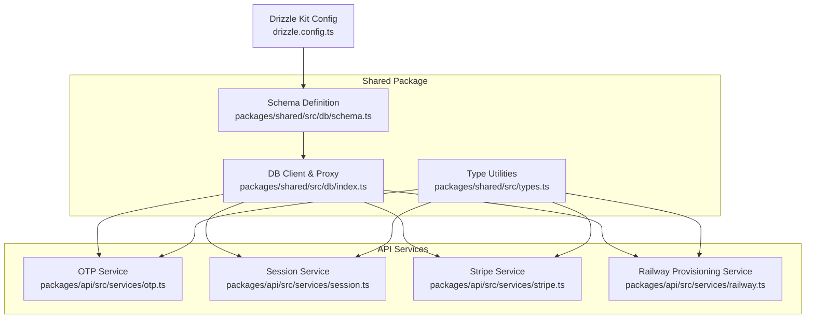
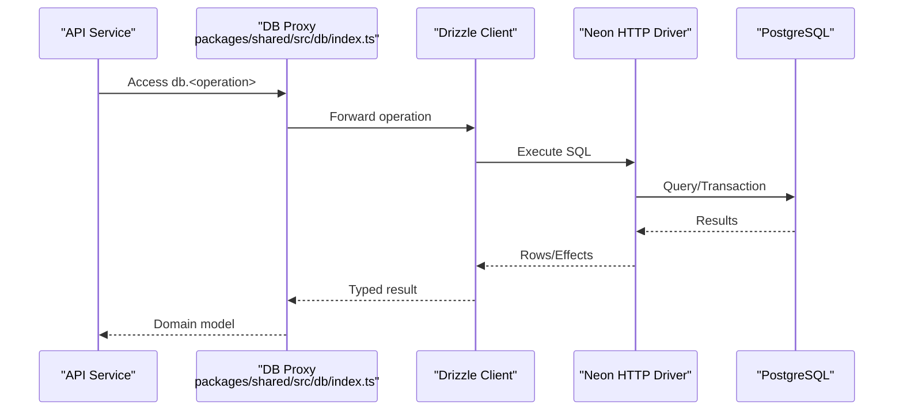
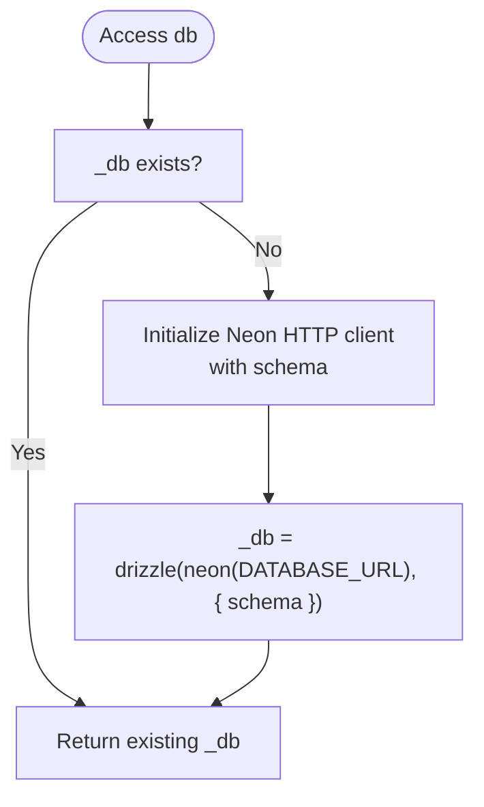
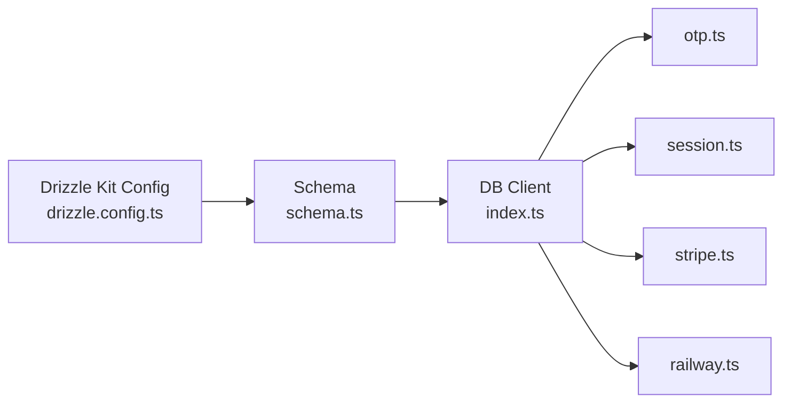

# Database Abstraction

<cite>
**Referenced Files in This Document**
- [drizzle.config.ts](file://drizzle.config.ts)
- [packages/shared/src/db/schema.ts](file://packages/shared/src/db/schema.ts)
- [packages/shared/src/db/index.ts](file://packages/shared/src/db/index.ts)
- [packages/shared/src/types.ts](file://packages/shared/src/types.ts)
- [packages/api/src/services/otp.ts](file://packages/api/src/services/otp.ts)
- [packages/api/src/services/session.ts](file://packages/api/src/services/session.ts)
- [packages/api/src/services/stripe.ts](file://packages/api/src/services/stripe.ts)
- [packages/api/src/services/railway.ts](file://packages/api/src/services/railway.ts)
</cite>

## Table of Contents
1. [Introduction](#introduction)
2. [Project Structure](#project-structure)
3. [Core Components](#core-components)
4. [Architecture Overview](#architecture-overview)
5. [Detailed Component Analysis](#detailed-component-analysis)
6. [Dependency Analysis](#dependency-analysis)
7. [Performance Considerations](#performance-considerations)
8. [Troubleshooting Guide](#troubleshooting-guide)
9. [Conclusion](#conclusion)
10. [Appendices](#appendices)

## Introduction
This document describes the database abstraction built with Drizzle ORM in the SparkClaw monorepo. It covers the schema definitions for users, otpCodes, sessions, subscriptions, and instances; initialization and connection management; query patterns and relationships; migration and schema evolution; and practical usage across services. Guidance is included for extending models, adding new tables, and maintaining consistency across the monorepo.

## Project Structure
The database layer is centralized under the shared package and consumed by API services. Drizzle Kit is configured to generate PostgreSQL migrations from a single schema definition file. The shared package exports both the schema and a lazily initialized database client.

**Diagram sources**
- [drizzle.config.ts](file://drizzle.config.ts#L1-L12)
- [packages/shared/src/db/schema.ts](file://packages/shared/src/db/schema.ts#L1-L146)
- [packages/shared/src/db/index.ts](file://packages/shared/src/db/index.ts#L1-L26)
- [packages/shared/src/types.ts](file://packages/shared/src/types.ts#L1-L57)
- [packages/api/src/services/otp.ts](file://packages/api/src/services/otp.ts#L1-L59)
- [packages/api/src/services/session.ts](file://packages/api/src/services/session.ts#L1-L43)
- [packages/api/src/services/stripe.ts](file://packages/api/src/services/stripe.ts#L1-L107)
- [packages/api/src/services/railway.ts](file://packages/api/src/services/railway.ts#L1-L477)

**Section sources**
- [drizzle.config.ts](file://drizzle.config.ts#L1-L12)
- [packages/shared/src/db/schema.ts](file://packages/shared/src/db/schema.ts#L1-L146)
- [packages/shared/src/db/index.ts](file://packages/shared/src/db/index.ts#L1-L26)
- [packages/shared/src/types.ts](file://packages/shared/src/types.ts#L1-L57)

## Core Components
- Schema module defines five tables with primary keys, constraints, indexes, and relations.
- DB client module initializes a singleton Drizzle client using Neon HTTP driver and exposes a proxy for ergonomic access.
- Type utilities derive TypeScript types from schema tables for strong typing of reads and writes.
- Services consume the schema and DB client to implement OTP, session, Stripe, and Railway provisioning flows.

Key responsibilities:
- Schema: Define domain entities, constraints, and indexes.
- DB client: Centralize connection initialization and expose a global proxy.
- Types: Provide select/insert types and domain enums.
- Services: Encapsulate business logic and database operations.

**Section sources**
- [packages/shared/src/db/schema.ts](file://packages/shared/src/db/schema.ts#L1-L146)
- [packages/shared/src/db/index.ts](file://packages/shared/src/db/index.ts#L1-L26)
- [packages/shared/src/types.ts](file://packages/shared/src/types.ts#L1-L57)
- [packages/api/src/services/otp.ts](file://packages/api/src/services/otp.ts#L1-L59)
- [packages/api/src/services/session.ts](file://packages/api/src/services/session.ts#L1-L43)
- [packages/api/src/services/stripe.ts](file://packages/api/src/services/stripe.ts#L1-L107)
- [packages/api/src/services/railway.ts](file://packages/api/src/services/railway.ts#L1-L477)

## Architecture Overview
The runtime architecture connects API services to the database via a shared Drizzle client. Drizzle Kit generates migrations from the schema definition, ensuring consistent schema evolution across environments.

**Diagram sources**
- [packages/shared/src/db/index.ts](file://packages/shared/src/db/index.ts#L1-L26)
- [packages/shared/src/db/schema.ts](file://packages/shared/src/db/schema.ts#L1-L146)

## Detailed Component Analysis

### Schema: users
- Purpose: Stores user identities.
- Fields:
  - id: UUID, primary key, generated randomly.
  - email: Unique, non-null varchar.
  - createdAt/updatedAt: Timestamps with timezone, default now.
- Constraints:
  - Unique constraint on email.
  - Default timestamps on create/update.
- Relations:
  - One-to-many with otpCodes.
  - One-to-many with sessions.
  - One-to-one with subscriptions.
  - One-to-one with instances.

Indexes:
- Implicit primary key index on id.
- Unique index on email.

**Section sources**
- [packages/shared/src/db/schema.ts](file://packages/shared/src/db/schema.ts#L14-L26)

### Schema: otpCodes
- Purpose: Stores hashed OTP codes with expiry and usage tracking.
- Fields:
  - id: UUID, primary key, generated randomly.
  - email: Non-null varchar.
  - codeHash: Non-null varchar (fixed length).
  - expiresAt: Non-null timestamp with timezone.
  - usedAt: Nullable timestamp with timezone.
  - createdAt: Timestamp with timezone, default now.
- Constraints:
  - Default timestamp on creation.
- Indexes:
  - email
  - expiresAt

**Section sources**
- [packages/shared/src/db/schema.ts](file://packages/shared/src/db/schema.ts#L30-L44)

### Schema: sessions
- Purpose: Stores user sessions with tokens and expiry.
- Fields:
  - id: UUID, primary key, generated randomly.
  - userId: Non-null UUID referencing users.id.
  - token: Unique, non-null varchar.
  - expiresAt: Non-null timestamp with timezone.
  - createdAt: Timestamp with timezone, default now.
- Constraints:
  - Unique constraint on token.
  - Foreign key to users.
  - Default timestamp on creation.
- Indexes:
  - token
  - userId

Relations:
- Belongs to users via foreign key.

**Section sources**
- [packages/shared/src/db/schema.ts](file://packages/shared/src/db/schema.ts#L48-L67)

### Schema: subscriptions
- Purpose: Tracks user billing subscriptions.
- Fields:
  - id: UUID, primary key, generated randomly.
  - userId: Unique, non-null UUID referencing users.id.
  - plan: Non-null varchar (plan identifier).
  - stripeCustomerId: Non-null varchar.
  - stripeSubscriptionId: Unique, non-null varchar.
  - status: Non-null varchar (status enum).
  - currentPeriodEnd: Nullable timestamp with timezone.
  - createdAt/updatedAt: Timestamps with timezone, default now.
- Constraints:
  - Unique constraint on userId.
  - Unique constraint on stripeSubscriptionId.
  - Foreign key to users.
  - Default timestamps on create/update.
- Indexes:
  - Unique on userId.
  - Index on stripeCustomerId.
  - Unique on stripeSubscriptionId.

Relations:
- Belongs to users.
- One-to-one with instances.

**Section sources**
- [packages/shared/src/db/schema.ts](file://packages/shared/src/db/schema.ts#L71-L101)

### Schema: instances
- Purpose: Represents user-owned application instances provisioned on external infrastructure.
- Fields:
  - id: UUID, primary key, generated randomly.
  - userId: Non-null UUID referencing users.id.
  - subscriptionId: Unique, non-null UUID referencing subscriptions.id.
  - railwayProjectId: Non-null varchar.
  - railwayServiceId: Optional varchar.
  - customDomain: Optional varchar (user-facing).
  - railwayUrl: Optional text (internal Railway URL).
  - url: Optional text (public URL pointing to custom domain).
  - status: Non-null varchar (instance lifecycle).
  - domainStatus: Optional varchar (DNS/domain provisioning).
  - errorMessage: Optional text.
  - createdAt/updatedAt: Timestamps with timezone, default now.
- Constraints:
  - Unique constraint on subscriptionId.
  - Foreign keys to users and subscriptions.
  - Default timestamps on create/update.
- Indexes:
  - Index on userId.
  - Unique on subscriptionId.
  - Index on status.
  - Unique on customDomain.
  - Index on domainStatus.

Relations:
- Belongs to users and subscriptions.

**Section sources**
- [packages/shared/src/db/schema.ts](file://packages/shared/src/db/schema.ts#L105-L145)

### Database Initialization and Connection Management
- The DB client is initialized lazily on first access.
- Environment variable DATABASE_URL is required.
- Neon HTTP driver is used with the schema namespace.
- A proxy forwards property access to the underlying Drizzle client, enabling ergonomic usage without explicit initialization everywhere.

**Diagram sources**
- [packages/shared/src/db/index.ts](file://packages/shared/src/db/index.ts#L7-L17)

**Section sources**
- [packages/shared/src/db/index.ts](file://packages/shared/src/db/index.ts#L1-L26)

### Relationship Definitions and Joins
- users ↔ otpCodes: one-to-many (via otpCodes.email or foreign key).
- users ↔ sessions: one-to-many (via sessions.userId).
- users ↔ subscriptions: one-to-one (via subscriptions.userId).
- users ↔ instances: one-to-one (via instances.userId).
- sessions → users: many-to-one (via sessions.userId).
- subscriptions → users: many-to-one (via subscriptions.userId).
- instances → users: many-to-one (via instances.userId).
- instances → subscriptions: many-to-one (via instances.subscriptionId).

These relationships are declared using Drizzle relations and foreign keys, enabling typed joins and nested selections in queries.

**Section sources**
- [packages/shared/src/db/schema.ts](file://packages/shared/src/db/schema.ts#L21-L26)
- [packages/shared/src/db/schema.ts](file://packages/shared/src/db/schema.ts#L65-L67)
- [packages/shared/src/db/schema.ts](file://packages/shared/src/db/schema.ts#L98-L101)
- [packages/shared/src/db/schema.ts](file://packages/shared/src/db/schema.ts#L139-L145)

### Migration Strategies and Schema Evolution
- Drizzle Kit configuration points to the schema file and migration output directory.
- PostgreSQL dialect is used.
- Strict and verbose modes are enabled for safety and feedback.
- Migrations are generated from the schema and applied to target databases.

Guidelines:
- Keep schema definitions in a single canonical file.
- Use Drizzle Kit to scaffold new migrations when altering tables.
- Maintain backward compatibility where possible; use nullable fields or defaults for additive changes.
- Review indexes and constraints before applying migrations to production.

**Section sources**
- [drizzle.config.ts](file://drizzle.config.ts#L1-L12)
- [packages/shared/src/db/schema.ts](file://packages/shared/src/db/schema.ts#L1-L146)

### Query Patterns and Examples
Below are representative query patterns used across services. Replace placeholders with actual values and ensure types align with inferred types from the schema.

- OTP creation and verification
  - Create OTP record with email, hashed code, and expiry.
  - Verify OTP by matching email/codeHash, ensuring not used and not expired.
  - Mark OTP as used upon successful verification.
  - Upsert user by email if missing.

- Session management
  - Create session with random token and expiry.
  - Verify session by token and expiry, then load user.
  - Delete session by token.

- Stripe event handling
  - Insert subscription on checkout completion.
  - Update subscription status and period end on updates.
  - Cancel subscription and suspend associated instance on deletion.

- Instance provisioning
  - Insert instance with initial status and domain status.
  - Update instance with internal Railway URL and public URL after deployment.
  - Update status to ready or error based on provisioning outcome.

For precise implementation references, see:
- OTP service: [packages/api/src/services/otp.ts](file://packages/api/src/services/otp.ts#L19-L58)
- Session service: [packages/api/src/services/session.ts](file://packages/api/src/services/session.ts#L13-L42)
- Stripe service: [packages/api/src/services/stripe.ts](file://packages/api/src/services/stripe.ts#L56-L106)
- Railway service: [packages/api/src/services/railway.ts](file://packages/api/src/services/railway.ts#L286-L476)

**Section sources**
- [packages/api/src/services/otp.ts](file://packages/api/src/services/otp.ts#L1-L59)
- [packages/api/src/services/session.ts](file://packages/api/src/services/session.ts#L1-L43)
- [packages/api/src/services/stripe.ts](file://packages/api/src/services/stripe.ts#L1-L107)
- [packages/api/src/services/railway.ts](file://packages/api/src/services/railway.ts#L1-L477)

### Transaction Handling
- The current implementation does not explicitly wrap operations in transactions.
- For multi-step operations (e.g., creating a user and a session, or updating multiple rows atomically), wrap the relevant statements in a transaction block to ensure atomicity.
- Use the Drizzle transaction API to group statements and roll back on failure.

[No sources needed since this section provides general guidance]

### Extending Database Models
Steps to add a new table:
1. Define the table and relations in the schema file.
2. Export the table and relations from the schema module.
3. Import the new table into the DB client module if needed for direct access.
4. Derive types from the new table using the provided type utilities.
5. Add indexes as needed for query performance.
6. Generate and apply migrations via Drizzle Kit.

Guidelines:
- Keep schema centralized in the shared package.
- Use UUID primary keys consistently.
- Prefer nullable fields for optional relationships.
- Add indexes for frequently filtered or joined columns.
- Maintain referential integrity with foreign keys.

**Section sources**
- [packages/shared/src/db/schema.ts](file://packages/shared/src/db/schema.ts#L1-L146)
- [packages/shared/src/db/index.ts](file://packages/shared/src/db/index.ts#L1-L26)
- [packages/shared/src/types.ts](file://packages/shared/src/types.ts#L1-L57)

## Dependency Analysis
The API services depend on the shared DB client and schema. The DB client depends on the schema and Neon HTTP driver. Drizzle Kit depends on the schema for generating migrations.

**Diagram sources**
- [drizzle.config.ts](file://drizzle.config.ts#L1-L12)
- [packages/shared/src/db/schema.ts](file://packages/shared/src/db/schema.ts#L1-L146)
- [packages/shared/src/db/index.ts](file://packages/shared/src/db/index.ts#L1-L26)
- [packages/api/src/services/otp.ts](file://packages/api/src/services/otp.ts#L1-L59)
- [packages/api/src/services/session.ts](file://packages/api/src/services/session.ts#L1-L43)
- [packages/api/src/services/stripe.ts](file://packages/api/src/services/stripe.ts#L1-L107)
- [packages/api/src/services/railway.ts](file://packages/api/src/services/railway.ts#L1-L477)

**Section sources**
- [drizzle.config.ts](file://drizzle.config.ts#L1-L12)
- [packages/shared/src/db/schema.ts](file://packages/shared/src/db/schema.ts#L1-L146)
- [packages/shared/src/db/index.ts](file://packages/shared/src/db/index.ts#L1-L26)
- [packages/api/src/services/otp.ts](file://packages/api/src/services/otp.ts#L1-L59)
- [packages/api/src/services/session.ts](file://packages/api/src/services/session.ts#L1-L43)
- [packages/api/src/services/stripe.ts](file://packages/api/src/services/stripe.ts#L1-L107)
- [packages/api/src/services/railway.ts](file://packages/api/src/services/railway.ts#L1-L477)

## Performance Considerations
- Indexes: Ensure indexes exist on foreign keys and frequently queried columns (e.g., sessions.token, instances.userId, subscriptions.stripeSubscriptionId).
- Queries: Use targeted filters and projections to minimize payload sizes.
- TTLs: Expire OTPs and sessions to reduce maintenance overhead.
- Batch operations: Group inserts/updates when possible to reduce round trips.
- Connection reuse: The lazy-initialized client reuses the same connection pool managed by the Neon driver.

[No sources needed since this section provides general guidance]

## Troubleshooting Guide
Common issues and resolutions:
- Missing DATABASE_URL: The DB client throws an error if the environment variable is not set. Ensure it is configured in your runtime environment.
- Migration conflicts: Regenerate migrations from the schema and reapply carefully. Validate schema diffs before applying to production.
- Constraint violations: Check unique indexes and foreign keys when inserts fail. Confirm referential integrity before linking records.
- Slow queries: Add indexes on hot filter/join columns and review query plans.

**Section sources**
- [packages/shared/src/db/index.ts](file://packages/shared/src/db/index.ts#L9-L12)
- [packages/shared/src/db/schema.ts](file://packages/shared/src/db/schema.ts#L40-L44)
- [packages/shared/src/db/schema.ts](file://packages/shared/src/db/schema.ts#L59-L63)
- [packages/shared/src/db/schema.ts](file://packages/shared/src/db/schema.ts#L89-L96)
- [packages/shared/src/db/schema.ts](file://packages/shared/src/db/schema.ts#L130-L137)

## Conclusion
The database abstraction leverages a centralized schema, a lazily initialized Drizzle client, and typed utilities to provide a robust foundation for the monorepo. By following the documented patterns for schema evolution, query design, and service integration, teams can extend the model safely and maintain consistency across environments.

## Appendices

### Strongly-Typed Models and Enums
- Select types derived from schema tables enable compile-time safety for reads.
- Insert types enforce write shapes aligned with the schema.
- Domain enums (Plan, SubscriptionStatus, InstanceStatus, DomainStatus) standardize values across services.

**Section sources**
- [packages/shared/src/types.ts](file://packages/shared/src/types.ts#L10-L31)