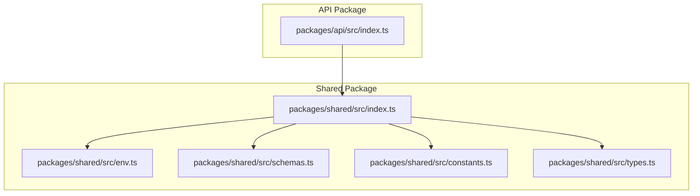
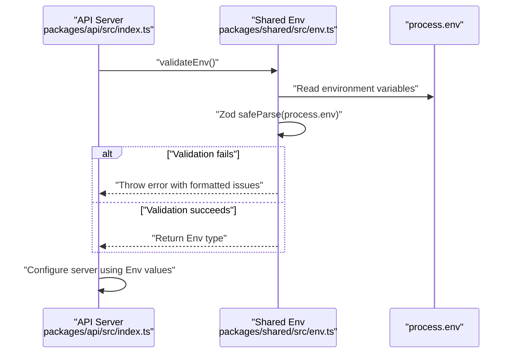
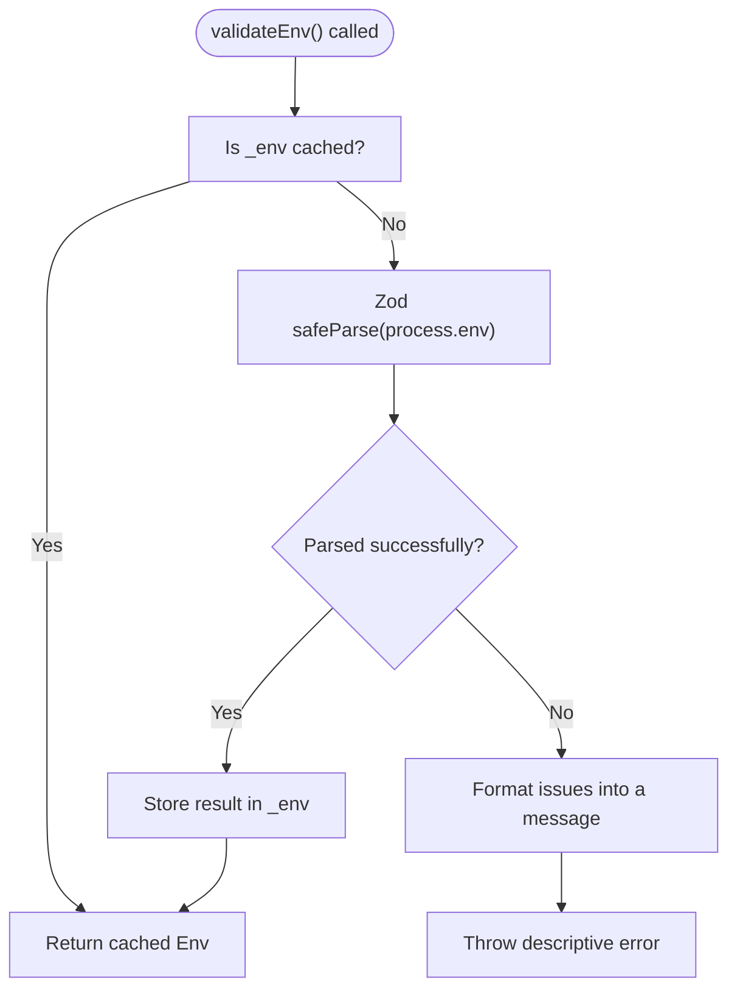
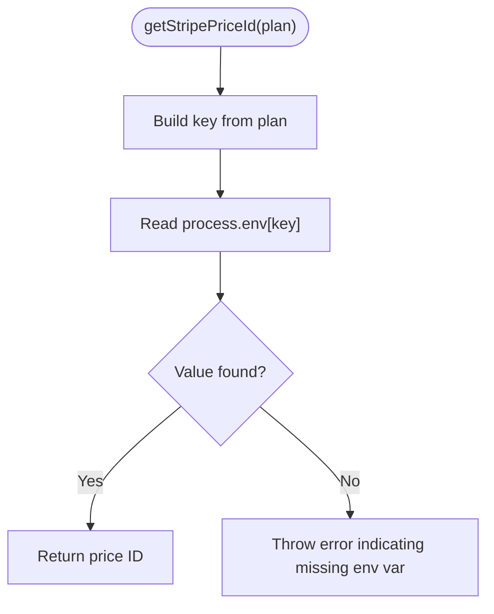
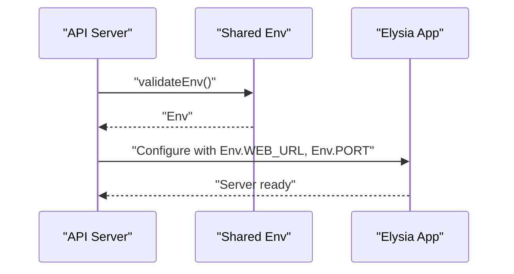
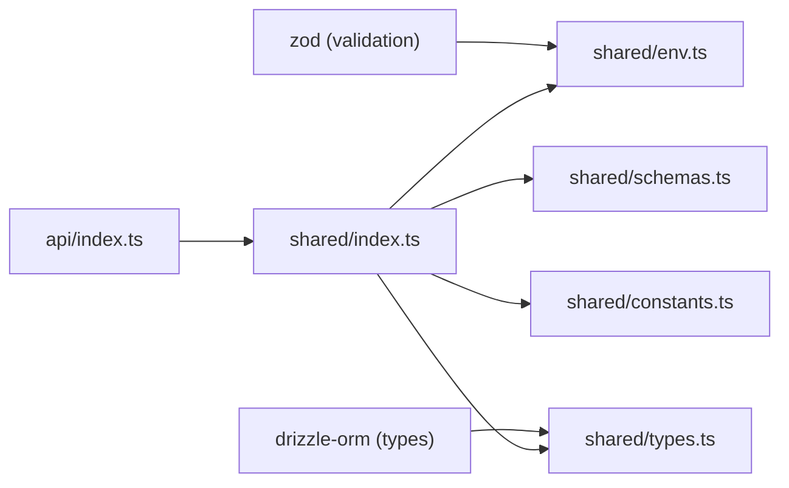

# Environment Configuration

<cite>
**Referenced Files in This Document**
- [env.ts](file://packages/shared/src/env.ts)
- [index.ts](file://packages/shared/src/index.ts)
- [schemas.ts](file://packages/shared/src/schemas.ts)
- [constants.ts](file://packages/shared/src/constants.ts)
- [types.ts](file://packages/shared/src/types.ts)
- [index.ts](file://packages/api/src/index.ts)
- [2026-03-07-quality-10-plan.md](file://docs/plans/2026-03-07-quality-10-plan.md)
</cite>

## Table of Contents
1. [Introduction](#introduction)
2. [Project Structure](#project-structure)
3. [Core Components](#core-components)
4. [Architecture Overview](#architecture-overview)
5. [Detailed Component Analysis](#detailed-component-analysis)
6. [Dependency Analysis](#dependency-analysis)
7. [Performance Considerations](#performance-considerations)
8. [Security Considerations](#security-considerations)
9. [Troubleshooting Guide](#troubleshooting-guide)
10. [Conclusion](#conclusion)

## Introduction
This document explains the environment variable validation and configuration management implemented in the shared package. It covers the Zod-based validation schema, defaults, type safety, runtime loading, and error handling. It also documents how to access validated configuration from other packages (web and api), outlines security considerations for sensitive variables, and provides troubleshooting guidance for common configuration issues.

## Project Structure
The environment configuration lives in the shared package and is consumed by other packages such as the API server. The shared package exports environment helpers and related utilities.

**Diagram sources**
- [index.ts](file://packages/shared/src/index.ts#L1-L5)
- [env.ts](file://packages/shared/src/env.ts#L1-L45)
- [schemas.ts](file://packages/shared/src/schemas.ts#L1-L26)
- [constants.ts](file://packages/shared/src/constants.ts#L1-L28)
- [types.ts](file://packages/shared/src/types.ts#L1-L57)
- [index.ts](file://packages/api/src/index.ts#L1-L25)

**Section sources**
- [index.ts](file://packages/shared/src/index.ts#L1-L5)
- [env.ts](file://packages/shared/src/env.ts#L1-L45)
- [index.ts](file://packages/api/src/index.ts#L1-L25)

## Core Components
- Zod-based environment schema with strict validation rules and defaults
- Runtime loader that validates and caches environment variables
- Type-safe getters for validated configuration
- Helpers for Stripe price ID resolution using environment variables
- Optional telemetry keys for observability

Key validation rules and defaults:
- DATABASE_URL: string URL (required)
- STRIPE_SECRET_KEY: string starting with a specific prefix (required)
- STRIPE_WEBHOOK_SECRET: string starting with a specific prefix (required)
- STRIPE_PRICE_STARTER, STRIPE_PRICE_PRO, STRIPE_PRICE_SCALE: string starting with a specific prefix (required)
- RAILWAY_API_TOKEN: non-empty string (required)
- RAILWAY_PROJECT_ID: non-empty string (required)
- RESEND_API_KEY: string starting with a specific prefix (required)
- SESSION_SECRET: minimum 32-character string (required)
- WEB_URL: string URL with default value (development-friendly)
- PORT: numeric coercion with default value
- NODE_ENV: enum with default value
- SENTRY_DSN: optional string
- POSTHOG_API_KEY: optional string
- CUSTOM_DOMAIN_ROOT: minimum-length string with default value
- REDIS_URL: optional URL string

Type safety guarantees:
- Env type inferred from the Zod schema ensures compile-time and runtime type checks
- Accessor functions enforce initialization order and prevent undefined access

**Section sources**
- [env.ts](file://packages/shared/src/env.ts#L3-L22)
- [env.ts](file://packages/shared/src/env.ts#L24-L44)

## Architecture Overview
The environment validation runs at application startup. The API package demonstrates the recommended pattern: import the validator, call it immediately, and use the validated values to configure the server.

**Diagram sources**
- [index.ts](file://packages/api/src/index.ts#L9-L20)
- [env.ts](file://packages/shared/src/env.ts#L28-L39)

## Detailed Component Analysis

### Environment Schema and Loader
The environment schema defines required and optional variables, applies validation rules, and sets defaults. The loader enforces initialization order and throws a descriptive error if validation fails.

**Diagram sources**
- [env.ts](file://packages/shared/src/env.ts#L28-L39)

Access patterns:
- Import and call the validator at startup to ensure environment readiness
- Use the getter to access validated values safely after initialization

**Section sources**
- [env.ts](file://packages/shared/src/env.ts#L28-L44)

### Stripe Price ID Resolution
The shared package exposes a helper to resolve Stripe price IDs from environment variables. It constructs the expected environment variable name from the selected plan and reads it from process.env, throwing if missing.

**Diagram sources**
- [constants.ts](file://packages/shared/src/constants.ts#L3-L8)

Usage example locations:
- The helper is exported via the shared package index and can be imported by other packages
- It is intended for use in contexts where plan-specific Stripe prices are needed

**Section sources**
- [constants.ts](file://packages/shared/src/constants.ts#L3-L8)
- [index.ts](file://packages/shared/src/index.ts#L1-L5)

### Accessing Validated Configuration in Other Packages
The API package demonstrates the recommended usage:
- Import the environment validator from the shared package
- Call the validator at startup to initialize and validate environment
- Use the validated values to configure application behavior (e.g., CORS origin, port)

**Diagram sources**
- [index.ts](file://packages/api/src/index.ts#L9-L20)
- [env.ts](file://packages/shared/src/env.ts#L28-L39)

**Section sources**
- [index.ts](file://packages/api/src/index.ts#L9-L20)

## Dependency Analysis
The shared package depends on Zod for schema validation and Drizzle ORM for database-related types. The API package depends on the shared package for environment validation and configuration.

**Diagram sources**
- [env.ts](file://packages/shared/src/env.ts#L1-L1)
- [types.ts](file://packages/shared/src/types.ts#L1-L1)
- [index.ts](file://packages/shared/src/index.ts#L1-L5)
- [index.ts](file://packages/api/src/index.ts#L1-L2)

**Section sources**
- [env.ts](file://packages/shared/src/env.ts#L1-L1)
- [types.ts](file://packages/shared/src/types.ts#L1-L1)
- [index.ts](file://packages/shared/src/index.ts#L1-L5)
- [index.ts](file://packages/api/src/index.ts#L1-L2)

## Performance Considerations
- Validation occurs once at startup and is cached, minimizing overhead during runtime
- Using coercion for numeric values avoids repeated parsing
- Optional variables reduce unnecessary validation costs when telemetry is disabled

## Security Considerations
- Sensitive keys (e.g., secret keys, API tokens) are validated but not redacted in logs; avoid logging raw Env objects
- Prefer short-lived secrets and rotate regularly
- Restrict access to environment files and CI/CD secrets
- Use separate keys for development, staging, and production
- Avoid embedding secrets in client-side code; keep them server-side

## Troubleshooting Guide
Common issues and resolutions:
- Missing required variables: The loader throws a descriptive error listing missing or invalid fields. Ensure all required variables are set before starting the application.
- Invalid types or formats: Variables must match the schema rules (e.g., URLs, prefixes, enums). Fix the environment values to satisfy the schema.
- Accessing Env before validation: Calling the getter without prior validation raises an error. Always call the validator at startup.
- Stripe price ID not found: The helper throws if the expected environment variable is missing. Ensure the correct variable for the selected plan is configured.

Validation and testing references:
- The environment validation behavior is documented in the project plan’s environment validation steps
- Unit tests for environment validation are planned and described in the quality plan

**Section sources**
- [env.ts](file://packages/shared/src/env.ts#L31-L36)
- [env.ts](file://packages/shared/src/env.ts#L42-L43)
- [constants.ts](file://packages/shared/src/constants.ts#L5-L7)
- [2026-03-07-quality-10-plan.md](file://docs/plans/2026-03-07-quality-10-plan.md#L22-L79)
- [2026-03-07-quality-10-plan.md](file://docs/plans/2026-03-07-quality-10-plan.md#L1091-L1131)

## Conclusion
The shared package provides a robust, type-safe environment configuration system powered by Zod. It enforces validation at startup, caches results, and exposes helpers for plan-specific configuration. Following the recommended usage pattern in consuming packages ensures reliable and secure runtime behavior across development, staging, and production environments.