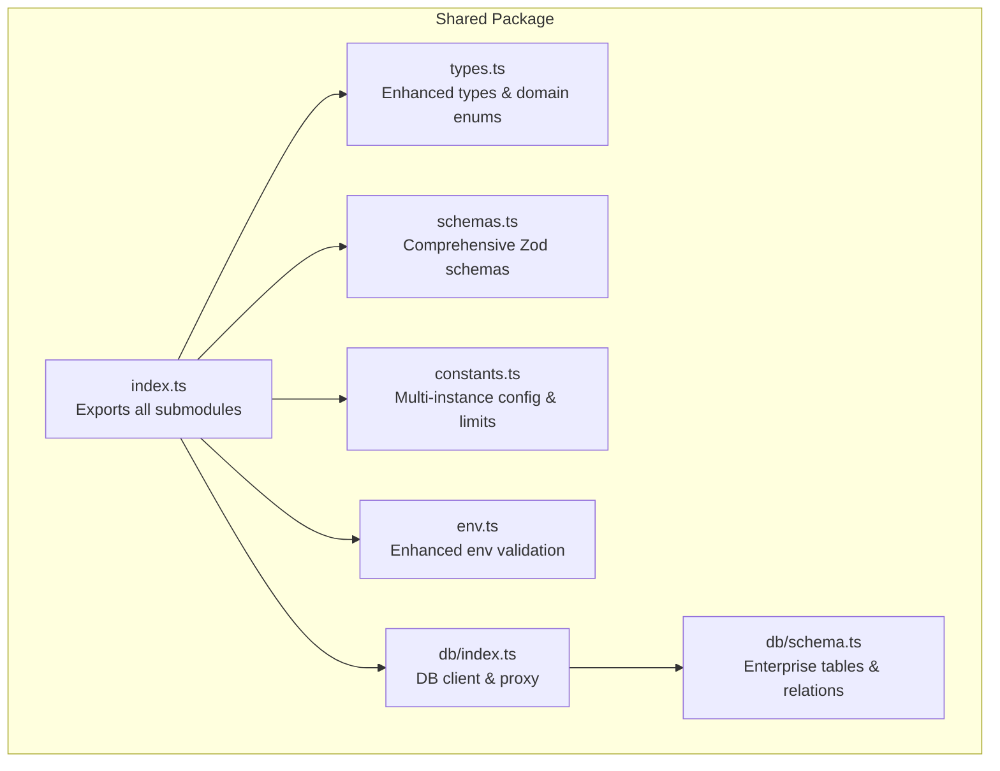
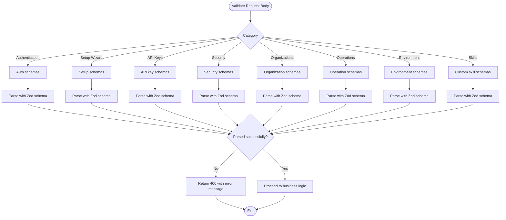
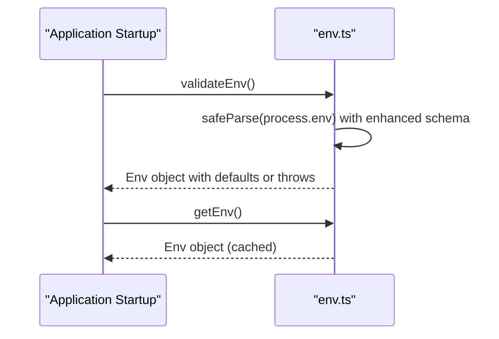
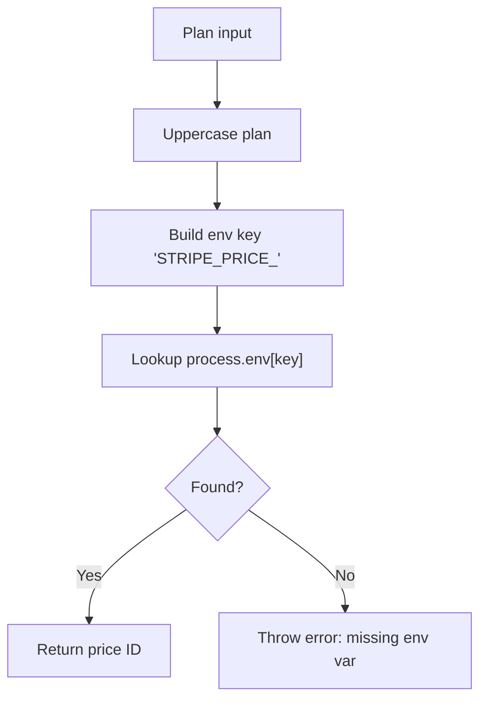
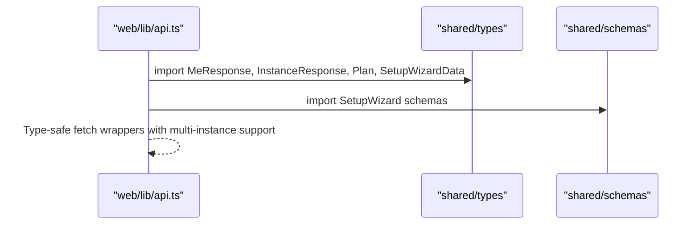
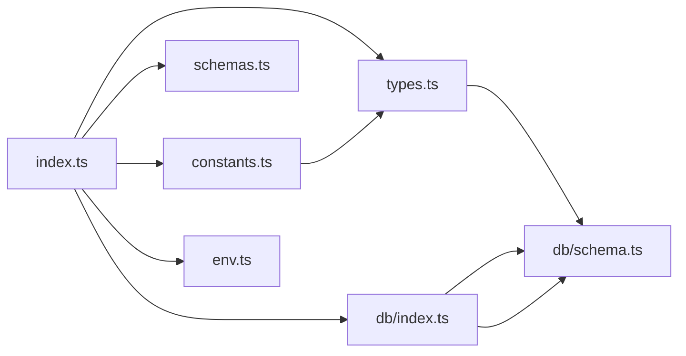

# Shared Package (Shared)

<cite>
**Referenced Files in This Document**
- [index.ts](file://packages/shared/src/index.ts)
- [types.ts](file://packages/shared/src/types.ts)
- [schemas.ts](file://packages/shared/src/schemas.ts)
- [constants.ts](file://packages/shared/src/constants.ts)
- [env.ts](file://packages/shared/src/env.ts)
- [schema.ts](file://packages/shared/src/db/schema.ts)
- [index.ts](file://packages/shared/src/db/index.ts)
- [package.json](file://packages/shared/package.json)
- [schemas.test.ts](file://packages/shared/src/__tests__/schemas.test.ts)
- [env.test.ts](file://packages/shared/src/__tests__/env.test.ts)
- [otp.ts](file://packages/api/src/services/otp.ts)
- [auth.ts](file://packages/api/src/routes/auth.ts)
- [api.ts](file://packages/web/src/lib/api.ts)
</cite>

## Update Summary
**Changes Made**
- Expanded database schema to support multi-instance architecture with new tables for organizations, API keys, audit logs, and advanced features
- Enhanced type system with new domain types for organizations, API keys, audit logs, usage tracking, and custom skills
- Added comprehensive validation schemas for setup wizard, API key management, TOTP authentication, and enterprise features
- Extended constants with plan instance limits and configuration values for multi-instance support
- Enhanced environment validation with observability and platform integration support
- Updated database relationships to support complex multi-instance workflows

## Table of Contents
1. [Introduction](#introduction)
2. [Project Structure](#project-structure)
3. [Core Components](#core-components)
4. [Architecture Overview](#architecture-overview)
5. [Detailed Component Analysis](#detailed-component-analysis)
6. [Dependency Analysis](#dependency-analysis)
7. [Performance Considerations](#performance-considerations)
8. [Troubleshooting Guide](#troubleshooting-guide)
9. [Conclusion](#conclusion)
10. [Appendices](#appendices)

## Introduction
This document describes the Shared package that centralizes common utilities, types, validation schemas, constants, environment configuration, and database abstractions used across the monorepo. The package now supports a comprehensive multi-instance architecture with advanced enterprise features including organizations, API key management, audit logging, usage tracking, and custom skill development.

Key enhancements include:
- Multi-instance architecture with instance-level configuration and resource management
- Enterprise-grade features including organizations, API keys, and audit trails
- Advanced operational capabilities with scheduled jobs, environment variables, and custom skills
- Comprehensive observability and monitoring integration
- Enhanced security features including TOTP and BYOK (Bring Your Own Key) support

## Project Structure
The Shared package exports multiple submodules for granular consumption with enhanced support for multi-instance architecture:
- Types and domain interfaces with comprehensive entity definitions
- Validation schemas for API contracts and enterprise features
- Constants and configuration values for multi-instance limits and operations
- Environment validation helpers with observability support
- Database schema with extensive table relationships for enterprise workflows



**Diagram sources**
- [index.ts](file://packages/shared/src/index.ts#L1-L5)
- [types.ts](file://packages/shared/src/types.ts#L1-L311)
- [schemas.ts](file://packages/shared/src/schemas.ts#L1-L214)
- [constants.ts](file://packages/shared/src/constants.ts#L1-L34)
- [env.ts](file://packages/shared/src/env.ts#L1-L57)
- [schema.ts](file://packages/shared/src/db/schema.ts#L1-L527)
- [index.ts](file://packages/shared/src/db/index.ts#L1-L26)

**Section sources**
- [index.ts](file://packages/shared/src/index.ts#L1-L5)
- [package.json](file://packages/shared/package.json#L6-L16)

## Core Components
- **Enhanced Types and domain enums**: Strongly typed entity interfaces including new organization, API key, audit log, usage record, scheduled job, environment variable, and custom skill types with comprehensive domain enums for enterprise features.
- **Comprehensive Zod schemas**: Validation schemas for setup wizard, API key management, TOTP authentication, LLM key management, organization operations, scheduled jobs, environment variables, and custom skills.
- **Multi-instance constants**: Configuration values for plan instance limits, polling intervals, provisioning retries, and operational thresholds.
- **Enhanced environment validation**: Strict schema-based validation with observability support including Sentry, PostHog, Langfuse, and BetterStack integrations.
- **Enterprise database**: Drizzle ORM Postgres schema with extensive table relationships supporting complex multi-instance workflows.

**Section sources**
- [types.ts](file://packages/shared/src/types.ts#L1-L311)
- [schemas.ts](file://packages/shared/src/schemas.ts#L1-L214)
- [constants.ts](file://packages/shared/src/constants.ts#L1-L34)
- [env.ts](file://packages/shared/src/env.ts#L1-L57)
- [schema.ts](file://packages/shared/src/db/schema.ts#L1-L527)
- [index.ts](file://packages/shared/src/db/index.ts#L1-L26)

## Architecture Overview
The Shared package acts as a comprehensive foundation for multi-instance applications with enterprise-grade features. API routes import schemas and constants from Shared to validate requests and enforce policies. Services use Shared constants and database schema to implement business logic including organization management, API key operations, and advanced instance configurations. Web clients import response types and plan enums to render UI consistently across multiple instances.

```mermaid
graph TB
subgraph "Web Client"
WEBAPI["web/lib/api.ts<br/>Typed fetch wrappers"]
end
subgraph "API Server"
ROUTES["api/routes/auth.ts<br/>Route handlers"]
OTPSRV["api/services/otp.ts<br/>OTP & user ops"]
ORGOPS["api/services/org.ts<br/>Organization management"]
APIOPS["api/services/api-keys.ts<br/>API key operations"]
end
subgraph "Shared"
SCH["schemas.ts<br/>Comprehensive validation"]
CON["constants.ts<br/>Multi-instance limits"]
DBIDX["db/index.ts<br/>DB client"]
DBSCHEMA["db/schema.ts<br/>Enterprise tables"]
END
WEBAPI --> |"imports types & plan enums"| SCH
ROUTES --> |"imports schemas & constants"| SCH
ROUTES --> |"imports constants"| CON
OTPSRV --> |"imports db & constants"| DBIDX
OTPSRV --> |"imports schema types"| DBSCHEMA
ORGOPS --> |"imports org schemas & types"| SCH
ORGOPS --> |"imports org relations"| DBSCHEMA
APIOPS --> |"imports api key schemas"| SCH
APIOPS --> |"imports api key relations"| DBSCHEMA
ROUTES --> |"imports db & relations"| DBIDX
ROUTES --> |"imports relations"| DBSCHEMA
```

**Diagram sources**
- [api.ts](file://packages/web/src/lib/api.ts#L1-L52)
- [auth.ts](file://packages/api/src/routes/auth.ts#L1-L80)
- [otp.ts](file://packages/api/src/services/otp.ts#L1-L59)
- [schemas.ts](file://packages/shared/src/schemas.ts#L1-L214)
- [constants.ts](file://packages/shared/src/constants.ts#L1-L34)
- [schema.ts](file://packages/shared/src/db/schema.ts#L1-L527)
- [index.ts](file://packages/shared/src/db/index.ts#L1-L26)

## Detailed Component Analysis

### Enhanced Type System and Interfaces
The type system has been significantly expanded to support multi-instance architecture and enterprise features:

- **Core Entities**: User, Subscription, Instance, Session, OTPCode remain with enhanced relationships
- **Enterprise Entities**: Organization, OrgMember, OrgInvite for team collaboration
- **Security Entities**: ApiKey, AuditLog, TotpSecret for access control and compliance
- **Advanced Features**: UsageRecord, ScheduledJob, EnvVar, CustomSkill for operational management
- **Setup Wizard**: ChannelConfigRecord, SetupWizardData, SetupWizardState for instance configuration
- **Domain Enums**: Enhanced with new types for API key scopes, usage types, scheduled task types, skill languages, and instance actions

```mermaid
classDiagram
class User {
+string id
+string email
+UserRole role
+datetime createdAt
+datetime updatedAt
}
class Organization {
+string id
+string name
+string slug
+string ownerId
+datetime createdAt
+datetime updatedAt
}
class OrgMember {
+string id
+string orgId
+string userId
+OrgRole role
+datetime createdAt
}
class OrgInvite {
+string id
+string orgId
+string email
+OrgRole role
+string token
+string invitedBy
+datetime expiresAt
+datetime acceptedAt
+datetime createdAt
}
class ApiKey {
+string id
+string userId
+string name
+string keyPrefix
+ApiKeyScope[] scopes
+datetime lastUsedAt
+datetime expiresAt
+datetime createdAt
}
class AuditLog {
+string id
+string userId
+string instanceId
+string action
+Record metadata
+string ip
+datetime createdAt
}
class UsageRecord {
+string id
+string userId
+string instanceId
+UsageType type
+number quantity
+string period
+Record metadata
+datetime createdAt
}
class ScheduledJob {
+string id
+string instanceId
+string name
+string cronExpression
+ScheduledTaskType taskType
+Record config
+boolean enabled
+datetime lastRunAt
+datetime nextRunAt
+datetime createdAt
+datetime updatedAt
}
class EnvVar {
+string id
+string instanceId
+string key
+string encryptedValue
+boolean isSecret
+datetime createdAt
+datetime updatedAt
}
class CustomSkill {
+string id
+string instanceId
+string name
+string description
+SkillLanguage language
+string code
+boolean enabled
+SkillTriggerType triggerType
+string triggerValue
+number timeout
+datetime lastRunAt
+SkillRunStatus lastRunStatus
+string lastRunOutput
+datetime createdAt
+datetime updatedAt
}
User ||--o{ Organization : "owns"
User ||--o{ OrgMember : "memberships"
User ||--o{ OrgInvite : "invitations"
User ||--o{ ApiKey : "creates"
User ||--o{ AuditLog : "performs actions"
User ||--o{ UsageRecord : "consumes resources"
User ||--o{ CustomSkill : "develops"
Organization ||--o{ OrgMember : "has members"
Organization ||--o{ OrgInvite : "invites"
OrgMember }|--|| User : "belongs to"
OrgMember }|--|| Organization : "belongs to"
OrgInvite }|--|| User : "invited by"
OrgInvite }|--|| Organization : "invites"
ApiKey }|--|| User : "created by"
AuditLog }|--|| User : "performed by"
AuditLog }|--|| Instance : "affects"
UsageRecord }|--|| User : "consumed by"
UsageRecord }|--|| Instance : "consumed on"
ScheduledJob }|--|| Instance : "runs on"
EnvVar }|--|| Instance : "configured for"
CustomSkill }|--|| Instance : "executed on"
```

**Diagram sources**
- [types.ts](file://packages/shared/src/types.ts#L24-L311)
- [schema.ts](file://packages/shared/src/db/schema.ts#L19-L527)

**Section sources**
- [types.ts](file://packages/shared/src/types.ts#L24-L311)
- [schema.ts](file://packages/shared/src/db/schema.ts#L19-L527)

### Comprehensive Zod Validation Schemas
The validation system has been expanded to support enterprise features and multi-instance operations:

- **Basic Authentication**: emailSchema, otpCodeSchema, planSchema, sendOtpSchema, verifyOtpSchema, createCheckoutSchema
- **Setup Wizard**: channelTypeSchema, aiModelSchema, botPersonaSchema, languageSchema, featureFlagsSchema, aiConfigSchema, channelConfigSchema, saveSetupSchema, saveChannelCredentialsSchema
- **API Key Management**: apiKeyScopeSchema, createApiKeySchema
- **Security**: verifyTotpSchema, llmProviderSchema, createLlmKeySchema
- **Organization Operations**: orgRoleSchema, createOrgSchema, inviteOrgMemberSchema, updateOrgMemberRoleSchema
- **Advanced Operations**: scheduledTaskTypeSchema, createScheduledJobSchema, updateScheduledJobSchema
- **Environment Management**: createEnvVarSchema, updateEnvVarSchema
- **Custom Skills**: skillLanguageSchema, skillTriggerTypeSchema, createCustomSkillSchema, updateCustomSkillSchema
- **Instance Actions**: instanceActionSchema



**Diagram sources**
- [schemas.ts](file://packages/shared/src/schemas.ts#L1-L214)

**Section sources**
- [schemas.ts](file://packages/shared/src/schemas.ts#L1-L214)
- [schemas.test.ts](file://packages/shared/src/__tests__/schemas.test.ts#L1-L75)

### Enhanced Environment Variable Validation
Environment validation has been expanded to support enterprise observability and platform integrations:

- **Database**: DATABASE_URL for connection management
- **Billing**: STRIPE_SECRET_KEY, STRIPE_WEBHOOK_SECRET, STRIPE_PRICE_* for pricing configuration
- **Platform**: RAILWAY_API_TOKEN, RAILWAY_PROJECT_ID for deployment integration
- **Communication**: RESEND_API_KEY for email notifications
- **Security**: SESSION_SECRET with minimum length requirement
- **Infrastructure**: WEB_URL, PORT, NODE_ENV with sensible defaults
- **Observability**: SENTRY_DSN for error tracking, POSTHOG_* for analytics, LANGFUSE_* for LLM observability, BETTERSTACK_* for log management
- **Custom Domains**: CUSTOM_DOMAIN_ROOT for multi-tenant support
- **Caching**: REDIS_URL for session storage
- **Templates**: OPENCLAW_GITHUB_REPO for template management
- **Monitoring**: PRISM_* for performance monitoring



**Diagram sources**
- [env.ts](file://packages/shared/src/env.ts#L40-L56)

**Section sources**
- [env.ts](file://packages/shared/src/env.ts#L1-L57)
- [env.test.ts](file://packages/shared/src/__tests__/env.test.ts#L1-L123)

### Enhanced Constants and Configuration Values
Constants have been expanded to support multi-instance architecture and enterprise features:

- **Stripe Integration**: getStripePriceId function with plan-based pricing resolution
- **Plan Configuration**: PLANS mapping with human-readable names and monthly prices
- **Security Limits**: OTP_EXPIRY_MS, OTP_SEND_RATE_LIMIT, OTP_VERIFY_RATE_LIMIT with configurable windows
- **Session Management**: SESSION_EXPIRY_MS, SESSION_COOKIE_NAME for authentication persistence
- **Instance Operations**: INSTANCE_POLL_INTERVAL_MS, INSTANCE_POLL_MAX_ATTEMPTS, INSTANCE_PROVISION_MAX_RETRIES for lifecycle management
- **Multi-instance Limits**: PLAN_INSTANCE_LIMITS mapping with per-plan instance quotas
- **Feature Flags**: Default configurations for advanced capabilities like voice messages, code execution, and media generation



**Diagram sources**
- [constants.ts](file://packages/shared/src/constants.ts#L3-L8)

**Section sources**
- [constants.ts](file://packages/shared/src/constants.ts#L1-L34)

### Enterprise Database Abstraction Layer (Drizzle ORM)
The database schema has been significantly expanded to support multi-instance architecture and enterprise features:

- **Core Tables**: users, otpCodes, sessions, subscriptions, instances with enhanced relationships
- **Organization Tables**: organizations, orgMembers, orgInvites for team collaboration
- **Security Tables**: apiKeys, auditLogs, totpSecrets for access control and compliance
- **Advanced Tables**: usageRecords, scheduledJobs, envVars, customSkills for operational management
- **Integration Tables**: channelConfigs, llmKeys for platform integrations
- **Enhanced Relationships**: Complex relationships supporting multi-instance workflows and enterprise governance
- **Database Client**: Lazy initialization with Neon HTTP driver and comprehensive table proxy

```mermaid
erDiagram
USERS {
uuid id PK
string email UK
string role
timestamp created_at
timestamp updated_at
}
ORGANIZATIONS {
uuid id PK
string name
string slug UK
uuid owner_id FK
timestamp created_at
timestamp updated_at
}
ORG_MEMBERS {
uuid id PK
uuid org_id FK
uuid user_id FK UK
string role
timestamp created_at
}
ORG_INVITES {
uuid id PK
uuid org_id FK
string email
string role
string token UK
uuid invited_by FK
timestamp expires_at
timestamp accepted_at
timestamp created_at
}
API_KEYS {
uuid id PK
uuid user_id FK
string name
string key_hash UK
string key_prefix
json scopes
timestamp last_used_at
timestamp expires_at
timestamp created_at
}
AUDIT_LOGS {
uuid id PK
uuid user_id FK
uuid instance_id FK
string action
json metadata
string ip
timestamp created_at
}
USAGE_RECORDS {
uuid id PK
uuid user_id FK
uuid instance_id FK
string type
integer quantity
string period
json metadata
timestamp created_at
}
SCHEDULED_JOBS {
uuid id PK
uuid instance_id FK
string name
string cron_expression
string task_type
json config
boolean enabled
timestamp last_run_at
timestamp next_run_at
timestamp created_at
timestamp updated_at
}
ENV_VARS {
uuid id PK
uuid instance_id FK
string key UK
text encrypted_value
boolean is_secret
timestamp created_at
timestamp updated_at
}
CUSTOM_SKILLS {
uuid id PK
uuid instance_id FK
string name UK
text description
string language
text code
boolean enabled
string trigger_type
string trigger_value
integer timeout
timestamp last_run_at
string last_run_status
text last_run_output
timestamp created_at
timestamp updated_at
}
USERS ||--o{ ORGANIZATIONS : "owns"
USERS ||--o{ ORG_MEMBERS : "joins"
USERS ||--o{ ORG_INVITES : "invites"
USERS ||--o{ API_KEYS : "creates"
USERS ||--o{ AUDIT_LOGS : "performs actions"
USERS ||--o{ USAGE_RECORDS : "consumes resources"
USERS ||--o{ CUSTOM_SKILLS : "develops"
ORGANIZATIONS ||--o{ ORG_MEMBERS : "has"
ORGANIZATIONS ||--o{ ORG_INVITES : "issues"
ORG_MEMBERS }|--|| USERS : "member"
ORG_MEMBERS }|--|| ORGANIZATIONS : "organization"
ORG_INVITES }|--|| USERS : "inviter"
ORG_INVITES }|--|| ORGANIZATIONS : "organization"
API_KEYS }|--|| USERS : "created by"
AUDIT_LOGS }|--|| USERS : "performed by"
AUDIT_LOGS }|--|| INSTANCES : "affects"
USAGE_RECORDS }|--|| USERS : "consumed by"
USAGE_RECORDS }|--|| INSTANCES : "consumed on"
SCHEDULED_JOBS }|--|| INSTANCES : "runs on"
ENV_VARS }|--|| INSTANCES : "configured for"
CUSTOM_SKILLS }|--|| INSTANCES : "executed on"
```

**Diagram sources**
- [schema.ts](file://packages/shared/src/db/schema.ts#L19-L527)

**Section sources**
- [schema.ts](file://packages/shared/src/db/schema.ts#L1-L527)
- [index.ts](file://packages/shared/src/db/index.ts#L1-L26)

### Import Conventions and Usage Patterns
Import patterns have been enhanced to support enterprise workflows:

- **Web Package**: Imports response types, plan enums, and setup wizard data for multi-instance UI rendering
- **API Routes**: Import comprehensive schemas and constants for validation and policy enforcement
- **API Services**: Import database schema, constants, and enterprise features for business logic implementation
- **Organization Services**: Import organization schemas and types for team management operations
- **API Key Services**: Import API key schemas and relations for access control implementation



**Diagram sources**
- [api.ts](file://packages/web/src/lib/api.ts#L1-L52)

**Section sources**
- [api.ts](file://packages/web/src/lib/api.ts#L1-L52)
- [auth.ts](file://packages/api/src/routes/auth.ts#L1-L80)
- [otp.ts](file://packages/api/src/services/otp.ts#L1-L59)

## Dependency Analysis
- **Internal Dependencies**:
  - types.ts depends on db/schema.ts for comprehensive Drizzle model inference
  - db/index.ts depends on db/schema.ts and @neondatabase/serverless/drizzle-orm
  - env.ts depends on zod for enhanced validation schema
  - schemas.ts depends on zod for comprehensive validation coverage
  - constants.ts depends on types.ts for type-safe configurations
  - index.ts re-exports all submodules with enhanced exports
- **External Dependencies**:
  - drizzle-orm, postgres, zod for database operations and validation
  - Enhanced with observability libraries (sentry, posthog, langfuse, betterstack)



**Diagram sources**
- [index.ts](file://packages/shared/src/index.ts#L1-L5)
- [types.ts](file://packages/shared/src/types.ts#L1-L20)
- [schema.ts](file://packages/shared/src/db/schema.ts#L1-L14)
- [index.ts](file://packages/shared/src/db/index.ts#L1-L3)

**Section sources**
- [package.json](file://packages/shared/package.json#L17-L25)

## Performance Considerations
- **Multi-instance Optimization**: Database indexes exist on frequently queried columns across all new tables (e.g., organization slugs, API key hashes, usage record periods, scheduled job schedules)
- **Resource Management**: Plan-based instance limits and polling intervals help manage resource consumption across multiple instances
- **Observability Overhead**: Enhanced logging and monitoring provide valuable insights but require careful tuning of sampling rates and retention policies
- **Security Validation**: Comprehensive schema validation adds overhead but ensures data integrity across enterprise deployments
- **Rate Limiting**: Configurable rate limits for OTP, API keys, and other operations prevent abuse while maintaining user experience

## Troubleshooting Guide
- **Environment Validation Errors**: validateEnv throws consolidated errors for missing or invalid enterprise configuration including observability keys, platform integrations, and security settings
- **Multi-instance Issues**: Verify instance limits, polling configurations, and provisioning retries align with plan quotas and resource availability
- **Organization Management**: Check organization membership, invitation tokens, and role assignments for access control issues
- **API Key Operations**: Validate API key scopes, expiration dates, and permissions for service integration problems
- **Database Connectivity**: Ensure DATABASE_URL is set and reachable; the lazy-initialized client will throw if configuration is missing
- **Enterprise Features**: Verify observability integrations (Sentry, PostHog, Langfuse, BetterStack) are properly configured for monitoring and debugging

**Section sources**
- [env.ts](file://packages/shared/src/env.ts#L40-L56)
- [otp.ts](file://packages/api/src/services/otp.ts#L27-L58)
- [index.ts](file://packages/shared/src/db/index.ts#L7-L17)

## Conclusion
The Shared package now provides a comprehensive foundation for multi-instance applications with enterprise-grade features. The expanded type system, validation schemas, and database abstractions support complex workflows including organization management, API key operations, audit logging, usage tracking, and custom skill development. By centralizing contracts and infrastructure, it improves consistency, reduces duplication, and enables scalable multi-instance deployments while maintaining security and compliance standards.

## Appendices

### Extending Types and Adding New Validation Schemas
- **Add new domain entities**: Extend types.ts with new interface definitions and export them via index.ts
- **Define comprehensive schemas**: Add Zod object schemas in schemas.ts with appropriate refinements for enterprise features
- **Update database schema**: Extend db/schema.ts with new table definitions and relationships
- **Export new functionality**: Update index.ts to expose new types, schemas, and database relations
- **Test thoroughly**: Update tests in schemas.test.ts and env.test.ts to cover new validations and configurations

**Section sources**
- [types.ts](file://packages/shared/src/types.ts#L31-L311)
- [schemas.ts](file://packages/shared/src/schemas.ts#L1-L214)
- [schema.ts](file://packages/shared/src/db/schema.ts#L1-L527)
- [index.ts](file://packages/shared/src/index.ts#L1-L5)

### Creating Reusable Utilities
- **Place new utilities under shared/src**: Organize enterprise features, security utilities, and operational tools
- **Export via index.ts**: Make new functionality available through comprehensive exports
- **Maintain backward compatibility**: Ensure new features don't break existing functionality
- **Follow naming conventions**: Use descriptive names that reflect enterprise and multi-instance contexts

**Section sources**
- [index.ts](file://packages/shared/src/index.ts#L1-L5)

### Guidelines for Consistency and Avoiding Circular Dependencies
- **Keep types.ts as dependency anchor**: Avoid importing from other shared modules to prevent cycles
- **Centralize enterprise validation**: Place organization, API key, and security validation in env.ts and dedicated modules
- **Group related functionality**: Organize schemas and constants by feature domains (authentication, enterprise, operations)
- **Use subpath exports**: Leverage enhanced exports in package.json for precise imports (e.g., "./db/schema")
- **Document enterprise features**: Clearly document multi-instance capabilities and security implications
- **Test observability integrations**: Ensure logging, monitoring, and error tracking work seamlessly across all enterprise features

**Section sources**
- [types.ts](file://packages/shared/src/types.ts#L1-L20)
- [env.ts](file://packages/shared/src/env.ts#L40-L56)
- [package.json](file://packages/shared/package.json#L9-L16)