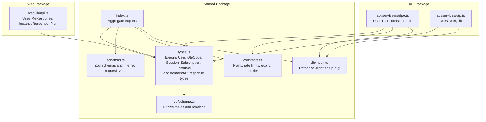
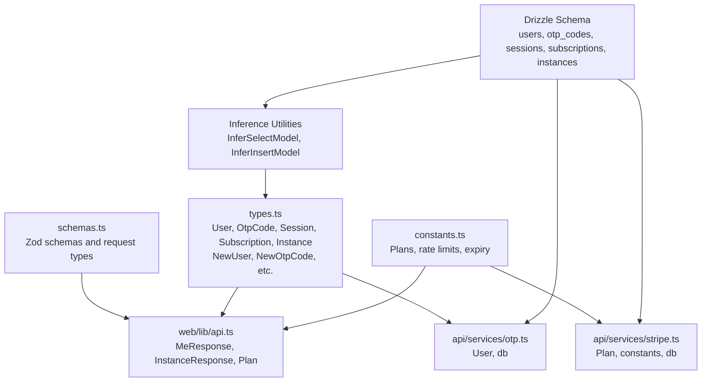
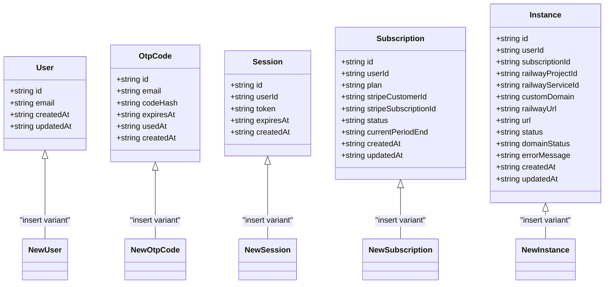
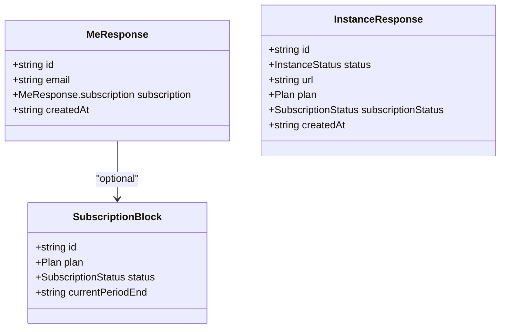
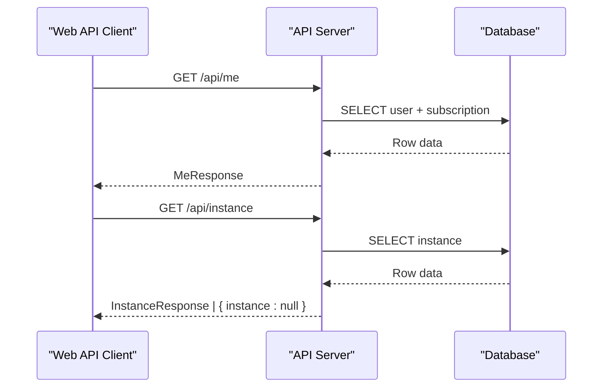
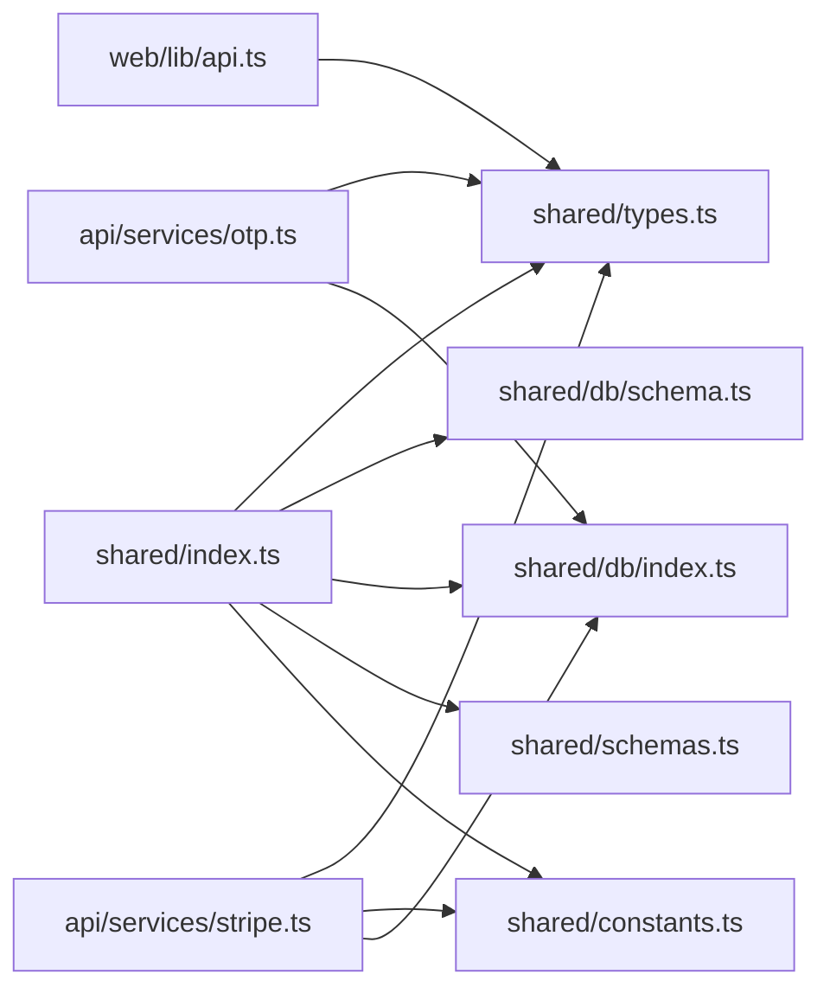

# Types and Interfaces

<cite>
**Referenced Files in This Document**
- [packages/shared/src/types.ts](file://packages/shared/src/types.ts)
- [packages/shared/src/db/schema.ts](file://packages/shared/src/db/schema.ts)
- [packages/shared/src/db/index.ts](file://packages/shared/src/db/index.ts)
- [packages/shared/src/schemas.ts](file://packages/shared/src/schemas.ts)
- [packages/shared/src/constants.ts](file://packages/shared/src/constants.ts)
- [packages/shared/src/index.ts](file://packages/shared/src/index.ts)
- [packages/web/src/lib/api.ts](file://packages/web/src/lib/api.ts)
- [packages/api/src/services/stripe.ts](file://packages/api/src/services/stripe.ts)
- [packages/api/src/services/otp.ts](file://packages/api/src/services/otp.ts)
- [packages/shared/package.json](file://packages/shared/package.json)
</cite>

## Table of Contents
1. [Introduction](#introduction)
2. [Project Structure](#project-structure)
3. [Core Components](#core-components)
4. [Architecture Overview](#architecture-overview)
5. [Detailed Component Analysis](#detailed-component-analysis)
6. [Dependency Analysis](#dependency-analysis)
7. [Performance Considerations](#performance-considerations)
8. [Troubleshooting Guide](#troubleshooting-guide)
9. [Conclusion](#conclusion)
10. [Appendices](#appendices)

## Introduction
This document describes the type system used in the shared package. It covers:
- Database entity interfaces and their select/insert variants inferred from Drizzle ORM
- Domain-specific types such as Plan, SubscriptionStatus, InstanceStatus, and DomainStatus
- API response interfaces MeResponse and InstanceResponse with nested structures and optionality
- How these types are used across the web and API packages
- Guidelines for extending types while maintaining type safety across the monorepo

## Project Structure
The shared package exposes a focused set of exports for types, schemas, constants, and database access. Consumers import from named exports to keep coupling low and type inference precise.

**Diagram sources**
- [packages/shared/src/index.ts](file://packages/shared/src/index.ts#L1-L5)
- [packages/shared/src/types.ts](file://packages/shared/src/types.ts#L1-L55)
- [packages/shared/src/db/schema.ts](file://packages/shared/src/db/schema.ts#L1-L146)
- [packages/shared/src/db/index.ts](file://packages/shared/src/db/index.ts#L1-L26)
- [packages/shared/src/schemas.ts](file://packages/shared/src/schemas.ts#L1-L26)
- [packages/shared/src/constants.ts](file://packages/shared/src/constants.ts#L1-L28)
- [packages/web/src/lib/api.ts](file://packages/web/src/lib/api.ts#L1-L52)
- [packages/api/src/services/stripe.ts](file://packages/api/src/services/stripe.ts#L1-L107)
- [packages/api/src/services/otp.ts](file://packages/api/src/services/otp.ts#L1-L59)

**Section sources**
- [packages/shared/src/index.ts](file://packages/shared/src/index.ts#L1-L5)
- [packages/shared/src/types.ts](file://packages/shared/src/types.ts#L1-L55)
- [packages/shared/src/db/schema.ts](file://packages/shared/src/db/schema.ts#L1-L146)
- [packages/shared/src/db/index.ts](file://packages/shared/src/db/index.ts#L1-L26)
- [packages/shared/src/schemas.ts](file://packages/shared/src/schemas.ts#L1-L26)
- [packages/shared/src/constants.ts](file://packages/shared/src/constants.ts#L1-L28)
- [packages/web/src/lib/api.ts](file://packages/web/src/lib/api.ts#L1-L52)
- [packages/api/src/services/stripe.ts](file://packages/api/src/services/stripe.ts#L1-L107)
- [packages/api/src/services/otp.ts](file://packages/api/src/services/otp.ts#L1-L59)

## Core Components
This section documents the primary types and their roles.

- Select types (reading from database):
  - User: inferred from the users table
  - OtpCode: inferred from the otp_codes table
  - Session: inferred from the sessions table
  - Subscription: inferred from the subscriptions table
  - Instance: inferred from the instances table

- Insert types (writing to database):
  - NewUser: inferred insert model for users
  - NewOtpCode: inferred insert model for otp_codes
  - NewSession: inferred insert model for sessions
  - NewSubscription: inferred insert model for subscriptions
  - NewInstance: inferred insert model for instances

- Domain types:
  - Plan: union of literal string types "starter" | "pro" | "scale"
  - SubscriptionStatus: "active" | "canceled" | "past_due"
  - InstanceStatus: "pending" | "ready" | "error" | "suspended"
  - DomainStatus: "pending" | "provisioning" | "ready" | "error"

- API response types:
  - MeResponse: user profile with nested subscription object and timestamps
  - InstanceResponse: instance metadata with status, URLs, plan, subscription status, and timestamps

Validation rules and constraints are enforced either by:
- Drizzle column definitions (e.g., lengths, nullability, uniqueness)
- Zod schemas for request inputs
- Constants for runtime behavior (e.g., OTP expiry, session expiry)

**Section sources**
- [packages/shared/src/types.ts](file://packages/shared/src/types.ts#L1-L55)
- [packages/shared/src/db/schema.ts](file://packages/shared/src/db/schema.ts#L14-L146)
- [packages/shared/src/schemas.ts](file://packages/shared/src/schemas.ts#L1-L26)
- [packages/shared/src/constants.ts](file://packages/shared/src/constants.ts#L1-L28)

## Architecture Overview
The type system bridges database schemas, request validation, and API responses. The diagram below shows how types flow from schema definitions to consumers.

**Diagram sources**
- [packages/shared/src/db/schema.ts](file://packages/shared/src/db/schema.ts#L1-L146)
- [packages/shared/src/types.ts](file://packages/shared/src/types.ts#L1-L55)
- [packages/shared/src/schemas.ts](file://packages/shared/src/schemas.ts#L1-L26)
- [packages/shared/src/constants.ts](file://packages/shared/src/constants.ts#L1-L28)
- [packages/web/src/lib/api.ts](file://packages/web/src/lib/api.ts#L1-L52)
- [packages/api/src/services/stripe.ts](file://packages/api/src/services/stripe.ts#L1-L107)
- [packages/api/src/services/otp.ts](file://packages/api/src/services/otp.ts#L1-L59)

## Detailed Component Analysis

### Database Entity Interfaces and Select/Insert Variants
- Select types represent rows returned from queries. They reflect the database schema’s columns, constraints, and defaults.
- Insert types represent write payloads. They exclude auto-generated and server-defaulted fields and may require fewer fields than the full row.

**Diagram sources**
- [packages/shared/src/db/schema.ts](file://packages/shared/src/db/schema.ts#L14-L146)
- [packages/shared/src/types.ts](file://packages/shared/src/types.ts#L12-L24)

**Section sources**
- [packages/shared/src/types.ts](file://packages/shared/src/types.ts#L10-L24)
- [packages/shared/src/db/schema.ts](file://packages/shared/src/db/schema.ts#L14-L146)

### Domain-Specific Types
- Plan: union of supported pricing tiers
- SubscriptionStatus: lifecycle statuses for a subscription
- InstanceStatus: provisioning and operational states for an instance
- DomainStatus: internal domain provisioning states

These types are used across API responses and service logic to ensure consistent interpretation of state and plan values.

**Section sources**
- [packages/shared/src/types.ts](file://packages/shared/src/types.ts#L28-L31)

### API Response Interfaces
- MeResponse: top-level user profile with nested subscription block and timestamps. The subscription block is optional.
- InstanceResponse: instance metadata including status, URLs, plan, subscription status, and timestamps.

**Diagram sources**
- [packages/shared/src/types.ts](file://packages/shared/src/types.ts#L35-L54)

**Section sources**
- [packages/shared/src/types.ts](file://packages/shared/src/types.ts#L35-L54)

### Validation Rules and Constraints
- Column-level constraints (from schema):
  - Primary keys, foreign keys, unique indexes, and indexes are defined per table.
  - Lengths and nullability are enforced via column definitions.
- Zod schemas:
  - Email format and max length
  - OTP code regex and fixed length
  - Plan enum
  - Request shapes for OTP send/verify and checkout creation
- Runtime constants:
  - OTP expiry and rate limits
  - Session expiry and cookie name
  - Instance polling intervals and retries

**Section sources**
- [packages/shared/src/db/schema.ts](file://packages/shared/src/db/schema.ts#L14-L146)
- [packages/shared/src/schemas.ts](file://packages/shared/src/schemas.ts#L1-L26)
- [packages/shared/src/constants.ts](file://packages/shared/src/constants.ts#L16-L28)

### Usage Across Packages
- Web package:
  - Imports MeResponse, InstanceResponse, and Plan to strongly type API responses and form submissions.
- API package:
  - Uses Plan and constants for Stripe interactions.
  - Uses User and database tables for OTP verification and user creation.
  - Uses database client to persist and update entities.

**Diagram sources**
- [packages/web/src/lib/api.ts](file://packages/web/src/lib/api.ts#L38-L44)
- [packages/shared/src/types.ts](file://packages/shared/src/types.ts#L35-L54)
- [packages/shared/src/db/schema.ts](file://packages/shared/src/db/schema.ts#L14-L146)

**Section sources**
- [packages/web/src/lib/api.ts](file://packages/web/src/lib/api.ts#L1-L52)
- [packages/api/src/services/stripe.ts](file://packages/api/src/services/stripe.ts#L1-L107)
- [packages/api/src/services/otp.ts](file://packages/api/src/services/otp.ts#L1-L59)

## Dependency Analysis
The shared package centralizes type and schema definitions. Consumers import from named exports to avoid tight coupling and to benefit from accurate inference.

**Diagram sources**
- [packages/shared/src/index.ts](file://packages/shared/src/index.ts#L1-L5)
- [packages/shared/src/types.ts](file://packages/shared/src/types.ts#L1-L55)
- [packages/shared/src/db/schema.ts](file://packages/shared/src/db/schema.ts#L1-L146)
- [packages/shared/src/db/index.ts](file://packages/shared/src/db/index.ts#L1-L26)
- [packages/shared/src/schemas.ts](file://packages/shared/src/schemas.ts#L1-L26)
- [packages/shared/src/constants.ts](file://packages/shared/src/constants.ts#L1-L28)
- [packages/web/src/lib/api.ts](file://packages/web/src/lib/api.ts#L1-L52)
- [packages/api/src/services/stripe.ts](file://packages/api/src/services/stripe.ts#L1-L107)
- [packages/api/src/services/otp.ts](file://packages/api/src/services/otp.ts#L1-L59)

**Section sources**
- [packages/shared/src/index.ts](file://packages/shared/src/index.ts#L1-L5)
- [packages/shared/package.json](file://packages/shared/package.json#L6-L12)

## Performance Considerations
- Prefer select types for read-heavy flows to minimize unnecessary fields.
- Use insert types for write operations to ensure only required fields are supplied.
- Keep Zod validations close to request boundaries to fail fast and reduce downstream errors.
- Use database indexes defined in schema to optimize frequent queries (e.g., by token, email, subscription ID).

## Troubleshooting Guide
- If a type appears inconsistent after schema changes:
  - Rebuild the shared package so inference aligns with the latest schema.
  - Confirm that the database client is initialized with the updated schema.
- If API responses do not match MeResponse or InstanceResponse:
  - Verify the backend returns the correct shape and optional fields.
  - Ensure the web client expects optional fields when applicable.
- If Stripe-related types mismatch:
  - Confirm Plan usage and constants alignment with environment variables.

**Section sources**
- [packages/shared/src/db/index.ts](file://packages/shared/src/db/index.ts#L1-L26)
- [packages/shared/src/constants.ts](file://packages/shared/src/constants.ts#L3-L8)
- [packages/web/src/lib/api.ts](file://packages/web/src/lib/api.ts#L38-L44)

## Conclusion
The shared package’s type system provides strong guarantees across the monorepo by:
- Inferring precise read/write types from Drizzle schemas
- Defining domain enums and API response interfaces
- Enforcing input validation with Zod
- Exposing constants for runtime behavior

Consumers in the web and API packages import from shared exports to maintain consistency and catch type mismatches early.

## Appendices

### Field Definitions and Validation Rules
- users
  - id: UUID, primary key, generated
  - email: varchar(255), unique, not null
  - createdAt/updatedAt: timestamp with timezone, defaults to now
- otp_codes
  - id: UUID, primary key, generated
  - email: varchar(255), not null
  - codeHash: varchar(64), not null
  - expiresAt: timestamp, not null
  - usedAt: timestamp (nullable)
  - createdAt: timestamp with timezone, defaults to now
- sessions
  - id: UUID, primary key, generated
  - userId: UUID, foreign key to users(id), not null
  - token: varchar(255), unique, not null
  - expiresAt: timestamp, not null
  - createdAt: timestamp with timezone, defaults to now
- subscriptions
  - id: UUID, primary key, generated
  - userId: UUID, unique FK to users(id), not null
  - plan: varchar(20), not null
  - stripeCustomerId: varchar(255), not null
  - stripeSubscriptionId: varchar(255), unique, not null
  - status: varchar(20), not null
  - currentPeriodEnd: timestamp (nullable)
  - createdAt/updatedAt: timestamp with timezone, defaults to now
- instances
  - id: UUID, primary key, generated
  - userId: UUID, FK to users(id), not null
  - subscriptionId: UUID, unique FK to subscriptions(id), not null
  - railwayProjectId/serviceId: varchar(255), not null
  - customDomain: varchar(255) (nullable)
  - railwayUrl: text (nullable)
  - url: text (nullable)
  - status: varchar(20), not null
  - domainStatus: varchar(20), default "pending"
  - errorMessage: text (nullable)
  - createdAt/updatedAt: timestamp with timezone, defaults to now

**Section sources**
- [packages/shared/src/db/schema.ts](file://packages/shared/src/db/schema.ts#L14-L146)

### Extending Types Safely
Guidelines:
- Add new tables in schema.ts and regenerate select/insert types in types.ts.
- Define domain enums and API response interfaces in types.ts for consistency.
- Add Zod schemas in schemas.ts and infer request types from them.
- Export new types from index.ts to make them available to consumers.
- Update consumers to import and use the new types; avoid ad-hoc local copies.
- Keep constants in constants.ts for environment-driven behavior.

**Section sources**
- [packages/shared/src/types.ts](file://packages/shared/src/types.ts#L1-L55)
- [packages/shared/src/schemas.ts](file://packages/shared/src/schemas.ts#L1-L26)
- [packages/shared/src/constants.ts](file://packages/shared/src/constants.ts#L1-L28)
- [packages/shared/src/index.ts](file://packages/shared/src/index.ts#L1-L5)