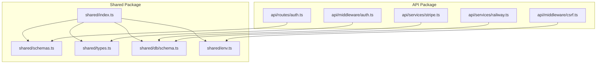
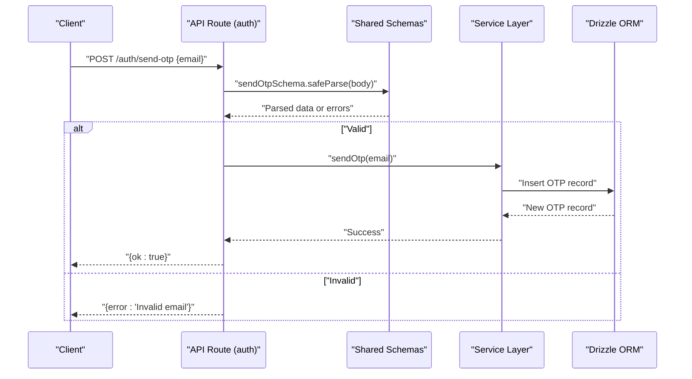
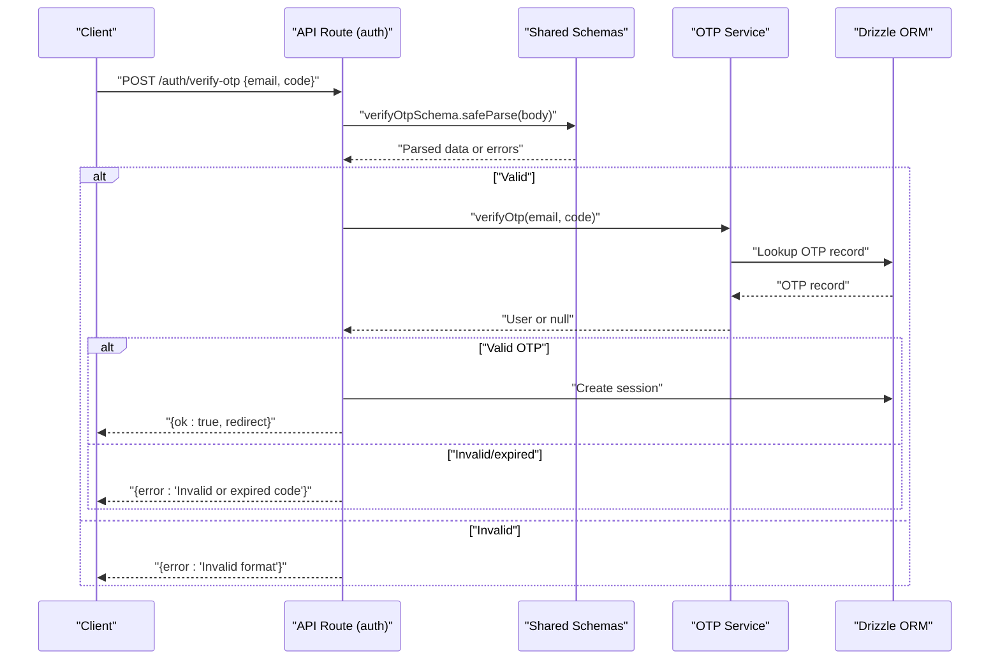
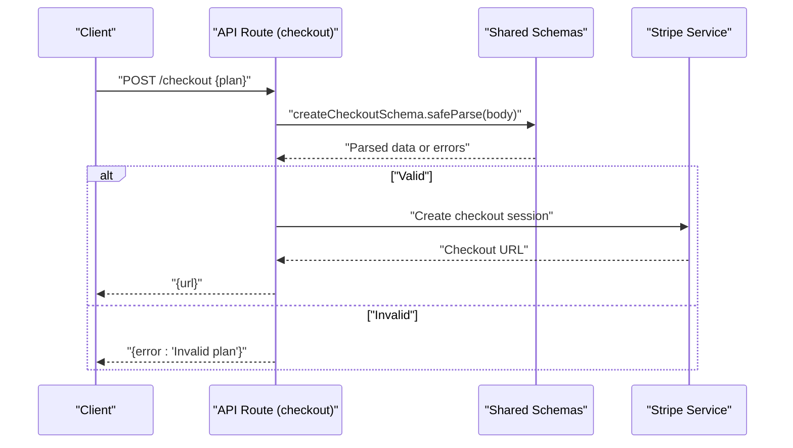
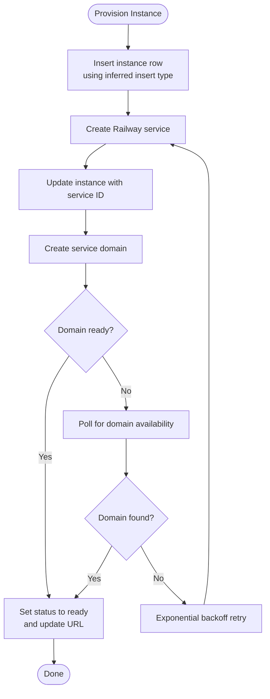
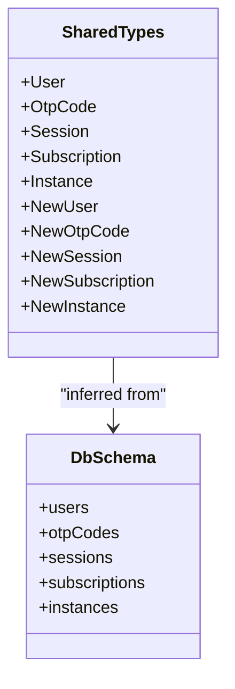
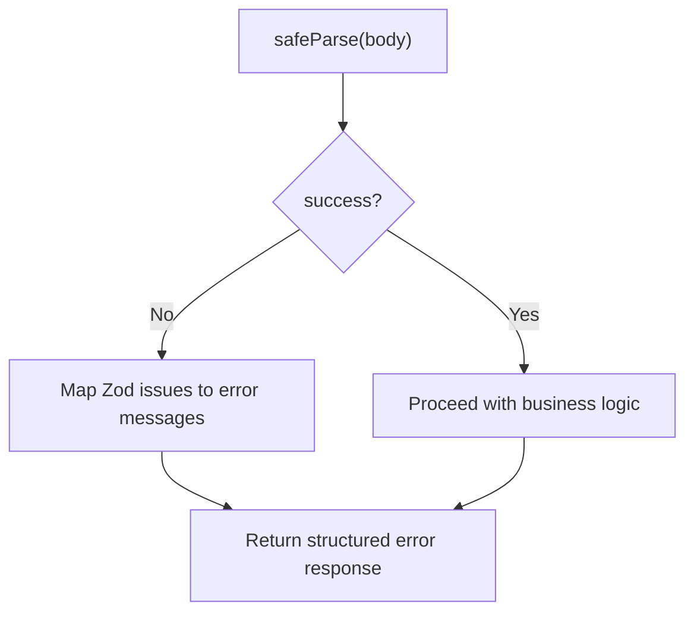
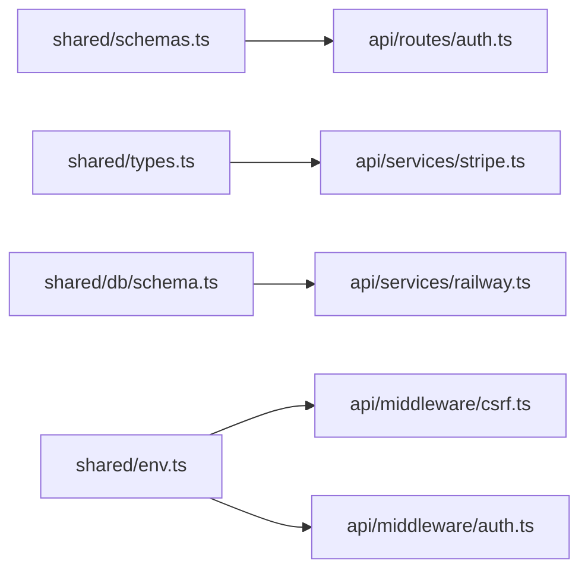

# Validation Schemas

<cite>
**Referenced Files in This Document**
- [schemas.ts](file://packages/shared/src/schemas.ts)
- [schema.ts](file://packages/shared/src/db/schema.ts)
- [types.ts](file://packages/shared/src/types.ts)
- [schemas.test.ts](file://packages/shared/src/__tests__/schemas.test.ts)
- [env.ts](file://packages/shared/src/env.ts)
- [index.ts](file://packages/shared/src/index.ts)
- [auth.ts](file://packages/api/src/routes/auth.ts)
- [csrf.ts](file://packages/api/src/middleware/csrf.ts)
- [auth.middleware.ts](file://packages/api/src/middleware/auth.ts)
- [stripe.ts](file://packages/api/src/services/stripe.ts)
- [railway.ts](file://packages/api/src/services/railway.ts)
</cite>

## Table of Contents
1. [Introduction](#introduction)
2. [Project Structure](#project-structure)
3. [Core Components](#core-components)
4. [Architecture Overview](#architecture-overview)
5. [Detailed Component Analysis](#detailed-component-analysis)
6. [Dependency Analysis](#dependency-analysis)
7. [Performance Considerations](#performance-considerations)
8. [Troubleshooting Guide](#troubleshooting-guide)
9. [Conclusion](#conclusion)
10. [Appendices](#appendices)

## Introduction
This document describes the Zod validation schemas used across the shared package and how they integrate with API routes and service layers. It focuses on:
- Input validation schemas for authentication requests, subscription management, and instance operations
- Output validation patterns for API responses and database operations
- Schema composition patterns, custom validation functions, and error handling strategies
- Examples of schema usage in API routes and service layers
- The relationship between request/response schemas and database operation schemas
- Guidelines for adding new validation schemas and maintaining consistency across the monorepo
- Strategies for schema evolution, backward compatibility, and migration

## Project Structure
The validation logic is primarily defined in the shared package and consumed by the API package:
- Shared package exports reusable Zod schemas and inferred TypeScript types
- API routes import shared schemas to validate incoming requests
- Services consume validated data and write to the database via Drizzle ORM
- Database schema definitions align with insert/update types for strong typing

**Diagram sources**
- [index.ts](file://packages/shared/src/index.ts#L1-L5)
- [schemas.ts](file://packages/shared/src/schemas.ts#L1-L26)
- [types.ts](file://packages/shared/src/types.ts#L1-L55)
- [schema.ts](file://packages/shared/src/db/schema.ts#L1-L146)
- [env.ts](file://packages/shared/src/env.ts#L25-L65)
- [auth.ts](file://packages/api/src/routes/auth.ts#L331-L413)
- [csrf.ts](file://packages/api/src/middleware/csrf.ts#L438-L459)
- [auth.middleware.ts](file://packages/api/src/middleware/auth.ts#L486-L500)
- [stripe.ts](file://packages/api/src/services/stripe.ts#L52-L106)
- [railway.ts](file://packages/api/src/services/railway.ts#L661-L871)

**Section sources**
- [index.ts](file://packages/shared/src/index.ts#L1-L5)
- [schemas.ts](file://packages/shared/src/schemas.ts#L1-L26)
- [types.ts](file://packages/shared/src/types.ts#L1-L55)
- [schema.ts](file://packages/shared/src/db/schema.ts#L1-L146)
- [env.ts](file://packages/shared/src/env.ts#L25-L65)

## Core Components
This section documents the primary validation schemas and their roles.

- Email schema
  - Purpose: Validates email strings with a maximum length constraint
  - Composition: Built from a Zod string with an email format check and a max length
  - Export: Available via the shared schemas module
  - Usage: Used as a field in request schemas for authentication and checkout flows

- OTP code schema
  - Purpose: Validates six-digit numeric codes
  - Composition: Zod string with a regex pattern ensuring exactly six digits
  - Export: Available via the shared schemas module
  - Usage: Used in OTP verification requests

- Plan schema
  - Purpose: Enumerates supported subscription plans
  - Composition: Zod enum with allowed plan values
  - Export: Available via the shared schemas module
  - Usage: Used in checkout creation requests

- Send OTP request schema
  - Purpose: Validates the payload for sending an OTP
  - Composition: Object containing an email field composed from the email schema
  - Export: Available via the shared schemas module
  - Usage: Consumed by API routes to validate incoming requests

- Verify OTP request schema
  - Purpose: Validates the payload for verifying an OTP
  - Composition: Object containing email and code fields composed from the email and OTP schemas
  - Export: Available via the shared schemas module
  - Usage: Consumed by API routes to validate incoming requests

- Create checkout request schema
  - Purpose: Validates the payload for initiating a checkout
  - Composition: Object containing a plan field composed from the plan schema
  - Export: Available via the shared schemas module
  - Usage: Consumed by API routes to validate incoming requests

- Inferred request types
  - Purpose: Strongly typed request inputs derived from schemas
  - Export: Types inferred from the schemas for SendOtpInput, VerifyOtpInput, and CreateCheckoutInput
  - Usage: Used in API route handlers and services to ensure type safety

**Section sources**
- [schemas.ts](file://packages/shared/src/schemas.ts#L1-L26)

## Architecture Overview
The validation architecture follows a layered approach:
- Shared schemas define canonical input validation rules
- API routes import shared schemas to parse and validate incoming requests
- Services receive validated data and operate on the database using Drizzle ORM
- Database schema definitions and inferred types ensure consistent write/read shapes

**Diagram sources**
- [auth.ts](file://packages/api/src/routes/auth.ts#L351-L373)
- [schemas.ts](file://packages/shared/src/schemas.ts#L9-L16)

## Detailed Component Analysis

### Authentication Request Schemas
Authentication endpoints rely on shared schemas to validate OTP send and verify requests.

- Send OTP
  - Route imports the shared send OTP schema
  - Parses and validates the request body
  - Returns structured errors on failure
  - On success, proceeds with OTP generation and delivery

- Verify OTP
  - Route imports the shared verify OTP schema
  - Parses and validates the request body
  - Returns structured errors on failure
  - On success, verifies the OTP against stored records and creates a session

**Diagram sources**
- [auth.ts](file://packages/api/src/routes/auth.ts#L374-L405)
- [schemas.ts](file://packages/shared/src/schemas.ts#L13-L16)

**Section sources**
- [auth.ts](file://packages/api/src/routes/auth.ts#L331-L413)
- [schemas.ts](file://packages/shared/src/schemas.ts#L9-L16)

### Subscription Management Schemas
Subscription management uses a plan schema to validate checkout creation requests.

- Create Checkout
  - Route imports the shared create checkout schema
  - Parses and validates the request body
  - Returns structured errors on failure
  - On success, initiates Stripe checkout session creation

**Diagram sources**
- [auth.ts](file://packages/api/src/routes/auth.ts#L351-L373)
- [schemas.ts](file://packages/shared/src/schemas.ts#L18-L20)

**Section sources**
- [auth.ts](file://packages/api/src/routes/auth.ts#L351-L373)
- [schemas.ts](file://packages/shared/src/schemas.ts#L18-L20)

### Instance Operations Schemas
Instance provisioning relies on database schema definitions and inferred types to ensure consistent writes.

- Provision Instance
  - Service inserts a new instance record using Drizzle ORM
  - Uses inferred insert types to maintain shape consistency with the database schema
  - Updates instance status and metadata during provisioning lifecycle

**Diagram sources**
- [railway.ts](file://packages/api/src/services/railway.ts#L780-L871)
- [schema.ts](file://packages/shared/src/db/schema.ts#L105-L137)
- [types.ts](file://packages/shared/src/types.ts#L20-L24)

**Section sources**
- [railway.ts](file://packages/api/src/services/railway.ts#L661-L871)
- [schema.ts](file://packages/shared/src/db/schema.ts#L105-L137)
- [types.ts](file://packages/shared/src/types.ts#L18-L24)

### Output Validation Patterns
Output validation ensures API responses and database operations conform to expected shapes.

- API response types
  - Domain-specific response interfaces define the shape of serialized outputs
  - Used to ensure consistent serialization across endpoints

- Database operation types
  - Inferred select and insert types from Drizzle ORM ensure write/read shapes match the database schema
  - Prevents runtime mismatches and improves developer confidence

**Diagram sources**
- [types.ts](file://packages/shared/src/types.ts#L10-L24)
- [schema.ts](file://packages/shared/src/db/schema.ts#L14-L145)

**Section sources**
- [types.ts](file://packages/shared/src/types.ts#L10-L55)
- [schema.ts](file://packages/shared/src/db/schema.ts#L14-L145)

### Schema Composition Patterns
- Reuse primitives
  - Compose higher-level schemas from primitive schemas (email, OTP code, plan)
- Keep constraints explicit
  - Define max lengths, regex patterns, and enums close to their usage
- Centralize exports
  - Export schemas and inferred types from a single module for easy consumption

**Section sources**
- [schemas.ts](file://packages/shared/src/schemas.ts#L1-L26)
- [index.ts](file://packages/shared/src/index.ts#L1-L5)

### Custom Validation Functions and Error Handling
- Route-level parsing
  - Routes import shared schemas and use safeParse to validate inputs
  - Return structured errors with appropriate HTTP status codes
- Environment validation
  - Environment variables are validated with a dedicated schema at startup
  - Throws descriptive errors listing missing or invalid variables
- CSRF and auth middleware
  - Middleware enforces security policies and integrates with validation results

**Diagram sources**
- [auth.ts](file://packages/api/src/routes/auth.ts#L353-L358)
- [env.ts](file://packages/shared/src/env.ts#L49-L60)

**Section sources**
- [auth.ts](file://packages/api/src/routes/auth.ts#L351-L413)
- [env.ts](file://packages/shared/src/env.ts#L49-L65)
- [csrf.ts](file://packages/api/src/middleware/csrf.ts#L438-L459)
- [auth.middleware.ts](file://packages/api/src/middleware/auth.ts#L486-L500)

## Dependency Analysis
The shared package acts as the single source of truth for validation rules, while the API package consumes these schemas.

**Diagram sources**
- [schemas.ts](file://packages/shared/src/schemas.ts#L1-L26)
- [types.ts](file://packages/shared/src/types.ts#L1-L55)
- [schema.ts](file://packages/shared/src/db/schema.ts#L1-L146)
- [env.ts](file://packages/shared/src/env.ts#L25-L65)
- [auth.ts](file://packages/api/src/routes/auth.ts#L331-L413)
- [stripe.ts](file://packages/api/src/services/stripe.ts#L52-L106)
- [railway.ts](file://packages/api/src/services/railway.ts#L661-L871)
- [csrf.ts](file://packages/api/src/middleware/csrf.ts#L438-L459)
- [auth.middleware.ts](file://packages/api/src/middleware/auth.ts#L486-L500)

**Section sources**
- [schemas.ts](file://packages/shared/src/schemas.ts#L1-L26)
- [types.ts](file://packages/shared/src/types.ts#L1-L55)
- [schema.ts](file://packages/shared/src/db/schema.ts#L1-L146)
- [env.ts](file://packages/shared/src/env.ts#L25-L65)
- [auth.ts](file://packages/api/src/routes/auth.ts#L331-L413)
- [stripe.ts](file://packages/api/src/services/stripe.ts#L52-L106)
- [railway.ts](file://packages/api/src/services/railway.ts#L661-L871)
- [csrf.ts](file://packages/api/src/middleware/csrf.ts#L438-L459)
- [auth.middleware.ts](file://packages/api/src/middleware/auth.ts#L486-L500)

## Performance Considerations
- Keep schema parsing lightweight
  - Use safeParse for request bodies to avoid throwing exceptions in hot paths
- Centralize validations
  - Reuse shared schemas to reduce duplication and parsing overhead
- Avoid unnecessary conversions
  - Use inferred types directly in services to minimize transformations
- Leverage database constraints
  - Combine Zod validation with database constraints for defense-in-depth

## Troubleshooting Guide
Common issues and resolutions:
- Validation failures in routes
  - Ensure the request body matches the schema fields and types
  - Check for missing fields or incorrect types
- Environment variable errors
  - Confirm all required environment variables are present and correctly formatted
  - Review the error message for the specific missing or invalid variable
- CSRF and auth middleware errors
  - Verify Origin header and session cookie presence
  - Ensure middleware order and conditions are met

**Section sources**
- [schemas.test.ts](file://packages/shared/src/__tests__/schemas.test.ts#L1-L75)
- [env.ts](file://packages/shared/src/env.ts#L49-L65)
- [csrf.ts](file://packages/api/src/middleware/csrf.ts#L438-L459)
- [auth.middleware.ts](file://packages/api/src/middleware/auth.ts#L486-L500)

## Conclusion
The shared package centralizes validation logic using Zod, enabling consistent input validation across API routes and robust output typing via inferred database types. By composing schemas from primitives, exporting inferred types, and integrating with middleware and services, the system maintains reliability, readability, and maintainability. Following the guidelines below will help preserve consistency and evolve validation rules safely.

## Appendices

### Guidelines for Adding New Validation Schemas
- Define primitive schemas first (email, OTP code, enums)
- Compose higher-level request schemas from primitives
- Export both the schema and an inferred type for the request shape
- Add unit tests validating acceptance and rejection of various inputs
- Import and use the schema in the route handler with safeParse
- Integrate with middleware for security (CSRF, auth) as needed

**Section sources**
- [schemas.ts](file://packages/shared/src/schemas.ts#L1-L26)
- [schemas.test.ts](file://packages/shared/src/__tests__/schemas.test.ts#L1-L75)

### Maintaining Consistency Across the Monorepo
- Export schemas and types from a single shared module
- Consume shared schemas in API routes and services
- Align database schema definitions with inferred insert/select types
- Keep environment validation centralized and fail fast at startup

**Section sources**
- [index.ts](file://packages/shared/src/index.ts#L1-L5)
- [schema.ts](file://packages/shared/src/db/schema.ts#L1-L146)
- [types.ts](file://packages/shared/src/types.ts#L1-L55)
- [env.ts](file://packages/shared/src/env.ts#L25-L65)

### Schema Evolution, Backward Compatibility, and Migration
- Versioned exports
  - Keep old schema exports alongside new ones during transitions
- Gradual adoption
  - Introduce new schemas in new routes and gradually migrate existing routes
- Backward-compatible parsing
  - Use optional fields and defaults when evolving request shapes
- Migration strategies
  - For database changes, evolve Drizzle schema and inferred types in lockstep
  - Update services to handle new fields while preserving existing behavior
- Testing
  - Add tests covering both old and new shapes to prevent regressions

[No sources needed since this section provides general guidance]