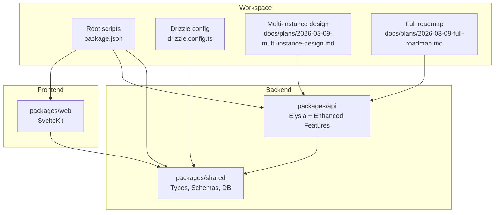
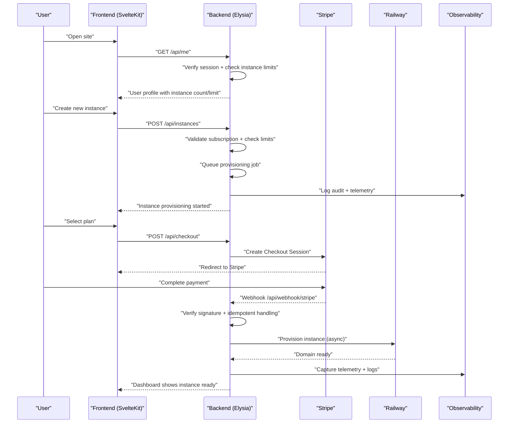
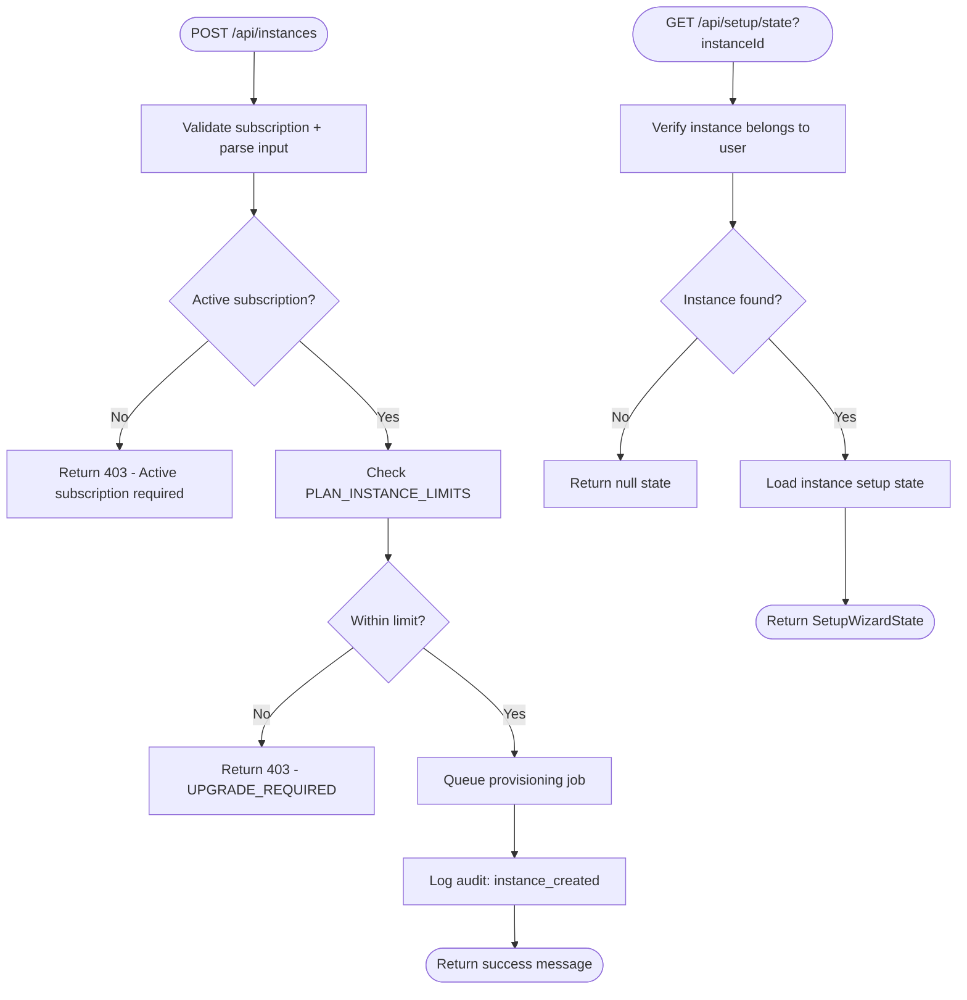
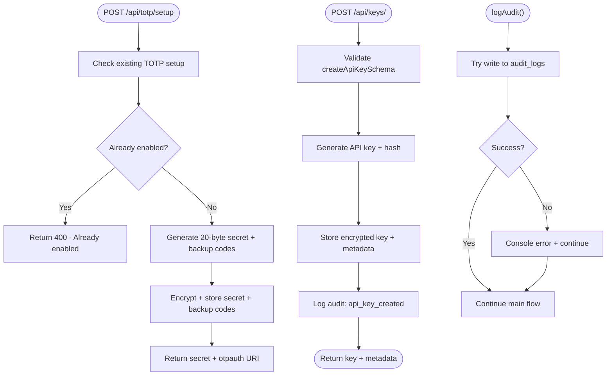
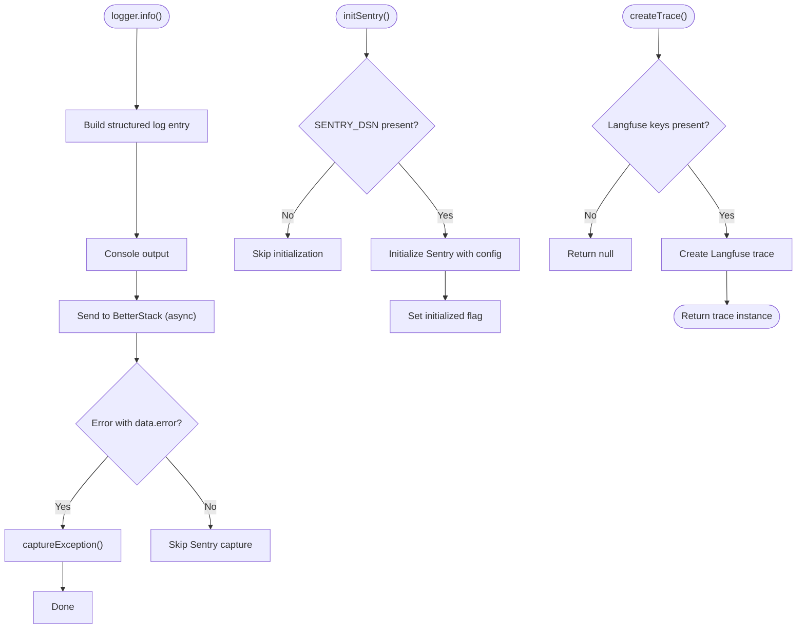
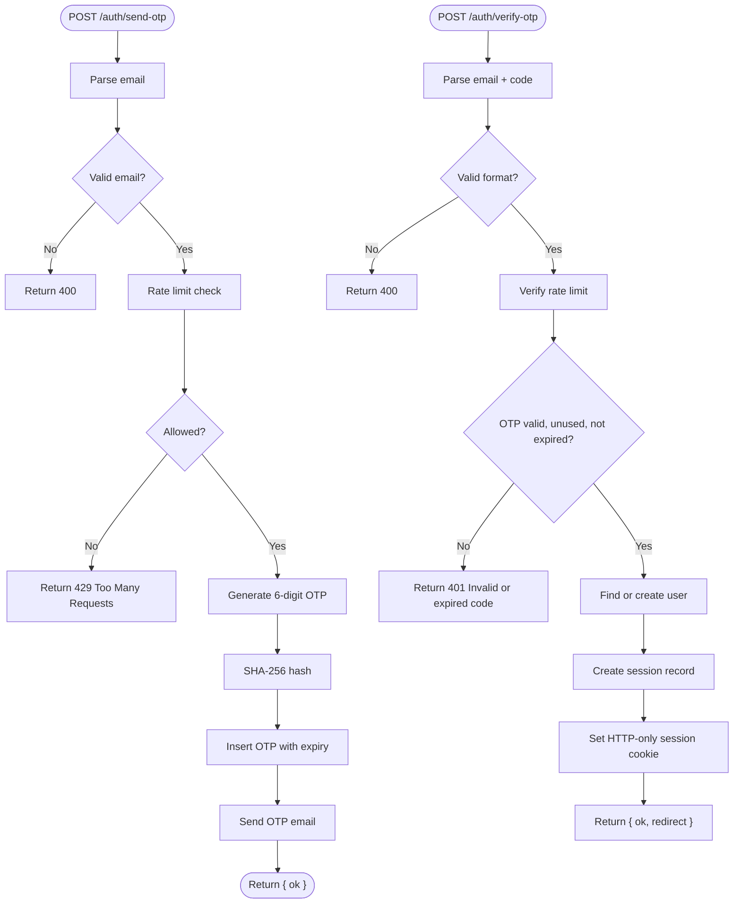
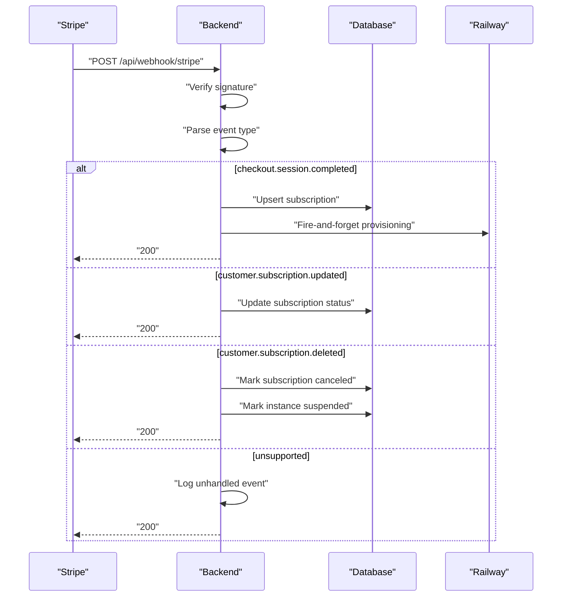
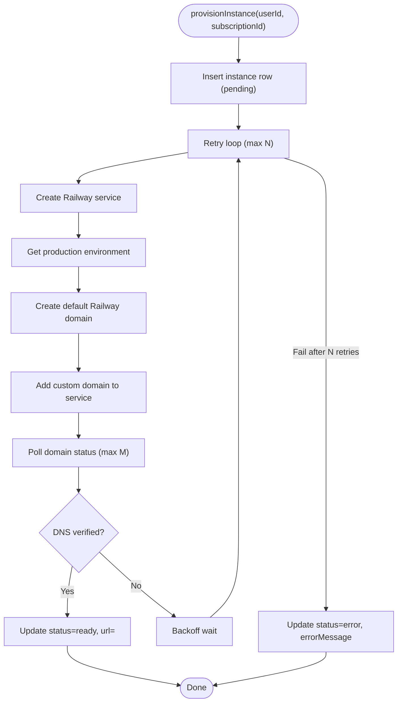
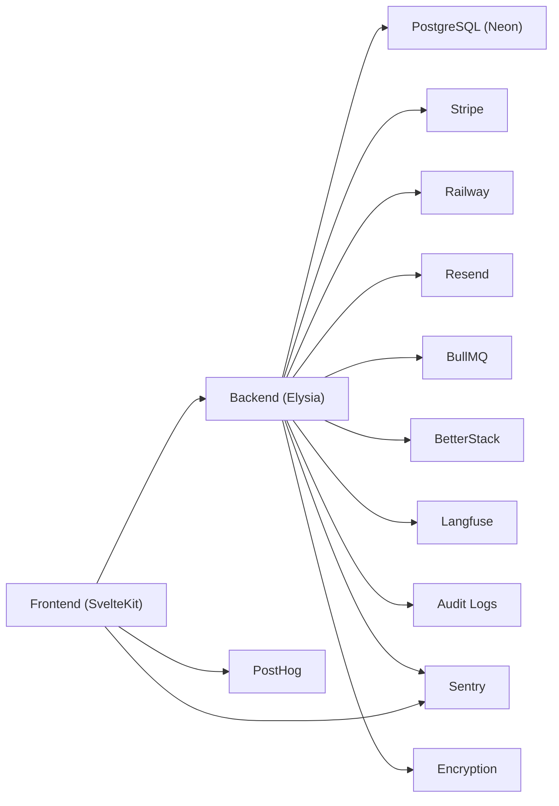

# Troubleshooting and FAQ

<cite>
**Referenced Files in This Document**
- [PRD.md](file://PRD.md)
- [package.json](file://package.json)
- [drizzle.config.ts](file://drizzle.config.ts)
- [packages/api/src/index.ts](file://packages/api/src/index.ts)
- [packages/api/src/routes/auth.ts](file://packages/api/src/routes/auth.ts)
- [packages/api/src/routes/api.ts](file://packages/api/src/routes/api.ts)
- [packages/api/src/routes/webhooks.ts](file://packages/api/src/routes/webhooks.ts)
- [packages/api/src/routes/setup.ts](file://packages/api/src/routes/setup.ts)
- [packages/api/src/routes/api-keys.ts](file://packages/api/src/routes/api-keys.ts)
- [packages/api/src/routes/totp.ts](file://packages/api/src/routes/totp.ts)
- [packages/api/src/routes/instance-actions.ts](file://packages/api/src/routes/instance-actions.ts)
- [packages/api/src/services/otp.ts](file://packages/api/src/services/otp.ts)
- [packages/api/src/services/stripe.ts](file://packages/api/src/services/stripe.ts)
- [packages/api/src/services/railway.ts](file://packages/api/src/services/railway.ts)
- [packages/api/src/services/session.ts](file://packages/api/src/services/session.ts)
- [packages/api/src/services/queue.ts](file://packages/api/src/services/queue.ts)
- [packages/api/src/services/audit.ts](file://packages/api/src/services/audit.ts)
- [packages/api/src/lib/logger.ts](file://packages/api/src/lib/logger.ts)
- [packages/api/src/lib/observability.ts](file://packages/api/src/lib/observability.ts)
- [packages/api/src/lib/rate-limiter.ts](file://packages/api/src/lib/rate-limiter.ts)
- [packages/api/src/lib/email.ts](file://packages/api/src/lib/email.ts)
- [packages/api/src/middleware/csrf.ts](file://packages/api/src/middleware/csrf.ts)
- [packages/shared/src/db/schema.ts](file://packages/shared/src/db/schema.ts)
- [packages/shared/src/env.ts](file://packages/shared/src/env.ts)
- [packages/shared/src/constants.ts](file://packages/shared/src/constants.ts)
- [packages/shared/src/schemas.ts](file://packages/shared/src/schemas.ts)
- [packages/shared/src/types.ts](file://packages/shared/src/types.ts)
- [packages/web/src/lib/api.ts](file://packages/web/src/lib/api.ts)
- [docs/plans/2026-03-09-multi-instance-design.md](file://docs/plans/2026-03-09-multi-instance-design.md)
- [docs/plans/2026-03-09-multi-instance-plan.md](file://docs/plans/2026-03-09-multi-instance-plan.md)
- [docs/plans/2026-03-09-full-roadmap.md](file://docs/plans/2026-03-09-full-roadmap.md)
</cite>

## Update Summary
**Changes Made**
- Added comprehensive multi-instance troubleshooting scenarios and workflows
- Enhanced security features documentation covering TOTP, API keys, and audit logging
- Expanded observability section with BetterStack logging, Langfuse LLM observability, and enhanced Sentry integration
- Updated database schema documentation to reflect multi-instance relationships
- Added new troubleshooting guides for instance management and security features

## Table of Contents
1. [Introduction](#introduction)
2. [Project Structure](#project-structure)
3. [Core Components](#core-components)
4. [Architecture Overview](#architecture-overview)
5. [Detailed Component Analysis](#detailed-component-analysis)
6. [Dependency Analysis](#dependency-analysis)
7. [Performance Considerations](#performance-considerations)
8. [Troubleshooting Guide](#troubleshooting-guide)
9. [Security Best Practices](#security-best-practices)
10. [Monitoring and Alerting](#monitoring-and-alerting)
11. [Escalation Procedures](#escalation-procedures)
12. [Preventive Maintenance](#preventive-maintenance)
13. [FAQ](#faq)
14. [Conclusion](#conclusion)

## Introduction
This document provides comprehensive troubleshooting guidance and FAQs for SparkClaw, focusing on authentication, billing, provisioning, performance, security, monitoring, and operational procedures. It consolidates known behaviors and error-handling patterns from the codebase and PRD to help diagnose and resolve common issues quickly. The document has been updated to reflect new multi-instance operations, enhanced security features, and improved observability capabilities.

## Project Structure
SparkClaw is a Bun workspace monorepo with four packages:
- packages/web: SvelteKit frontend (SSR/static)
- packages/api: Elysia backend API, webhooks, services, and enhanced observability
- packages/shared: Shared types, schemas, database definitions, and constants
- packages/api: Enhanced with multi-instance support, security features, and observability



**Diagram sources**
- [package.json](file://package.json#L1-L23)
- [drizzle.config.ts](file://drizzle.config.ts#L1-L13)
- [docs/plans/2026-03-09-multi-instance-design.md](file://docs/plans/2026-03-09-multi-instance-design.md#L1-L98)
- [docs/plans/2026-03-09-full-roadmap.md](file://docs/plans/2026-03-09-full-roadmap.md#L150-L179)

**Section sources**
- [package.json](file://package.json#L1-L23)
- [drizzle.config.ts](file://drizzle.config.ts#L1-L13)
- [docs/plans/2026-03-09-multi-instance-design.md](file://docs/plans/2026-03-09-multi-instance-design.md#L1-L98)
- [docs/plans/2026-03-09-full-roadmap.md](file://docs/plans/2026-03-09-full-roadmap.md#L150-L179)

## Core Components
- Authentication (Email OTP): OTP generation, hashing, storage, verification, and session creation with rate limiting.
- Billing (Stripe): Checkout session creation, webhook verification, idempotent event handling, and subscription state updates.
- Provisioning (Railway): Instance creation via GraphQL, polling for readiness, custom domain setup, and error handling.
- Multi-instance Management: Instance creation, deletion, and management across user accounts with plan-based limits.
- Security Features: TOTP (Two-Factor Authentication), API key management, audit logging, and encryption utilities.
- Enhanced Observability: BetterStack logging, Langfuse LLM observability, Sentry error tracking, and PostHog analytics.
- Database: Drizzle ORM schema with indexes and relations for users, sessions, OTP codes, subscriptions, instances, and audit logs.

**Section sources**
- [packages/api/src/routes/api.ts](file://packages/api/src/routes/api.ts#L1-L207)
- [packages/api/src/routes/setup.ts](file://packages/api/src/routes/setup.ts#L1-L200)
- [packages/api/src/routes/api-keys.ts](file://packages/api/src/routes/api-keys.ts#L1-L119)
- [packages/api/src/routes/totp.ts](file://packages/api/src/routes/totp.ts#L73-L253)
- [packages/api/src/services/otp.ts](file://packages/api/src/services/otp.ts#L1-L59)
- [packages/api/src/services/stripe.ts](file://packages/api/src/services/stripe.ts#L1-L107)
- [packages/api/src/services/railway.ts](file://packages/api/src/services/railway.ts#L1-L291)
- [packages/api/src/services/audit.ts](file://packages/api/src/services/audit.ts#L1-L50)
- [packages/api/src/lib/logger.ts](file://packages/api/src/lib/logger.ts#L1-L84)
- [packages/api/src/lib/observability.ts](file://packages/api/src/lib/observability.ts#L1-L149)
- [packages/shared/src/db/schema.ts](file://packages/shared/src/db/schema.ts#L1-L187)
- [PRD.md](file://PRD.md#L387-L420)

## Architecture Overview
High-level flow for end-to-end user onboarding, multi-instance management, and enhanced observability:



**Diagram sources**
- [packages/api/src/routes/api.ts](file://packages/api/src/routes/api.ts#L62-L92)
- [packages/api/src/routes/api.ts](file://packages/api/src/routes/api.ts#L118-L160)
- [packages/api/src/routes/webhooks.ts](file://packages/api/src/routes/webhooks.ts#L1-L49)
- [packages/api/src/services/stripe.ts](file://packages/api/src/services/stripe.ts#L1-L107)
- [packages/api/src/services/railway.ts](file://packages/api/src/services/railway.ts#L177-L291)
- [packages/api/src/lib/logger.ts](file://packages/api/src/lib/logger.ts#L74-L76)
- [PRD.md](file://PRD.md#L276-L327)

## Detailed Component Analysis

### Multi-Instance Management
**Updated** Enhanced with comprehensive instance lifecycle management and plan-based limits.

Common issues:
- Instance limit reached during creation
- Invalid instance ID access attempts
- Setup wizard state not persisting across instances
- Audit logging for instance operations



**Diagram sources**
- [packages/api/src/routes/api.ts](file://packages/api/src/routes/api.ts#L118-L160)
- [packages/api/src/routes/setup.ts](file://packages/api/src/routes/setup.ts#L653-L704)
- [packages/shared/src/constants.ts](file://packages/shared/src/constants.ts#L63-L69)

**Section sources**
- [packages/api/src/routes/api.ts](file://packages/api/src/routes/api.ts#L1-L207)
- [packages/api/src/routes/setup.ts](file://packages/api/src/routes/setup.ts#L1-L200)
- [packages/shared/src/constants.ts](file://packages/shared/src/constants.ts#L63-L69)
- [docs/plans/2026-03-09-multi-instance-design.md](file://docs/plans/2026-03-09-multi-instance-design.md#L48-L59)

### Security Features
**Updated** Comprehensive security implementation including TOTP, API keys, and audit logging.

Common issues:
- TOTP setup verification failures
- API key creation/deletion errors
- Audit log write failures
- Encryption/decryption issues



**Diagram sources**
- [packages/api/src/routes/totp.ts](file://packages/api/src/routes/totp.ts#L105-L161)
- [packages/api/src/routes/api-keys.ts](file://packages/api/src/routes/api-keys.ts#L48-L92)
- [packages/api/src/services/audit.ts](file://packages/api/src/services/audit.ts#L30-L50)

**Section sources**
- [packages/api/src/routes/totp.ts](file://packages/api/src/routes/totp.ts#L73-L253)
- [packages/api/src/routes/api-keys.ts](file://packages/api/src/routes/api-keys.ts#L1-L119)
- [packages/api/src/services/audit.ts](file://packages/api/src/services/audit.ts#L1-L50)
- [packages/api/src/lib/crypto.ts](file://packages/api/src/lib/crypto.ts#L1-L49)

### Enhanced Observability
**Updated** Comprehensive observability stack with BetterStack, Langfuse, and enhanced Sentry integration.

Common issues:
- BetterStack logging failures
- Langfuse trace creation errors
- Sentry initialization issues
- Telemetry flush problems



**Diagram sources**
- [packages/api/src/lib/logger.ts](file://packages/api/src/lib/logger.ts#L48-L77)
- [packages/api/src/lib/observability.ts](file://packages/api/src/lib/observability.ts#L11-L22)
- [packages/api/src/lib/observability.ts](file://packages/api/src/lib/observability.ts#L108-L119)

**Section sources**
- [packages/api/src/lib/logger.ts](file://packages/api/src/lib/logger.ts#L1-L84)
- [packages/api/src/lib/observability.ts](file://packages/api/src/lib/observability.ts#L1-L149)
- [packages/shared/src/env.ts](file://packages/shared/src/env.ts#L20-L26)

### Authentication (Email OTP)
Common issues:
- OTP not received or delayed
- Invalid/expired OTP
- Rate limit exceeded
- Session cookie not set or expired



**Diagram sources**
- [packages/api/src/routes/auth.ts](file://packages/api/src/routes/auth.ts#L21-L71)
- [packages/api/src/services/otp.ts](file://packages/api/src/services/otp.ts#L27-L58)
- [packages/api/src/services/session.ts](file://packages/api/src/services/session.ts#L13-L42)
- [packages/api/src/lib/rate-limiter.ts](file://packages/api/src/lib/rate-limiter.ts)

**Section sources**
- [packages/api/src/routes/auth.ts](file://packages/api/src/routes/auth.ts#L1-L80)
- [packages/api/src/services/otp.ts](file://packages/api/src/services/otp.ts#L1-L59)
- [packages/api/src/services/session.ts](file://packages/api/src/services/session.ts#L1-L43)
- [PRD.md](file://PRD.md#L85-L99)

### Billing (Stripe)
Common issues:
- Signature verification failure
- Missing or invalid webhook signature
- Duplicate or delayed events
- Payment success but no instance created



**Diagram sources**
- [packages/api/src/routes/webhooks.ts](file://packages/api/src/routes/webhooks.ts#L1-L49)
- [packages/api/src/services/stripe.ts](file://packages/api/src/services/stripe.ts#L45-L106)

**Section sources**
- [packages/api/src/routes/webhooks.ts](file://packages/api/src/routes/webhooks.ts#L1-L49)
- [packages/api/src/services/stripe.ts](file://packages/api/src/services/stripe.ts#L1-L107)
- [PRD.md](file://PRD.md#L100-L130)

### Provisioning (Railway)
Common issues:
- Railway API errors or timeouts
- Domain DNS not ready
- Exceeded retry attempts
- Instance remains pending after server restart



**Diagram sources**
- [packages/api/src/services/railway.ts](file://packages/api/src/services/railway.ts#L177-L291)

**Section sources**
- [packages/api/src/services/railway.ts](file://packages/api/src/services/railway.ts#L1-L291)
- [PRD.md](file://PRD.md#L131-L167)

### Database Schema and Relations
**Updated** Enhanced with multi-instance relationships and audit logging.

```mermaid
erDiagram
USERS {
uuid id PK
varchar email UK
varchar role
timestamp created_at
timestamp updated_at
}
OTP_CODES {
uuid id PK
varchar email
varchar code_hash
timestamp expires_at
timestamp used_at
timestamp created_at
}
SESSIONS {
uuid id PK
uuid user_id FK
varchar token UK
timestamp expires_at
timestamp created_at
}
SUBSCRIPTIONS {
uuid id PK
uuid user_id UK FK
varchar plan
varchar stripe_customer_id
varchar stripe_subscription_id UK
varchar status
timestamp current_period_end
timestamp created_at
timestamp updated_at
}
INSTANCES {
uuid id PK
uuid user_id FK
uuid subscription_id FK
varchar railway_project_id
varchar railway_service_id
varchar custom_domain
text railway_url
text url
varchar status
varchar domain_status
boolean setup_completed
varchar instance_name
jsonb ai_config
jsonb features
text error_message
timestamp created_at
timestamp updated_at
}
AUDIT_LOGS {
uuid id PK
uuid user_id FK
varchar action
uuid instance_id FK
jsonb metadata
varchar ip
timestamp created_at
}
USERS ||--o{ OTP_CODES : "has"
USERS ||--o{ SESSIONS : "has"
USERS ||--|| SUBSCRIPTIONS : "has"
USERS ||--o{ INSTANCES : "has"
USERS ||--o{ AUDIT_LOGS : "has"
SUBSCRIPTIONS ||--o{ INSTANCES : "has"
INSTANCES ||--o{ AUDIT_LOGS : "has"
```

**Diagram sources**
- [packages/shared/src/db/schema.ts](file://packages/shared/src/db/schema.ts#L1-L187)

**Section sources**
- [packages/shared/src/db/schema.ts](file://packages/shared/src/db/schema.ts#L1-L187)

## Dependency Analysis
**Updated** Enhanced dependency graph with new security and observability components.

External dependencies and their roles:
- Bun runtime and Elysia for backend
- SvelteKit for frontend
- PostgreSQL (Neon) via Drizzle ORM
- Stripe for billing and webhooks
- Railway for instance hosting
- Resend for OTP emails
- Sentry for error tracking
- PostHog for product analytics
- BetterStack for centralized logging
- Langfuse for LLM observability
- BullMQ for job queueing



**Diagram sources**
- [PRD.md](file://PRD.md#L193-L208)
- [packages/api/src/lib/observability.ts](file://packages/api/src/lib/observability.ts#L1-L149)
- [packages/api/src/lib/logger.ts](file://packages/api/src/lib/logger.ts#L1-L84)

**Section sources**
- [PRD.md](file://PRD.md#L193-L208)
- [packages/api/src/lib/observability.ts](file://packages/api/src/lib/observability.ts#L1-L149)
- [packages/api/src/lib/logger.ts](file://packages/api/src/lib/logger.ts#L1-L84)

## Performance Considerations
**Updated** Enhanced performance targets with multi-instance considerations.

Target performance metrics (from PRD):
- Landing page load (LCP) < 2 seconds
- API read response p95 < 200 ms
- API write response p95 < 500 ms
- OTP delivery p95 < 30 seconds
- Instance provisioning p95 < 5 minutes
- Multi-instance listing response p95 < 100 ms per instance
- Audit log writes should not block main requests

Optimization tips:
- Database: Ensure indexes exist for frequent filters (e.g., sessions.token, instances.status, audit_logs.user_id). Use connection pooling and keep-alive queries to mitigate cold starts.
- API: Keep handlers lean; offload heavy tasks to background jobs. Cache non-sensitive data where appropriate. Implement pagination for multi-instance lists.
- Frontend: Optimize bundles, enable compression, and leverage CDN distribution. Implement virtual scrolling for large instance lists.
- Provisioning: Tune retry backoff and polling intervals to balance responsiveness and cost. Use job queues for asynchronous operations.
- Security: Cache TOTP verification results briefly to reduce database load. Implement efficient API key validation.

**Section sources**
- [PRD.md](file://PRD.md#L389-L398)
- [packages/api/src/routes/api.ts](file://packages/api/src/routes/api.ts#L94-L102)

## Troubleshooting Guide

### Multi-Instance Management Problems
**Updated** Comprehensive troubleshooting for multi-instance operations.

Symptoms and fixes:
- Instance limit reached during creation
  - Verify user's current plan and instance count via `/api/me`
  - Check PLAN_INSTANCE_LIMITS configuration for the user's plan
  - Review audit logs for instance creation attempts
  - References: [packages/api/src/routes/api.ts](file://packages/api/src/routes/api.ts#L118-L160), [packages/shared/src/constants.ts](file://packages/shared/src/constants.ts#L63-L69)
- Invalid instance ID access attempts
  - Ensure instance belongs to the authenticated user using proper authorization
  - Check instance ownership before performing operations
  - References: [packages/api/src/routes/api.ts](file://packages/api/src/routes/api.ts#L104-L116), [packages/api/src/routes/setup.ts](file://packages/api/src/routes/setup.ts#L629-L633)
- Setup wizard state persistence issues
  - Verify instanceId parameter is included in all setup endpoints
  - Check instance setupCompleted flag and channel configurations
  - References: [packages/api/src/routes/setup.ts](file://packages/api/src/routes/setup.ts#L653-L704), [packages/api/src/routes/setup.ts](file://packages/api/src/routes/setup.ts#L706-L789)
- Audit logging failures
  - Verify audit log table exists and is accessible
  - Check for database connectivity issues
  - References: [packages/api/src/services/audit.ts](file://packages/api/src/services/audit.ts#L30-L50)

### Security Feature Problems
**Updated** Comprehensive troubleshooting for security implementations.

Symptoms and fixes:
- TOTP setup verification failures
  - Verify TOTP secret generation and QR code creation
  - Check time-based code validation with ±1 window
  - Ensure backup codes are properly encrypted and stored
  - References: [packages/api/src/routes/totp.ts](file://packages/api/src/routes/totp.ts#L105-L161), [packages/api/src/routes/totp.ts](file://packages/api/src/routes/totp.ts#L163-L210)
- API key creation/deletion errors
  - Verify API key schema validation passes
  - Check key generation algorithm and hashing
  - Ensure audit logging for key operations
  - References: [packages/api/src/routes/api-keys.ts](file://packages/api/src/routes/api-keys.ts#L48-L92), [packages/api/src/routes/api-keys.ts](file://packages/api/src/routes/api-keys.ts#L94-L119)
- Encryption/decryption issues
  - Verify ENCRYPTION_SECRET or SESSION_SECRET environment variable
  - Check AES-256-GCM algorithm implementation
  - Test round-trip encryption/decryption with various inputs
  - References: [packages/api/src/lib/crypto.ts](file://packages/api/src/lib/crypto.ts#L1-L49), [packages/shared/src/env.ts](file://packages/shared/src/env.ts#L13)

### Enhanced Observability Problems
**Updated** Comprehensive troubleshooting for observability stack.

Symptoms and fixes:
- BetterStack logging failures
  - Verify BETTERSTACK_SOURCE_TOKEN and BETTERSTACK_HOST environment variables
  - Check network connectivity to BetterStack endpoint
  - Ensure log entries are properly structured JSON
  - References: [packages/api/src/lib/logger.ts](file://packages/api/src/lib/logger.ts#L18-L46), [packages/shared/src/env.ts](file://packages/shared/src/env.ts#L25-L26)
- Langfuse trace creation errors
  - Verify LANGFUSE_PUBLIC_KEY and LANGFUSE_SECRET_KEY environment variables
  - Check Langfuse service availability and rate limits
  - Ensure proper trace metadata and context passing
  - References: [packages/api/src/lib/observability.ts](file://packages/api/src/lib/observability.ts#L92-L119), [packages/shared/src/env.ts](file://packages/shared/src/env.ts#L21-L23)
- Sentry initialization issues
  - Verify SENTRY_DSN environment variable is set
  - Check Sentry SDK version compatibility
  - Ensure proper error context attachment
  - References: [packages/api/src/lib/observability.ts](file://packages/api/src/lib/observability.ts#L11-L22), [packages/shared/src/env.ts](file://packages/shared/src/env.ts#L17)

### Authentication Problems
Symptoms and fixes:
- OTP not received
  - Verify email provider credentials and deliverability. Check rate limiter thresholds and IP/email grouping.
  - Confirm hashed OTP storage and expiry window.
  - Review logs for send/verify rate limit responses.
  - References: [packages/api/src/routes/auth.ts](file://packages/api/src/routes/auth.ts#L21-L40), [packages/api/src/services/otp.ts](file://packages/api/src/services/otp.ts#L19-L25), [packages/api/src/lib/rate-limiter.ts](file://packages/api/src/lib/rate-limiter.ts)
- Invalid or expired OTP
  - Ensure code matches stored hash and is not expired or used.
  - Confirm rate limit for verify attempts.
  - References: [packages/api/src/services/otp.ts](file://packages/api/src/services/otp.ts#L27-L45), [packages/api/src/routes/auth.ts](file://packages/api/src/routes/auth.ts#L41-L58)
- Session cookie issues
  - Check cookie flags (HTTP-only, Secure, SameSite) and domain/path.
  - Validate session lookup and expiry.
  - References: [packages/api/src/routes/auth.ts](file://packages/api/src/routes/auth.ts#L61-L68), [packages/api/src/services/session.ts](file://packages/api/src/services/session.ts#L23-L38)

### Billing Issues
Symptoms and fixes:
- Webhook signature failure
  - Confirm webhook secret and signature header presence.
  - Validate event parsing and type handling.
  - References: [packages/api/src/routes/webhooks.ts](file://packages/api/src/routes/webhooks.ts#L6-L21), [packages/api/src/services/stripe.ts](file://packages/api/src/services/stripe.ts#L20-L26)
- Payment success but no instance created
  - Check async provisioning fire-and-forget call and error logging.
  - Verify Railway API availability and rate limits.
  - References: [packages/api/src/services/stripe.ts](file://packages/api/src/services/stripe.ts#L68-L71), [packages/api/src/services/railway.ts](file://packages/api/src/services/railway.ts#L177-L291)
- Subscription status inconsistencies
  - Ensure idempotent handling and upsert logic for subscription updates.
  - References: [packages/api/src/services/stripe.ts](file://packages/api/src/services/stripe.ts#L74-L106)

### Provisioning Problems
Symptoms and fixes:
- Deployment failures
  - Inspect error messages recorded in the instance row.
  - Retry provisioning after resolving transient errors.
  - References: [packages/api/src/services/railway.ts](file://packages/api/src/services/railway.ts#L279-L287)
- Timeout issues
  - Adjust polling attempts and intervals.
  - Validate custom domain DNS propagation.
  - References: [packages/api/src/services/railway.ts](file://packages/api/src/services/railway.ts#L238-L263)
- Environment configuration errors
  - Verify Railway project ID, API token, and environment names.
  - References: [packages/api/src/services/railway.ts](file://packages/api/src/services/railway.ts#L148-L171)

### Debugging Techniques
**Updated** Enhanced debugging techniques with multi-instance and security features.

- Log analysis
  - Use structured logs for authentication, billing, provisioning, and multi-instance flows.
  - Filter by correlation IDs (user ID, subscription ID, instance ID).
  - Check BetterStack for centralized log aggregation and filtering.
  - References: [packages/api/src/lib/logger.ts](file://packages/api/src/lib/logger.ts), [packages/api/src/lib/observability.ts](file://packages/api/src/lib/observability.ts#L28-L46)
- Error tracking with Sentry
  - Integrate Sentry DSN for frontend and backend.
  - Correlate errors with logs and user sessions.
  - Use enhanced context capture for multi-instance operations.
  - References: [PRD.md](file://PRD.md#L206-L207), [packages/shared/src/env.ts](file://packages/shared/src/env.ts), [packages/api/src/lib/observability.ts](file://packages/api/src/lib/observability.ts#L25-L42)
- Monitoring dashboard usage
  - Use PostHog for funnel analysis and user behavior insights.
  - Track multi-instance creation rates and security feature adoption.
  - References: [PRD.md](file://PRD.md#L207-L208)
- Audit trail investigation
  - Query audit logs for security events and instance operations.
  - Use audit logs to track TOTP enable/disable actions and API key changes.
  - References: [packages/api/src/services/audit.ts](file://packages/api/src/services/audit.ts#L30-L50)

### Step-by-Step Guides

#### Multi-Service Failure (Billing + Provisioning + Multi-instance)
**Updated** Enhanced multi-service failure scenario.

1. Confirm webhook signature verification succeeded.
2. Check subscription creation/upsert in DB.
3. Verify async provisioning was triggered for correct subscription.
4. Inspect Railway API responses and custom domain status.
5. Check instance limit enforcement and plan-based restrictions.
6. Verify audit logs for instance creation attempts.
7. Manually re-run provisioning if needed.
References:
- [packages/api/src/routes/webhooks.ts](file://packages/api/src/routes/webhooks.ts#L23-L44)
- [packages/api/src/services/stripe.ts](file://packages/api/src/services/stripe.ts#L45-L72)
- [packages/api/src/services/railway.ts](file://packages/api/src/services/railway.ts#L238-L263)
- [packages/api/src/routes/api.ts](file://packages/api/src/routes/api.ts#L118-L160)
- [packages/api/src/services/audit.ts](file://packages/api/src/services/audit.ts#L30-L50)

#### Data Inconsistency Resolution
**Updated** Enhanced data inconsistency resolution with multi-instance context.

1. Compare Stripe customer/subscription IDs with DB rows.
2. Reconcile subscription status and current period end.
3. Update instance status to reflect subscription state.
4. Verify instance ownership and plan-based limits.
5. Check audit logs for any unauthorized access attempts.
References:
- [packages/api/src/services/stripe.ts](file://packages/api/src/services/stripe.ts#L74-L106)
- [packages/shared/src/db/schema.ts](file://packages/shared/src/db/schema.ts#L71-L101)
- [packages/api/src/routes/api.ts](file://packages/api/src/routes/api.ts#L118-L160)

#### Security Incident Response
**Updated** New security incident response procedure.

1. Identify compromised account via audit logs (failed login attempts, TOTP bypasses).
2. Immediately revoke all API keys and regenerate encryption keys.
3. Force logout all sessions and invalidate TOTP setup.
4. Monitor BetterStack for suspicious activities and rate limit violations.
5. Coordinate with user to reset TOTP and review API key usage.
6. Update security policies and consider additional rate limiting.
References:
- [packages/api/src/services/audit.ts](file://packages/api/src/services/audit.ts#L30-L50)
- [packages/api/src/routes/totp.ts](file://packages/api/src/routes/totp.ts#L212-L253)
- [packages/api/src/routes/api-keys.ts](file://packages/api/src/routes/api-keys.ts#L94-L119)
- [packages/api/src/lib/logger.ts](file://packages/api/src/lib/logger.ts#L74-L76)

#### Emergency Recovery Procedure
**Updated** Enhanced emergency recovery with multi-instance considerations.

1. Pause new provisioning while investigating.
2. Drain webhook processing and replay missed events.
3. Manually reconcile pending instances and audit logs.
4. Resume with mitigations (rate limits, backoff tuning, enhanced logging).
5. Monitor BetterStack for error spikes and Sentry for critical alerts.
References:
- [packages/api/src/routes/webhooks.ts](file://packages/api/src/routes/webhooks.ts#L23-L44)
- [packages/api/src/services/railway.ts](file://packages/api/src/services/railway.ts#L198-L277)
- [packages/api/src/lib/logger.ts](file://packages/api/src/lib/logger.ts#L18-L46)

**Section sources**
- [packages/api/src/routes/api.ts](file://packages/api/src/routes/api.ts#L1-L207)
- [packages/api/src/routes/setup.ts](file://packages/api/src/routes/setup.ts#L1-L200)
- [packages/api/src/routes/api-keys.ts](file://packages/api/src/routes/api-keys.ts#L1-L119)
- [packages/api/src/routes/totp.ts](file://packages/api/src/routes/totp.ts#L73-L253)
- [packages/api/src/services/audit.ts](file://packages/api/src/services/audit.ts#L1-L50)
- [packages/api/src/lib/logger.ts](file://packages/api/src/lib/logger.ts#L1-L84)
- [packages/api/src/lib/observability.ts](file://packages/api/src/lib/observability.ts#L1-L149)
- [PRD.md](file://PRD.md#L377-L384)

## Security Best Practices
**Updated** Enhanced security practices with multi-instance and advanced security features.

- Environment variables
  - Store secrets in environment variables only (DATABASE_URL, STRIPE_SECRET_KEY, STRIPE_WEBHOOK_SECRET, RAILWAY_API_TOKEN, RESEND_API_KEY, SESSION_SECRET, SENTRY_DSN, POSTHOG_API_KEY, ENCRYPTION_SECRET, BETTERSTACK_SOURCE_TOKEN, LANGFUSE_PUBLIC_KEY, LANGFUSE_SECRET_KEY).
  - References: [PRD.md](file://PRD.md#L639-L651)
- Cookie configuration
  - Use HTTP-only, Secure, SameSite cookies for sessions.
  - References: [packages/api/src/routes/auth.ts](file://packages/api/src/routes/auth.ts#L61-L68)
- Input validation
  - Validate all API inputs with Zod schemas.
  - References: [packages/shared/src/schemas.ts](file://packages/shared/src/schemas.ts)
- CSRF protection
  - Enforce SameSite cookies and Origin header validation for state-changing endpoints.
  - References: [packages/api/src/middleware/csrf.ts](file://packages/api/src/middleware/csrf.ts)
- Webhook verification
  - Verify Stripe signatures and handle duplicates idempotently.
  - References: [packages/api/src/routes/webhooks.ts](file://packages/api/src/routes/webhooks.ts#L6-L21), [packages/api/src/services/stripe.ts](file://packages/api/src/services/stripe.ts#L20-L26)
- Two-Factor Authentication (TOTP)
  - Implement TOTP for all administrative actions and sensitive operations.
  - Store encrypted TOTP secrets and backup codes.
  - References: [packages/api/src/routes/totp.ts](file://packages/api/src/routes/totp.ts#L105-L161)
- API Key Management
  - Implement scoped API keys with expiration dates.
  - Store encrypted API key hashes and maintain audit trails.
  - References: [packages/api/src/routes/api-keys.ts](file://packages/api/src/routes/api-keys.ts#L48-L92)
- Audit Logging
  - Log all security-relevant events with timestamps and user context.
  - Ensure audit log writes never block main application flow.
  - References: [packages/api/src/services/audit.ts](file://packages/api/src/services/audit.ts#L30-L50)
- Encryption
  - Use AES-256-GCM for all sensitive data encryption.
  - Implement proper key derivation and random IV generation.
  - References: [packages/api/src/lib/crypto.ts](file://packages/api/src/lib/crypto.ts#L1-L49)

**Section sources**
- [PRD.md](file://PRD.md#L399-L411)
- [packages/api/src/routes/auth.ts](file://packages/api/src/routes/auth.ts#L61-L68)
- [packages/api/src/middleware/csrf.ts](file://packages/api/src/middleware/csrf.ts)
- [packages/api/src/routes/webhooks.ts](file://packages/api/src/routes/webhooks.ts#L6-L21)
- [packages/api/src/services/stripe.ts](file://packages/api/src/services/stripe.ts#L20-L26)
- [packages/api/src/routes/totp.ts](file://packages/api/src/routes/totp.ts#L105-L161)
- [packages/api/src/routes/api-keys.ts](file://packages/api/src/routes/api-keys.ts#L48-L92)
- [packages/api/src/services/audit.ts](file://packages/api/src/services/audit.ts#L30-L50)
- [packages/api/src/lib/crypto.ts](file://packages/api/src/lib/crypto.ts#L1-L49)

## Monitoring and Alerting
**Updated** Enhanced monitoring with comprehensive observability stack.

- Error tracking
  - Configure Sentry DSN for frontend and backend with enhanced context capture.
  - Monitor multi-instance operation failures and security incidents.
  - References: [PRD.md](file://PRD.md#L206-L207)
- Product analytics
  - Integrate PostHog for conversion funnels and feature flags.
  - Track multi-instance adoption rates and security feature usage.
  - References: [PRD.md](file://PRD.md#L207-L208)
- Logs
  - Emit structured logs for authentication, billing, provisioning, and multi-instance operations.
  - Centralize logs with BetterStack for real-time monitoring and alerting.
  - References: [packages/api/src/lib/logger.ts](file://packages/api/src/lib/logger.ts)
- Webhook monitoring
  - Track missing or duplicate events; use Stripe's dashboard to replay events.
  - Monitor webhook processing latency and error rates.
  - References: [packages/api/src/routes/webhooks.ts](file://packages/api/src/routes/webhooks.ts#L23-L44)
- Audit monitoring
  - Monitor security events in real-time via audit log streams.
  - Set up alerts for unusual activity patterns (multiple failed logins, API key creations).
  - References: [packages/api/src/services/audit.ts](file://packages/api/src/services/audit.ts#L30-L50)
- Performance monitoring
  - Track API response times, database query performance, and queue processing times.
  - Monitor multi-instance scaling and resource utilization.
  - References: [PRD.md](file://PRD.md#L389-L398)

**Section sources**
- [PRD.md](file://PRD.md#L206-L208)
- [packages/api/src/lib/logger.ts](file://packages/api/src/lib/logger.ts)
- [packages/api/src/lib/observability.ts](file://packages/api/src/lib/observability.ts#L1-L149)
- [packages/api/src/routes/webhooks.ts](file://packages/api/src/routes/webhooks.ts#L23-L44)
- [packages/api/src/services/audit.ts](file://packages/api/src/services/audit.ts#L30-L50)

## Escalation Procedures
**Updated** Enhanced escalation procedures with multi-instance and security considerations.

- Critical incidents
  - Engage on-call engineer; coordinate with Stripe, Railway, and email provider.
  - Use Sentry for real-time error triage and PostHog for impact assessment.
  - Coordinate with security team for TOTP/API key breaches.
  - References: [PRD.md](file://PRD.md#L614-L629)
- External service providers
  - For Stripe: verify webhook signing secrets and event replay.
  - For Railway: check API quotas and regional availability.
  - For email: confirm sender reputation and deliverability settings.
  - References: [PRD.md](file://PRD.md#L614-L629), [packages/api/src/services/stripe.ts](file://packages/api/src/services/stripe.ts#L20-L26), [packages/api/src/services/railway.ts](file://packages/api/src/services/railway.ts#L13-L34)
- Security incidents
  - Immediate isolation of compromised accounts and services.
  - Coordination with legal/compliance teams for data breach reporting.
  - Enhanced monitoring and rate limiting for affected users.
  - References: [packages/api/src/services/audit.ts](file://packages/api/src/services/audit.ts#L30-L50), [packages/api/src/routes/totp.ts](file://packages/api/src/routes/totp.ts#L212-L253)

**Section sources**
- [PRD.md](file://PRD.md#L614-L629)
- [packages/api/src/services/stripe.ts](file://packages/api/src/services/stripe.ts#L20-L26)
- [packages/api/src/services/railway.ts](file://packages/api/src/services/railway.ts#L13-L34)
- [packages/api/src/services/audit.ts](file://packages/api/src/services/audit.ts#L30-L50)

## Preventive Maintenance
**Updated** Enhanced preventive maintenance with multi-instance and observability considerations.

- Database health
  - Run periodic vacuum/analyze; monitor slow queries.
  - Monitor multi-instance growth patterns and optimize indexing.
  - References: [PRD.md](file://PRD.md#L412-L419)
- Secrets rotation
  - Rotate Stripe, Railway, and email provider credentials regularly.
  - Rotate encryption keys and API key secrets periodically.
  - References: [PRD.md](file://PRD.md#L639-L651)
- Capacity planning
  - Monitor provisioning throughput and adjust retry/backoff parameters.
  - Plan for multi-instance scaling and resource allocation.
  - References: [PRD.md](file://PRD.md#L389-L398), [packages/api/src/services/railway.ts](file://packages/api/src/services/railway.ts#L198-L277)
- Observability maintenance
  - Monitor BetterStack log volume and retention policies.
  - Regularly review Sentry error trends and optimize sampling rates.
  - References: [packages/api/src/lib/logger.ts](file://packages/api/src/lib/logger.ts#L18-L46), [packages/api/src/lib/observability.ts](file://packages/api/src/lib/observability.ts#L136-L149)

**Section sources**
- [PRD.md](file://PRD.md#L389-L398)
- [PRD.md](file://PRD.md#L412-L419)
- [PRD.md](file://PRD.md#L639-L651)
- [packages/api/src/services/railway.ts](file://packages/api/src/services/railway.ts#L198-L277)
- [packages/api/src/lib/logger.ts](file://packages/api/src/lib/logger.ts#L18-L46)
- [packages/api/src/lib/observability.ts](file://packages/api/src/lib/observability.ts#L136-L149)

## FAQ

Q: How does multi-instance support work?
A: Users can create multiple OpenClaw instances based on their subscription plan limits (Starter: 1, Pro: 3, Scale: 10). Each instance has its own Railway service, custom domain, and configuration. References: [PRD.md](file://PRD.md#L90-L96), [packages/api/src/routes/api.ts](file://packages/api/src/routes/api.ts#L118-L160), [packages/shared/src/constants.ts](file://packages/shared/src/constants.ts#L63-L69)

Q: What security features are available?
A: Multi-factor authentication (TOTP), API key management with scopes and expiration, encryption utilities, audit logging, and comprehensive error tracking. References: [PRD.md](file://PRD.md#L317-L326), [packages/api/src/routes/totp.ts](file://packages/api/src/routes/totp.ts#L105-L161), [packages/api/src/routes/api-keys.ts](file://packages/api/src/routes/api-keys.ts#L48-L92)

Q: How do I monitor system health?
A: Use BetterStack for centralized logging, Sentry for error tracking, PostHog for analytics, and monitor audit logs for security events. References: [PRD.md](file://PRD.md#L206-L208), [packages/api/src/lib/logger.ts](file://packages/api/src/lib/logger.ts#L18-L46), [packages/api/src/services/audit.ts](file://packages/api/src/services/audit.ts#L30-L50)

Q: What observability tools are available?
A: BetterStack for log management, Langfuse for LLM observability, Sentry for error tracking, and PostHog for product analytics. References: [PRD.md](file://PRD.md#L206-L208), [packages/api/src/lib/observability.ts](file://packages/api/src/lib/observability.ts#L92-L119)

Q: How do I troubleshoot instance creation failures?
A: Check subscription status, verify instance limits, review provisioning logs, and examine audit trails for failed attempts. References: [packages/api/src/routes/api.ts](file://packages/api/src/routes/api.ts#L118-L160), [packages/api/src/services/audit.ts](file://packages/api/src/services/audit.ts#L30-L50)

Q: How do I handle security incidents?
A: Immediately revoke compromised credentials, audit all related activities, notify affected users, and implement additional security measures. References: [packages/api/src/services/audit.ts](file://packages/api/src/services/audit.ts#L30-L50), [packages/api/src/routes/totp.ts](file://packages/api/src/routes/totp.ts#L212-L253)

Q: How do I manage API keys securely?
A: Use scoped permissions, set expiration dates, rotate keys regularly, and monitor usage through audit logs. References: [packages/api/src/routes/api-keys.ts](file://packages/api/src/routes/api-keys.ts#L48-L92), [packages/api/src/services/audit.ts](file://packages/api/src/services/audit.ts#L30-L50)

Q: How do I check if a webhook was processed?
A: Verify signature, inspect logs for the event type, and confirm DB updates. References: [packages/api/src/routes/webhooks.ts](file://packages/api/src/routes/webhooks.ts#L6-L44), [packages/api/src/services/stripe.ts](file://packages/api/src/services/stripe.ts#L45-L106)

Q: How do I reset a stuck provisioning job?
A: After investigating, manually re-run provisioning or update the instance status to error/ready as appropriate. References: [packages/api/src/services/railway.ts](file://packages/api/src/services/railway.ts#L177-L291)

Q: Can I change my plan later?
A: Plan changes are handled via Stripe subscription status updates. References: [PRD.md](file://PRD.md#L118-L125), [packages/api/src/services/stripe.ts](file://packages/api/src/services/stripe.ts#L74-L84)

Q: How do I manage secrets securely?
A: Store all secrets in environment variables and avoid committing them to the repository. References: [PRD.md](file://PRD.md#L639-L651)

Q: What browser/cookies should I use?
A: Use modern browsers and ensure cookies are enabled. Session cookies are HTTP-only and Secure. References: [PRD.md](file://PRD.md#L97-L98), [packages/api/src/routes/auth.ts](file://packages/api/src/routes/auth.ts#L61-L68)

Q: How do I report a bug or get support?
A: Use the support resources linked from the dashboard and include relevant correlation IDs from logs and Sentry. References: [PRD.md](file://PRD.md#L206-L208)

**Section sources**
- [PRD.md](file://PRD.md#L85-L130)
- [packages/api/src/routes/api.ts](file://packages/api/src/routes/api.ts#L118-L160)
- [packages/api/src/routes/totp.ts](file://packages/api/src/routes/totp.ts#L105-L161)
- [packages/api/src/routes/api-keys.ts](file://packages/api/src/routes/api-keys.ts#L48-L92)
- [packages/api/src/services/audit.ts](file://packages/api/src/services/audit.ts#L30-L50)
- [packages/api/src/lib/logger.ts](file://packages/api/src/lib/logger.ts#L18-L46)
- [packages/api/src/lib/observability.ts](file://packages/api/src/lib/observability.ts#L92-L119)

## Conclusion
This guide consolidates comprehensive troubleshooting workflows, security practices, monitoring, and escalation procedures for SparkClaw's enhanced multi-instance architecture. The updated documentation reflects new security features, comprehensive observability stack, and multi-instance management capabilities. Use the referenced components, enhanced logging, and audit trails to isolate issues quickly, apply the recommended mitigations, and maintain system reliability in a multi-instance environment.